---
## Front matter
lang: ru-RU
title: "Лабораторная работа №1"
subtitle: "Простые модели компьютерной сети"
author: 
  - Астраханцева А. А.
institute:
  - Российский университет дружбы народов, Москва, Россия
date: 14 февраля 2025

## i18n babel
babel-lang: russian
babel-otherlangs: english

## Formatting pdf
toc: false
toc-title: Содержание
slide_level: 2
aspectratio: 169
section-titles: true
theme: metropolis
header-includes:
 - \metroset{progressbar=frametitle,sectionpage=progressbar,numbering=fraction}
---

# Информация

## Докладчик

:::::::::::::: {.columns align=center}
::: {.column width="70%"}

  * Астраханцева Анастасия Александровна
  * НФИбд-01-22, 1132226437
  * Российский университет дружбы народов
  * [1132226437@pfur.ru](mailto:1132226437@pfur.ru)
  * <https://github.com/aaastrakhantseva>

:::
::: {.column width="30%"}

:::
::::::::::::::

# Вводная часть

## Цели лабораторной работы

Приобретение навыков моделирования сетей передачи данных с помощью средства имитационного моделирования NS-2, а также анализ полученных результатов
моделирования.

## Задачи

1. Создание шаблона сценария для NS-2.
2.  Выполнение примера описания топологии сети, состоящей из двух узлов и одного соединения.
3. Выполнение примера описания с усложнённой топологией сети.
4.  Выполнение примера с кольцевой топологией сети
5. Выполнение упражнения

# Выполнение ЛР

## Создание необходимых директорий и файла

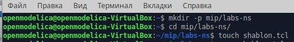{#fig:001 width=70%}

## Создание шаблона

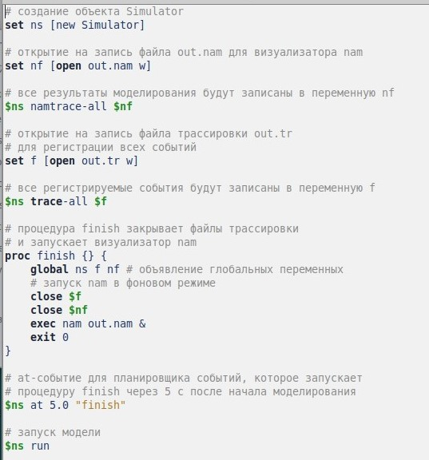{#fig:002 width=70%}

## Запуск симулятора

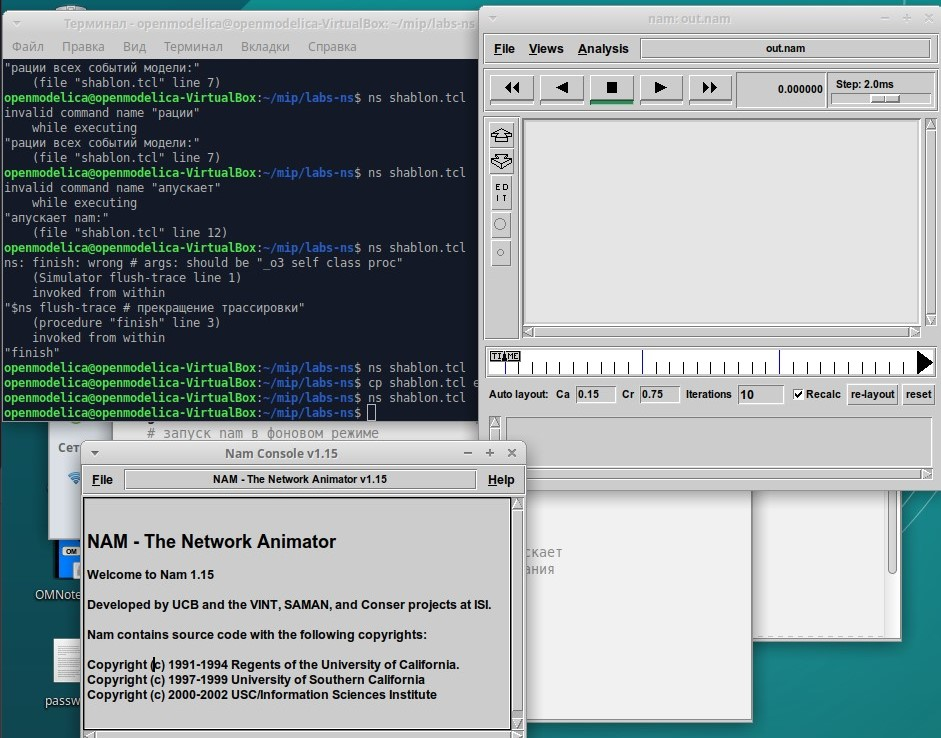{#fig:003 width=70%}

# Выполнение примера описания топологии сети, состоящей из двух узлов и одного соединения.

## Постановка задачи

Требуется смоделировать сеть передачи данных, состоящую из двух узлов, соединённых дуплексной линией связи с полосой пропускания 2 Мб/с и задержкой 10 мс, очередью с обслуживанием типа DropTail. От одного узла к другому по протоколу UDP осуществляется передача пакетов, размером 500 байт, с постоянной скоростью 200 пакетов в секунду.

## Копирование шаблона

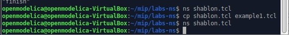{#fig:004 width=70%}

## Скрипт для описания простой сети

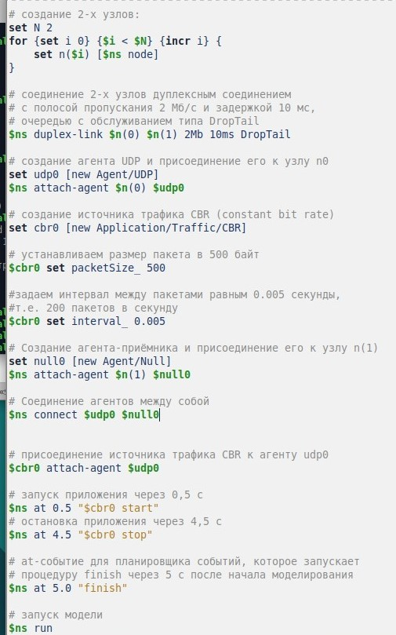{#fig:005 width=70%}

## Запуск аниматора

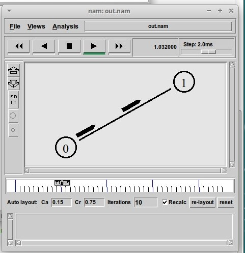{#fig:006 width=70%}

## Запуск аниматора

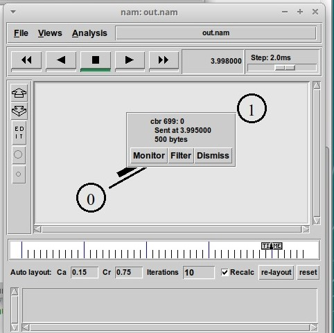{#fig:007 width=70%}

# Выполнение примера описания с усложнённой топологией сети.

## Постановка задачи. 

- сеть состоит из 4 узлов (n0, n1, n2, n3);
- между узлами n0 и n2, n1 и n2 установлено дуплексное соединение с пропускной
способностью 2 Мбит/с и задержкой 10 мс;
- между узлами n2 и n3 установлено дуплексное соединение с пропускной способностью 1,7 Мбит/с и задержкой 20 мс;
- каждый узел использует очередь с дисциплиной DropTail для накопления пакетов,
максимальный размер которой составляет 10;
- TCP-источник на узле n0 подключается к TCP-приёмнику на узле n3
(по-умолчанию, максимальный размер пакета, который TCP-агент может генерировать, равняется 1KByte)
- TCP-приёмник генерирует и отправляет ACK пакеты отправителю и откидывает
полученные пакеты;
- UDP-агент, который подсоединён к узлу n1, подключён к null-агенту на узле n3
(null-агент просто откидывает пакеты);
- генераторы трафика ftp и cbr прикреплены к TCP и UDP агентам соответственно;
- генератор cbr генерирует пакеты размером 1 Кбайт со скоростью 1 Мбит/с;
- работа cbr начинается в 0,1 секунду и прекращается в 4,5 секунды, а ftp начинает
работать в 1,0 секунду и прекращает в 4,0 секунды.

## Копирование шаблона

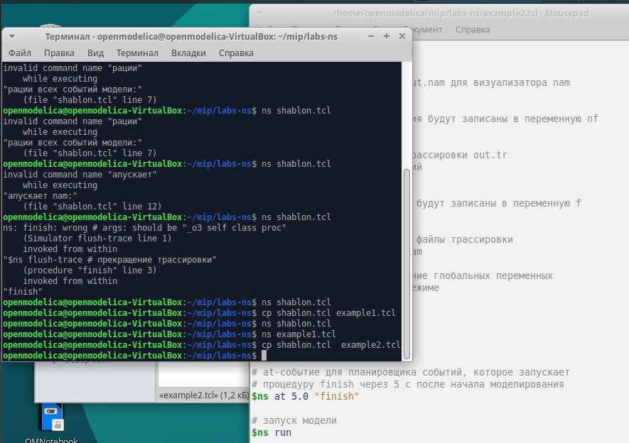{#fig:008 width=70%}

## Создание скрипта

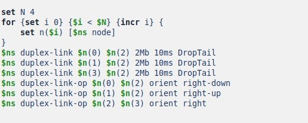{#fig:009 width=70%}

## Создание скрипта

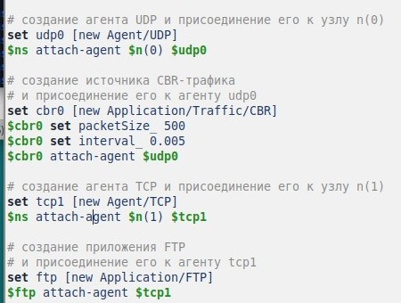{#fig:010 width=70%}

## Создание скрипта

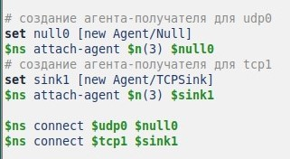{#fig:011 width=70%}

## Создание скрипта

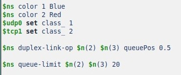{#fig:012 width=70%}

## Создание скрипта

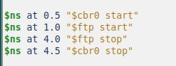{#fig:013 width=70%}

## Запуск аниматора

{#fig:014 width=70%}

#  Выполнение примера с кольцевой топологией сети

## Постановка задачи 
- Требуется построить модель передачи данных по сети с кольцевой топологией и динамической маршрутизацией пакетов:
- сеть состоит из 7 узлов, соединённых в кольцо;
- данные передаются от узла n(0) к узлу n(3) по кратчайшему пути;
- с 1 по 2 секунду модельного времени происходит разрыв соединения между
узлами n(1) и n(2);
- при разрыве соединения маршрут передачи данных должен измениться на резервный.

## Копирование шаблона

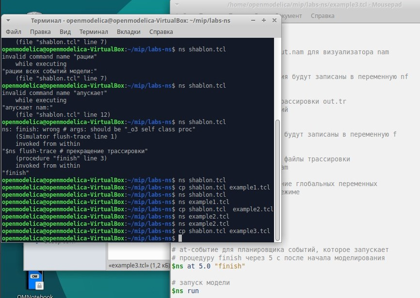{#fig:015 width=70%}

## Создание скрипта.

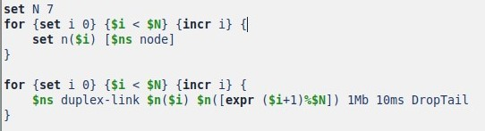{#fig:016 width=70%}

## Создание скрипта

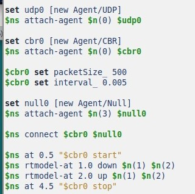{#fig:017 width=70%}

## Создание скрипта

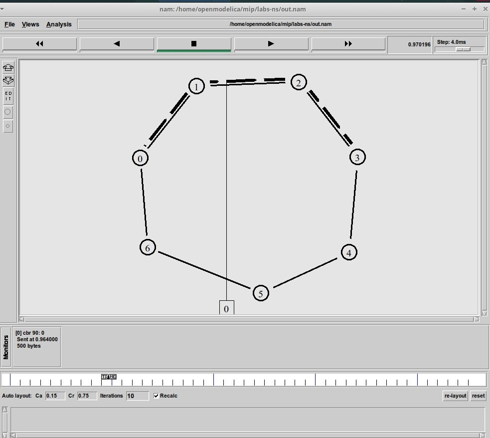{#fig:018 width=70%}

## Создание скрипта

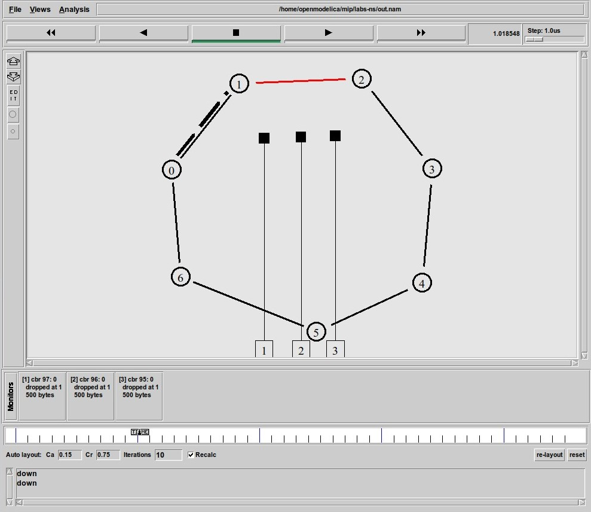{#fig:019 width=70%}

## Создание скрипта

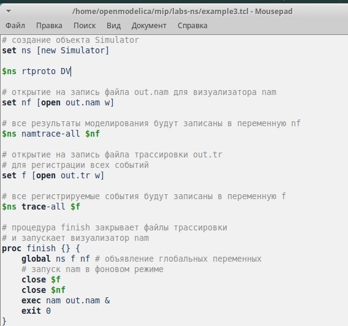{#fig:020 width=70%}

## Запуск аниматора

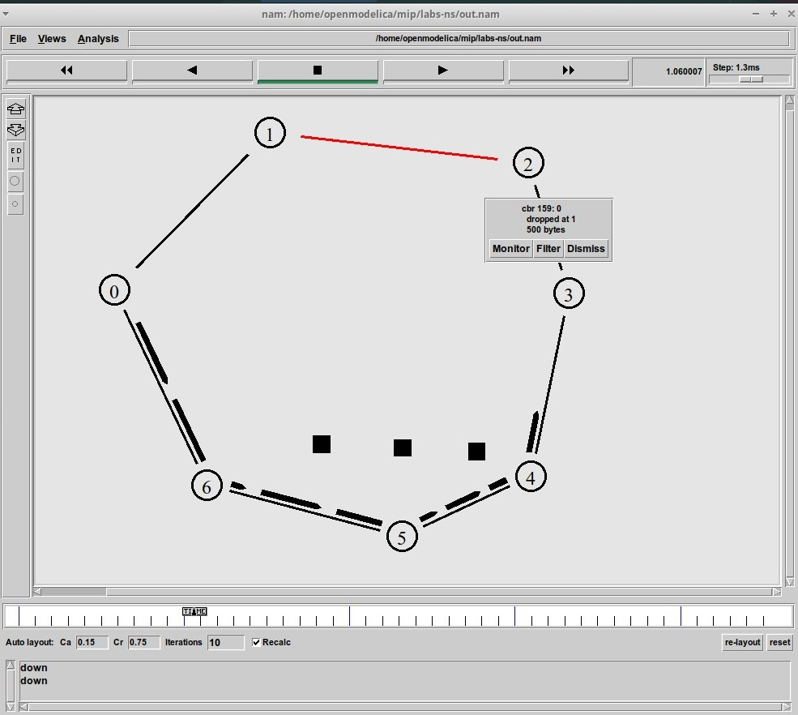{#fig:021 width=70%}

# Выполнение упражнения

## Постановка задачи
- Внесите следующие изменения в реализацию примера с кольцевой
топологией сети:
- топология сети должна соответствовать представленной на рисунке в тексте описания ЛР.
- передача данных должна осуществляться от узла n(0) до узла n(5) по кратчайшему пути в течение 5 секунд модельного времени;
- передача данных должна идти по протоколу TCP (тип Newreno), на принимающей стороне используется TCPSink-объект типа DelAck; поверх TCP работает протокол FTP с 0,5 до 4,5 секунд модельного времени;
- с 1 по 2 секунду модельного времени происходит разрыв соединения между узлами n(0) и n(1);
- при разрыве соединения маршрут передачи данных должен измениться на резервный, после восстановления соединения пакеты снова должны пойти по кратчайшему пути.

## Создание скрипта

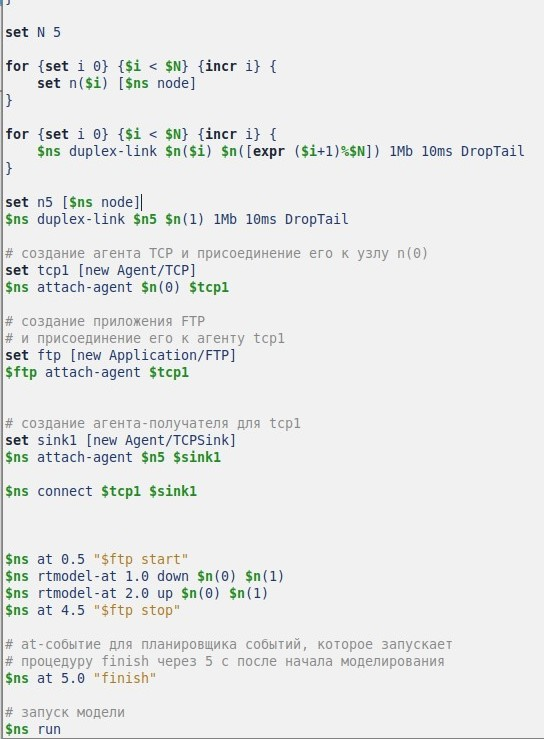{#fig:022 width=70%}

## Запуск аниматора

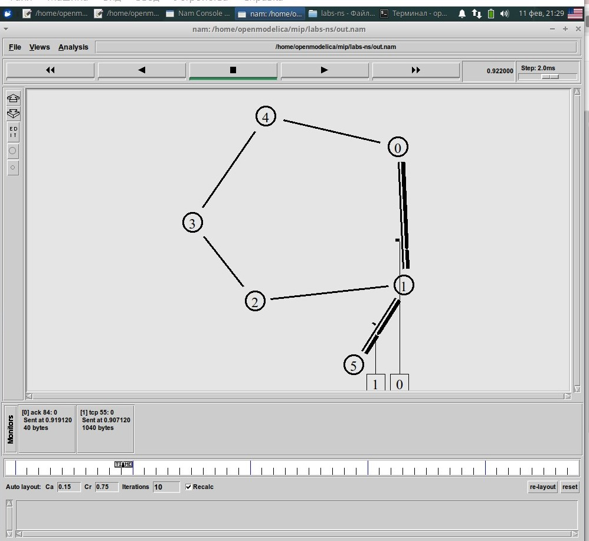{#fig:023 width=70%}

## Запуск аниматора

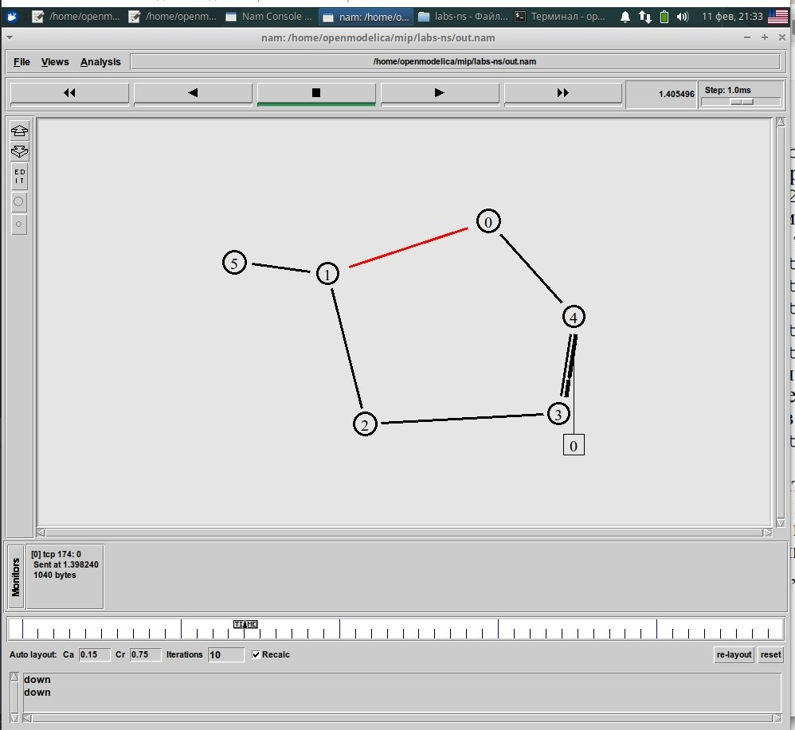{#fig:024 width=70%}

## Выводы 

В ходе выполнения лабораторной работы я приобрела навыки моделирования сетей передачи данных с помощью средства имитационного моделирования NS-2, а также провела анализ полученных результатов моделирования.

# Спасибо за внимание!
