---
## Front matter
title: "Лабораторная работа №1"
subtitle: "Простые модели компьютерной сети"
author: "Астраханцева А. А."

## Generic otions
lang: ru-RU
toc-title: "Содержание"

## Bibliography
bibliography: bib/cite.bib
csl: pandoc/csl/gost-r-7-0-5-2008-numeric.csl

## Pdf output format
toc: true # Table of contents
toc-depth: 2
lof: true # List of figures
lot: false # List of tables
fontsize: 12pt
linestretch: 1.5
papersize: a4
documentclass: scrreprt
## I18n polyglossia
polyglossia-lang:
  name: russian
  options:
	- spelling=modern
	- babelshorthands=true
polyglossia-otherlangs:
  name: english
## I18n babel
babel-lang: russian
babel-otherlangs: english
## Fonts
mainfont: IBM Plex Serif
romanfont: IBM Plex Serif
sansfont: IBM Plex Sans
monofont: IBM Plex Mono
mathfont: STIX Two Math
mainfontoptions: Ligatures=Common,Ligatures=TeX,Scale=0.94
romanfontoptions: Ligatures=Common,Ligatures=TeX,Scale=0.94
sansfontoptions: Ligatures=Common,Ligatures=TeX,Scale=MatchLowercase,Scale=0.94
monofontoptions: Scale=MatchLowercase,Scale=0.94,FakeStretch=0.9
mathfontoptions:
## Biblatex
biblatex: true
biblio-style: "gost-numeric"
biblatexoptions:
  - parentracker=true
  - backend=biber
  - hyperref=auto
  - language=auto
  - autolang=other*
  - citestyle=gost-numeric
## Pandoc-crossref LaTeX customization
figureTitle: "Рис."
tableTitle: "Таблица"
listingTitle: "Листинг"
lofTitle: "Список иллюстраций"
lotTitle: "Список таблиц"
lolTitle: "Листинги"
## Misc options
indent: true
header-includes:
  - \usepackage{indentfirst}
  - \usepackage{float} # keep figures where there are in the text
  - \floatplacement{figure}{H} # keep figures where there are in the text
---

# Цель работы

Приобретение навыков моделирования сетей передачи данных с помощью средства имитационного моделирования NS-2, а также анализ полученных результатов
моделирования.

# Задание

1. Создание шаблона сценария для NS-2.
2.  Выполнение примера описания топологии сети, состоящей из двух узлов и одного соединения.
3. Выполнение примера описания с усложнённой топологией сети.
4.  Выполнение примера с кольцевой топологией сети
5. Выполнение упражнения

# Выполнение лабораторной работы

1. Создание шаблона сценария для NS-2.
В своём рабочем каталоге создаем директорию mip, в которой будут выполняться лабораторные работы. Внутри mip создаем директорию lab-ns, а в ней файл shablon.tcl: (рис. [-@fig:001]).

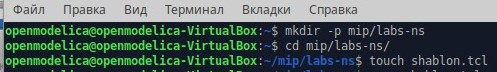{#fig:001 width=70%}

Откроем на редактирование файл shablon.tcl. 
Создадим объект типа Simulator. Затем создадим переменную nf и укажем, что требуется открыть на запись nam-файл для регистрации выходных результатов моделирования. Далее создадим переменную f и откроем на запись файл трассировки для регистрации всех событий модели. После этого добавим процедуру finish, которая закрывает файлы трассировки
и запускает nam. Наконец, с помощью команды at указываем планировщику событий, что процедуру finish следует запустить через 5 с после начала моделирования, после чего
запустить симулятор ns. Полный текст шаблона представлен на скриншоте (рис. [-@fig:002]).

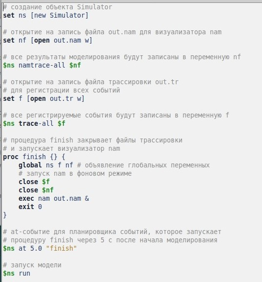{#fig:002 width=70%}

Сохранив изменения в отредактированном файле shablon.tcl и закрыв его, запускаем симулятор. Получившийся шаблон можно использовать в дальнейшем в большинстве разрабатываемых скриптов NS-2, добавляя в него до строки $ns at 5.0 "finish"
описание объектов и действий моделируемой системы (рис. [-@fig:003]).

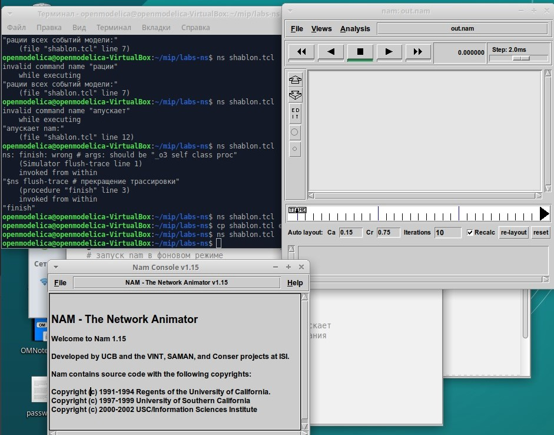{#fig:003 width=70%}

2.  Выполнение примера описания топологии сети, состоящей из двух узлов и одного соединения.

**Постановка задачи**. Требуется смоделировать сеть передачи данных, состоящую из двух узлов, соединённых дуплексной линией связи с полосой пропускания 2 Мб/с и задержкой 10 мс, очередью с обслуживанием типа DropTail. От одного узла к другому по протоколу UDP осуществляется передача пакетов, размером 500 байт, с постоянной скоростью 200 пакетов в секунду.

Скопируем содержимое созданного шаблона в новый файл example1.tcl (рис. [-@fig:004]).

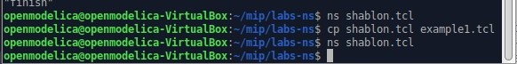{#fig:004 width=70%}

Откроем example1.tcl на редактирование. Добавим в него до строки $ns at 5.0 "finish" описание топологии сети. Создадим агент UDP и присоединим к узлу n0. В узле агент сам не может генерировать трафик, он лишь реализует протоколы и алгоритмы транспортного
уровня. Поэтому к агенту присоединяется приложение. В данном случае — это
источник с постоянной скоростью (Constant Bit Rate, CBR), который каждые 5 мс
посылает пакет R = 500 байт. Таким образом, скорость источника:

$$ R = \frac{500 \cdot 8}{0.005} = 800000 \text{ бит/с} $$

Cоздадим Null-агент, который работает как приёмник трафика, и прикрепим
его к узлу n1, после чего соединим агенты между собой. Для запуска и остановки приложения CBR добавим at-события в планировщик событий (перед командой $ns at 5.0 "finish") (рис. [-@fig:005]).

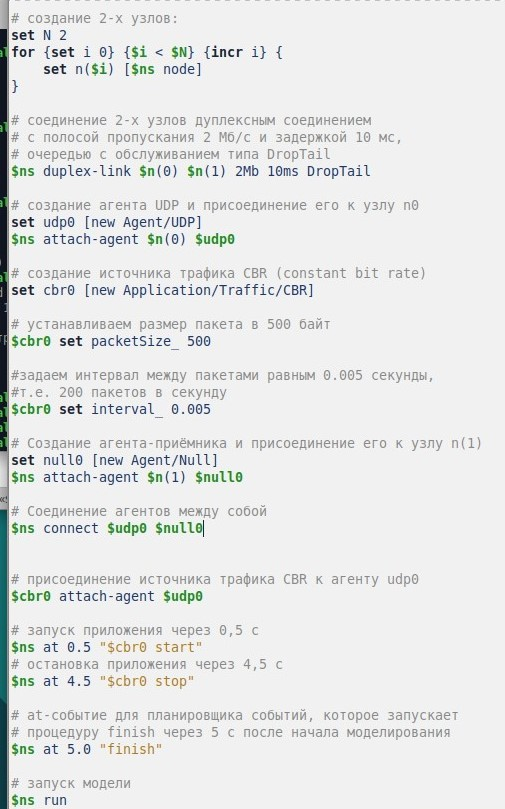{#fig:005 width=70%}

Сохраним изменения в отредактированном файле и запустим симулятор. Получим в качестве результата запуск аниматора nam в фоновом режиме. При нажатии на кнопку play в окне nam через 0.5 секунды из узла 0 данные начнут поступать к узлу 1. (рис. [-@fig:006]).

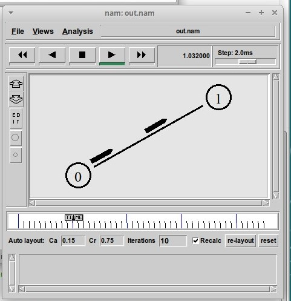{#fig:006 width=70%}

Этот процесс можно замедлить, выбирая шаг отображения в nam. Можно осуществлять наблюдение за отдельным пакетом, щёлкнув по нему в окне nam, а щёлкнув по соединению, можно получить о нем некоторую информацию (рис. [-@fig:007]).

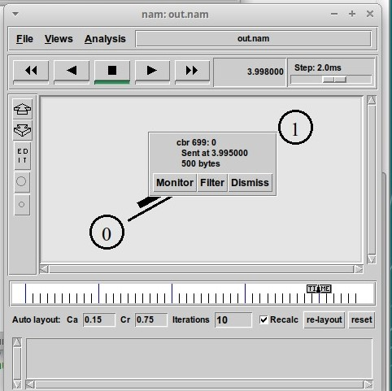{#fig:007 width=70%}

3. Выполнение примера описания с усложнённой топологией сети.

**Постановка задачи**. Описание моделируемой сети (рис. 2.4):
- сеть состоит из 4 узлов (n0, n1, n2, n3);
- между узлами n0 и n2, n1 и n2 установлено дуплексное соединение с пропускной
способностью 2 Мбит/с и задержкой 10 мс;
- между узлами n2 и n3 установлено дуплексное соединение с пропускной способностью 1,7 Мбит/с и задержкой 20 мс;
- каждый узел использует очередь с дисциплиной DropTail для накопления пакетов,
максимальный размер которой составляет 10;
- TCP-источник на узле n0 подключается к TCP-приёмнику на узле n3
(по-умолчанию, максимальный размер пакета, который TCP-агент может генерировать, равняется 1KByte)
- TCP-приёмник генерирует и отправляет ACK пакеты отправителю и откидывает
полученные пакеты;
- UDP-агент, который подсоединён к узлу n1, подключён к null-агенту на узле n3
(null-агент просто откидывает пакеты);
- генераторы трафика ftp и cbr прикреплены к TCP и UDP агентам соответственно;
- генератор cbr генерирует пакеты размером 1 Кбайт со скоростью 1 Мбит/с;
- работа cbr начинается в 0,1 секунду и прекращается в 4,5 секунды, а ftp начинает
работать в 1,0 секунду и прекращает в 4,0 секунды.

Скопируем содержимое созданного шаблона в новый файл example2.tcl (рис. [-@fig:008]).

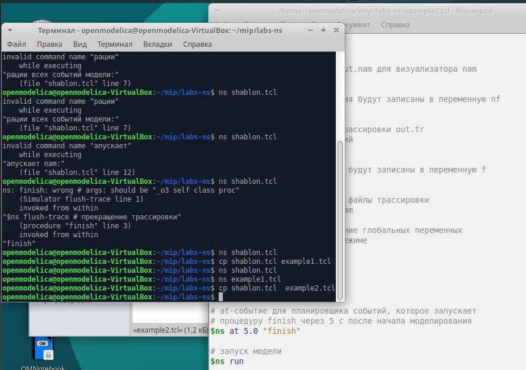{#fig:008 width=70%}

Откроем example2.tcl на редактирование. Создадим 4 узла и 3 дуплексных соединения с указанием направления:(рис. [-@fig:009]).

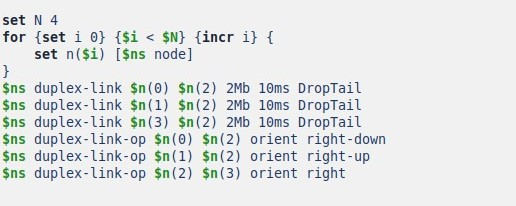{#fig:009 width=70%}

Создадим агент UDP с прикреплённым к нему источником CBR и агент TCP с прикреплённым к нему приложением FTP: (рис. [-@fig:010]).

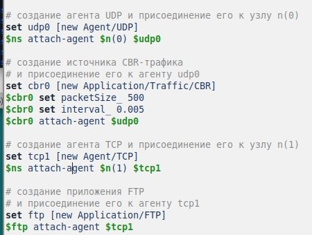{#fig:010 width=70%}

Создадим агенты-получатели. Соединим агенты udp0 и tcp1 и их получателей (рис. [-@fig:011]).

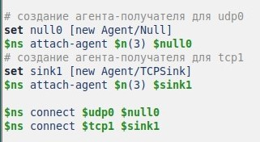{#fig:011 width=70%}

Зададим описание цвета каждого потока. Добавим отслеживание событий в очереди и наложение ограничения на размер очереди: (рис. [-@fig:012]).

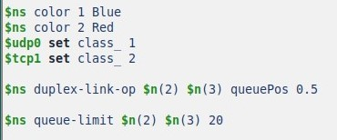{#fig:012 width=70%}

Добавим at-события: (рис. [-@fig:013]).

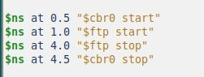{#fig:013 width=70%}

Сохранив изменения в отредактированном файле и запустив симулятор, получим анимированный результат моделирования. При запуске скрипта можно заметить, что по соединениям между узлами n(0)–n(2) и n(1)–n(2) к узлу n(2) передаётся данных больше, чем способно передаваться по соединению от узла n(2) к узлу n(3). Действительно, мы передаём 200 пакетов в секунду от каждого источника данных в узлах n(0) и n(1), а каждый пакет имеет
размер 500 байт. Таким образом, полоса каждого соединения 0, 8 Mb, а суммарная
— 1, 6 Mb. Но соединение n(2)–n(3) имеет полосу лишь 1 Mb. Следовательно, часть
пакетов должна теряться. В окне аниматора можно видеть пакеты в очереди, а также
те пакеты, которые отбрасываются при переполнении. (рис. [-@fig:014]).

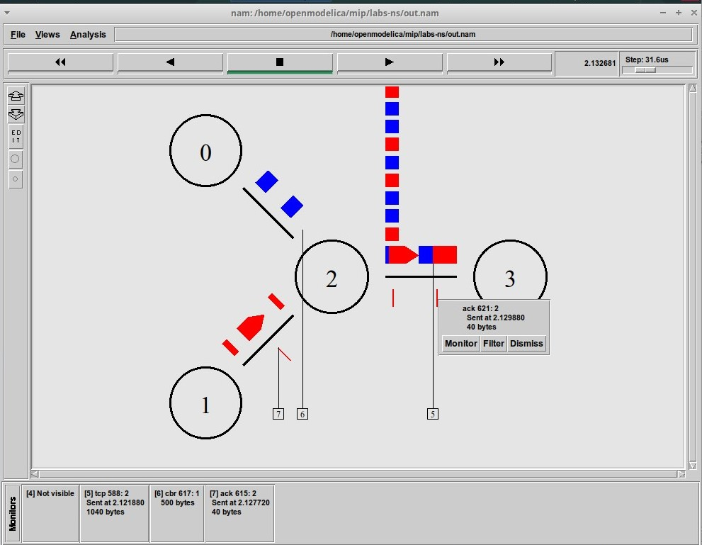{#fig:014 width=70%}

4.  Выполнение примера с кольцевой топологией сети

**Постановка задачи**. Требуется построить модель передачи данных по сети с кольцевой топологией и динамической маршрутизацией пакетов:
- сеть состоит из 7 узлов, соединённых в кольцо;
- данные передаются от узла n(0) к узлу n(3) по кратчайшему пути;
- с 1 по 2 секунду модельного времени происходит разрыв соединения между
узлами n(1) и n(2);
- при разрыве соединения маршрут передачи данных должен измениться на резервный.

Скопируем содержимое созданного шаблона в новый файл example3.tcl (рис. [-@fig:015]).

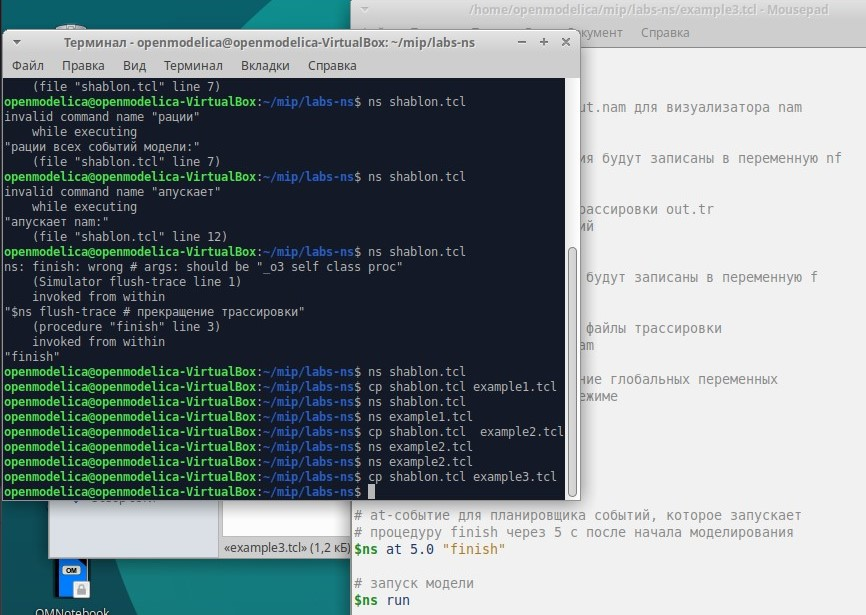{#fig:015 width=70%}

Откроем example3.tcl на редактирование. Опишем топологию моделируемой сети. Далее соединим узлы так, чтобы создать круговую топологию (рис. [-@fig:016]).

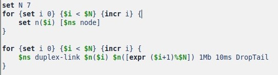{#fig:016 width=70%}

Каждый узел, за исключением последнего, соединяется со следующим, последний соединяется с первым. Для этого в цикле используем оператор %, означающий остаток от деления нацело.
Зададим передачу данных от узла n(0) к узлу n(3). Добавим команду разрыва соединения между узлами n(1) и n(2) на время в одну секунду, а также время начала и окончания передачи данных: (рис. [-@fig:017]).

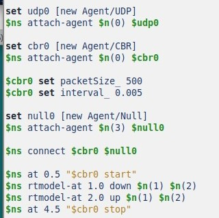{#fig:017 width=70%}

Запустим анимацию созданный кольцевой сети. Данные передаются по кратчайшему маршруту от узла n(0) к узлу n(3), через узлы n(1) и n(2) (рис. [-@fig:018]).

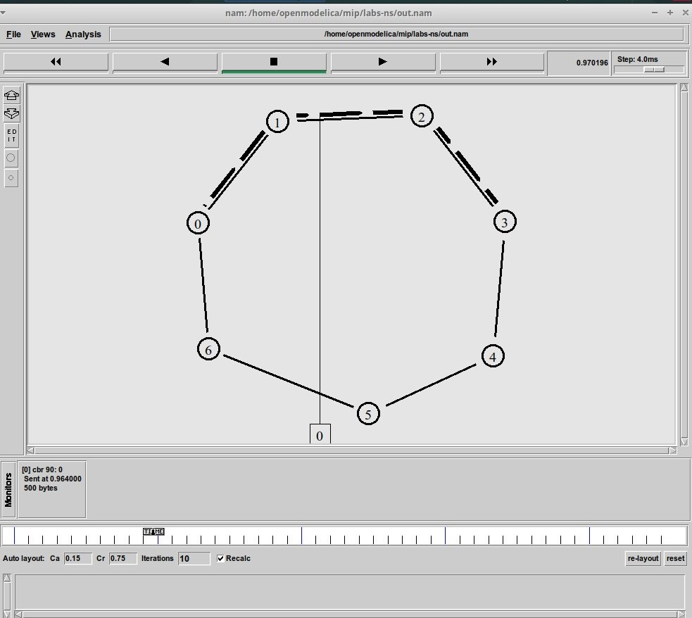{#fig:018 width=70%}

В заданный промежуток времени происходит разрыв цепи. Некоторые данные теряются  (рис. [-@fig:019]).

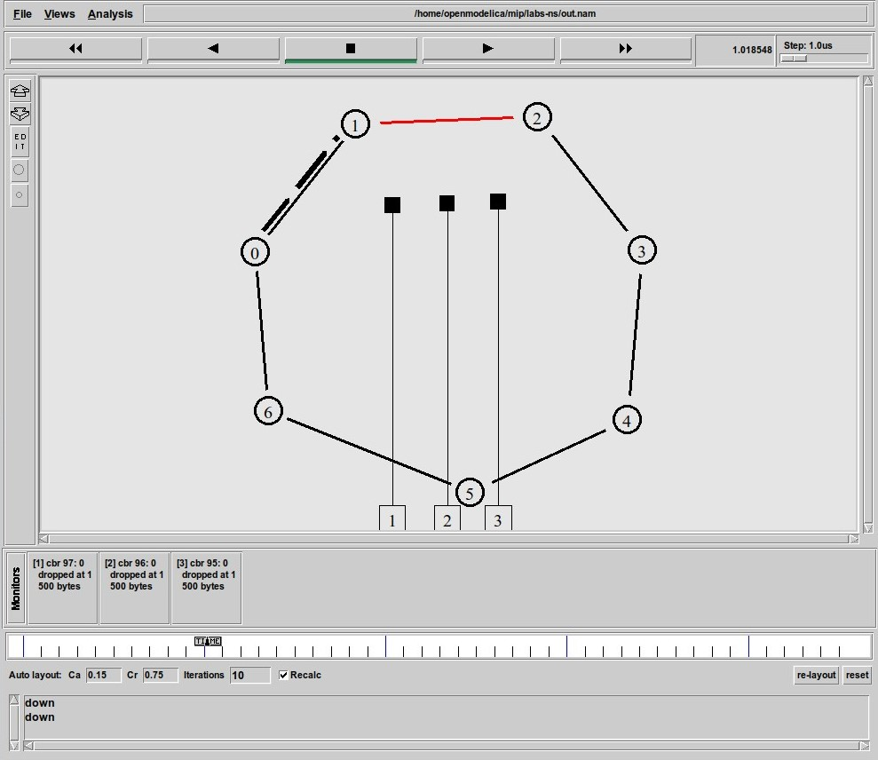{#fig:019 width=70%}

Добавим в начало скрипта после команды создания объекта Simulator строчку `$ns rtproto DV` (рис. [-@fig:020]).

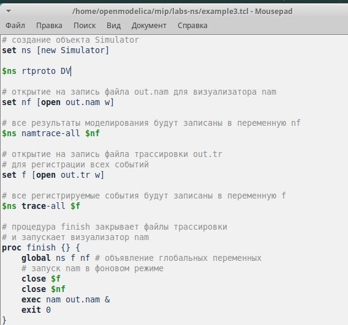{#fig:020 width=70%}

Увидим, что сразу после запуска в сети отправляется небольшое количество
маленьких пакетов, используемых для обмена информацией, необходимой для маршрутизации между узлами. Когда соединение будет разорвано, информация
о топологии будет обновлена, и пакеты будут отсылаться по новому маршруту через
узлы n(6), n(5) и n(4) (рис. [-@fig:021]).

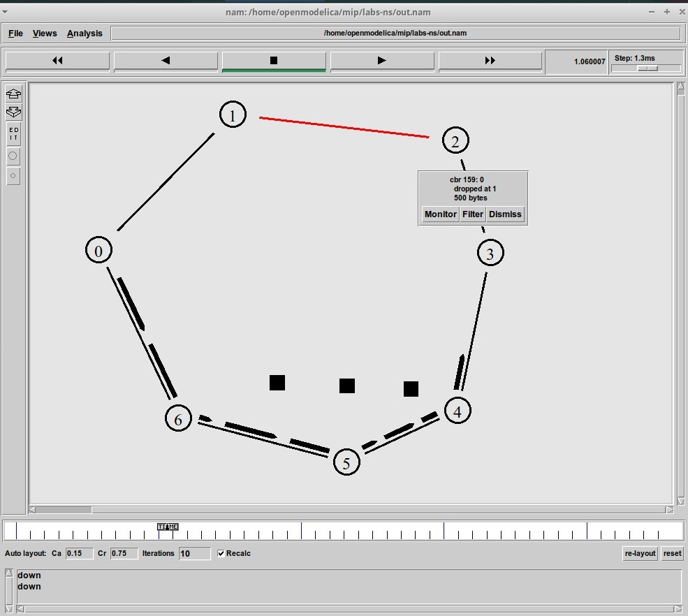{#fig:021 width=70%}

5. Выполнение упражнения

**Постановка задачи** Внесите следующие изменения в реализацию примера с кольцевой
топологией сети:
- топология сети должна соответствовать представленной на рисунке в тексте описания ЛР.
- передача данных должна осуществляться от узла n(0) до узла n(5) по кратчайшему пути в течение 5 секунд модельного времени;
- передача данных должна идти по протоколу TCP (тип Newreno), на принимающей стороне используется TCPSink-объект типа DelAck; поверх TCP работает протокол FTP с 0,5 до 4,5 секунд модельного времени;
- с 1 по 2 секунду модельного времени происходит разрыв соединения между узлами n(0) и n(1);
- при разрыве соединения маршрут передачи данных должен измениться на резервный, после восстановления соединения пакеты снова должны пойти по кратчайшему пути.

Скопируем шаблон сценария в новый файл example4.tcl. Откроем файл на редактирование. По условию упражнения создадим 5 узлов. Соединим из кольцевой связью. Соединим узлы n5 и n1. Везде будем использовать дуплексную линию связи с полосой пропускания 1 Мб/с и задержкой 10 мс, очередью с обслуживанием типа DropTail. Создадим агента TCP и свяжем его с узлом n(0). Создадим приложение FTP и соединим его с агентом TCP. Создадим агента получателя, зададим время работы FTP и время разрыва (рис. [-@fig:022]).

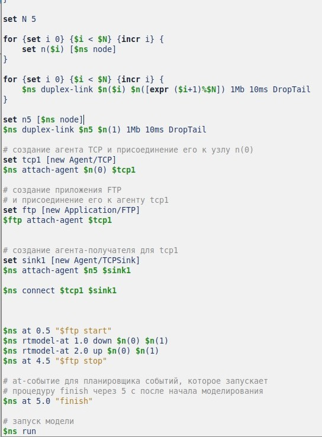{#fig:022 width=70%}

Запустим анимацию созданной цепи. В момент времени 0.5 начинается передача пакетов от узла n(0) к узлу n5. Передаются данные по протоколу TCP, в обратном направлении отправляются Ack сигнал, который означет, что данные успешно получены (рис. [-@fig:023]).

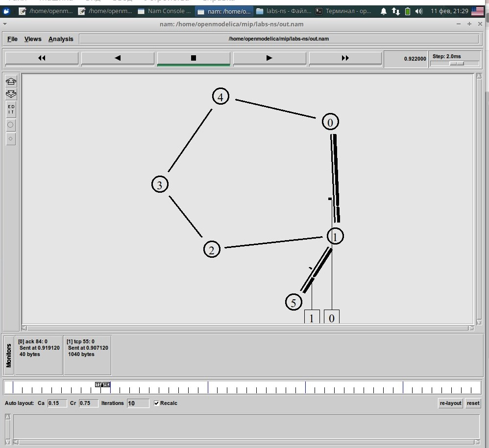{#fig:023 width=70%}

Далее с 1 до 2 секунды происходит разрыв соединения между узлами n(0) и n(1). Теперь данные отправляются по ближайшему возможному маршруту через узлы n(4), n(3) и n(2) (рис. [-@fig:024]).

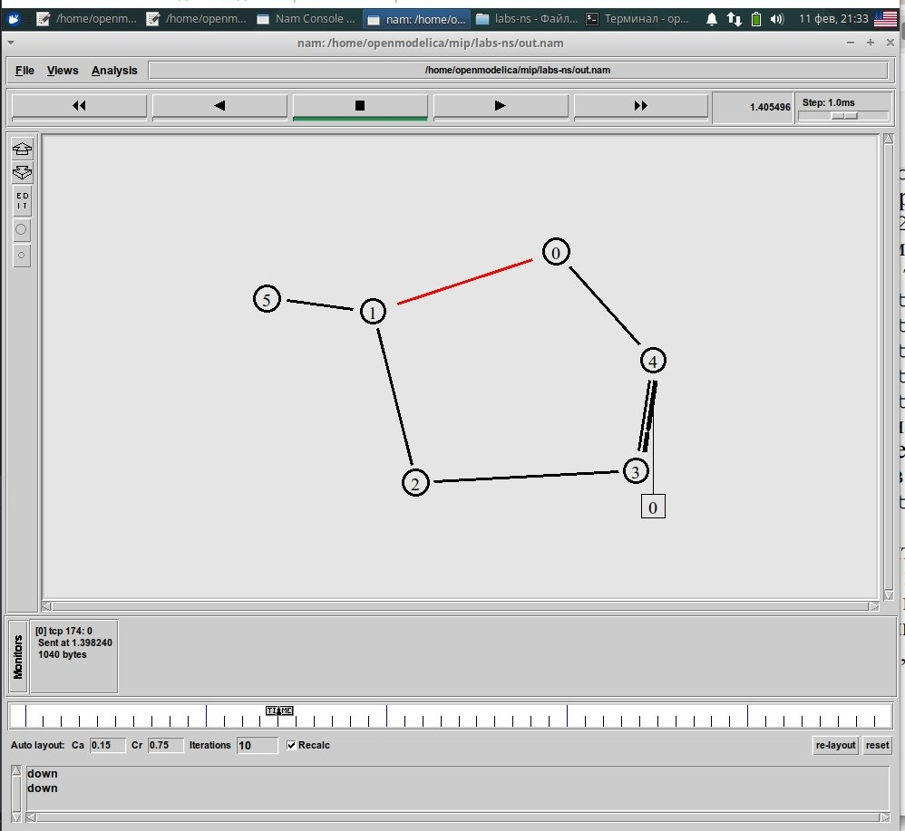{#fig:024 width=70%}

# Выводы

В ходе выполнения лабораторной работы я приобрела навыки моделирования сетей передачи данных с помощью средства имитационного моделирования NS-2, а также провела анализ полученных результатов моделирования.

