---
## Front matter
lang: ru-RU
title: "Лабораторная работа №2"
subtitle: "Исследование протокола TCP и алгоритма управления очередью RED"
author: 
  - Астраханцева А. А.
institute:
  - Российский университет дружбы народов, Москва, Россия
date: 20 февраля 2025

## i18n babel
babel-lang: russian
babel-otherlangs: english

## Formatting pdf
toc: false
toc-title: Содержание
slide_level: 2
aspectratio: 169
section-titles: true
theme: metropolis
header-includes:
 - \metroset{progressbar=frametitle,sectionpage=progressbar,numbering=fraction}
---

# Информация

## Докладчик

:::::::::::::: {.columns align=center}
::: {.column width="70%"}

  * Астраханцева Анастасия Александровна
  * НФИбд-01-22, 1132226437
  * Российский университет дружбы народов
  * [1132226437@pfur.ru](mailto:1132226437@pfur.ru)
  * <https://github.com/aaastrakhantseva>

:::
::: {.column width="30%"}


:::
::::::::::::::

# Вводная часть

## Цели лабораторной работы

Приобретение навыков моделирования сетей передачи данных с помощью средства имитационного моделирования NS-2, а также анализ полученных результатов моделирования. Ознакомление с протоколом TCP и алгоритмом управления очередью RED.

## Задачи

1. Выполнение примера описания топологии сети с дисциплиной RED.
2. Выполнение упражнения

# Выполнение ЛР

## Постановка задачи

- сеть состоит из 6 узлов;
-  между всеми узлами установлено дуплексное соединение с различными пропускной способностью и задержкой 10 мс;
- узел r1 использует очередь с дисциплиной RED для накопления пакетов, максимальный размер которой составляет 25;
- TCP-источники на узлах s1 и s2 подключаются к TCP-приёмнику на узле s3;
- генераторы трафика FTP прикреплены к TCP-агентам.

## Создание необходимых директорий и файла

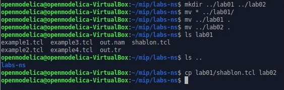{#fig:001 width=70%}

## Написание скрипта. Создание узлов

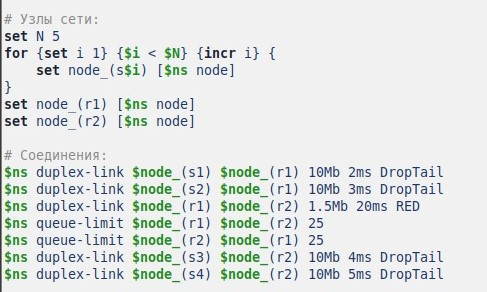{#fig:002 width=70%}

## Написание скрипта. Создание агента и приложений

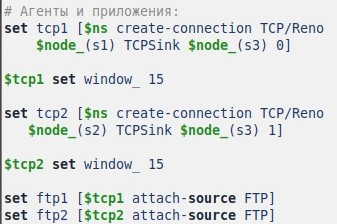{#fig:003 width=70%}

## Написание скрипта. Мониторинг окна и очереди

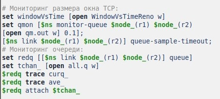{#fig:004 width=70%}

## Написание скрипта

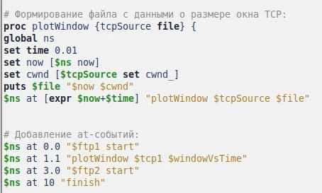{#fig:005 width=70%}

## График размера окна Reno

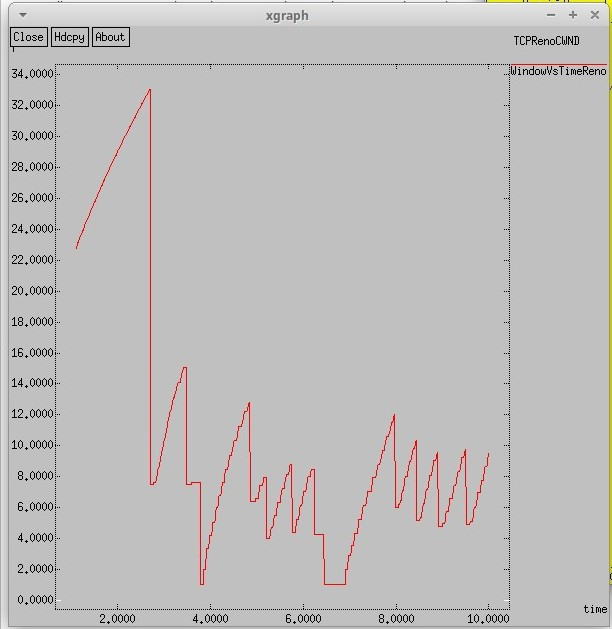{#fig:006 width=70%}

## График изменения размера очереди и средней очереди Reno

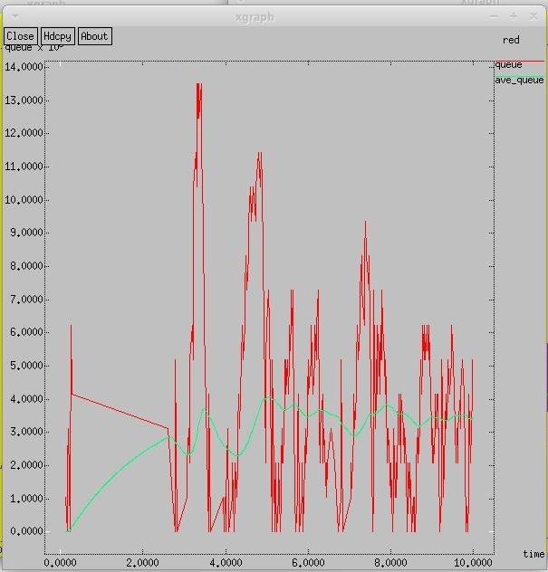{#fig:007 width=70%}

# Выполнение упражнения

## Постановка задачи

- Измените в модели на узле s1 тип протокола TCP с Reno на NewReno, затем на Vegas. Сравните и поясните результаты.
- Внесите изменения при отображении окон с графиками (измените цвет фона, цвет траекторий, подписи к осям, подпись траектории в легенде).

## Изменение скрипта. Смена типа TCP

```
# Агенты и приложения:
set tcp1 [$ns create-connection TCP/Newreno $node_(s1) TCPSink $node_(s3) 0]

$tcp1 set window_ 15

set tcp2 [$ns create-connection TCP/Reno $node_(s2) TCPSink $node_(s3) 1]

```

## Изменение скрипта. Изменение цвета графика

```
    set f [open temp.queue w]
    puts $f "TitleText: red"
    puts $f "Device: Postscript"
    puts $f "0.Color: Purple"
    puts $f "1.Color: Green"
```

## Изменение скрипта. Изменение цвета осей и подписей в легенде для размера очереди

```
  puts $f \"Current_size_of_queue
    exec cat temp.q >@ $f
    puts $f \n\"Average_size_of_queue
    exec cat temp.a >@ $f
```

## Изменение скрипта. Изменение цвета осей и подписей в легенде для размера окна

```
    puts $windowVsTime "0.Color: Purple"
    puts $windowVsTime \"Window_size"
```

## График размера окна Newreno

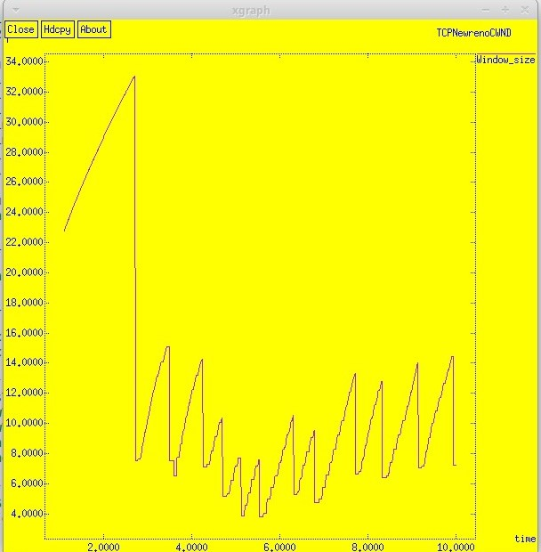{#fig:008 width=70%}

## График изменения размера очереди и средней очереди Newreno

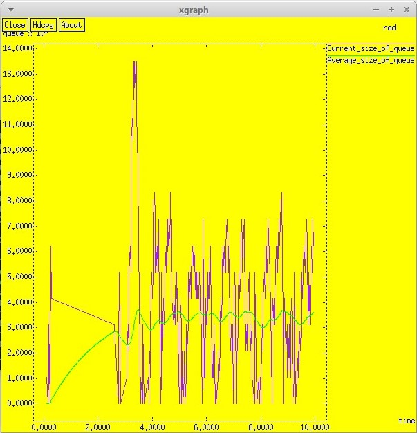{#fig:009 width=70%}

## Изменение скрипта. Смена типа TCP

```
# Агенты и приложения:
set tcp1 [$ns create-connection TCP/Vegas $node_(s1) TCPSink $node_(s3) 0]

$tcp1 set window_ 15
set tcp2 [$ns create-connection TCP/Reno $node_(s2) TCPSink $node_(s3) 1]

```

## График размера окна Vegas

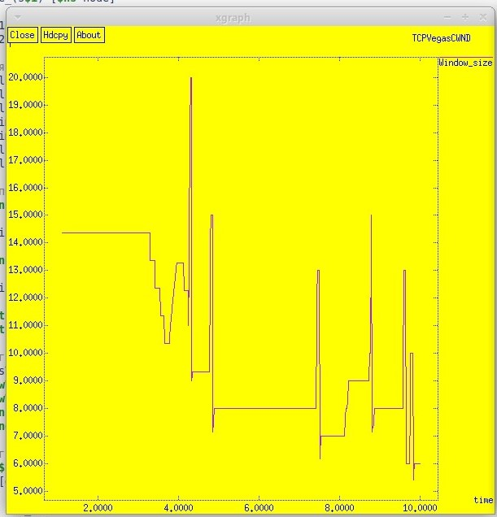{#fig:010 width=70%}

## График изменения размера очереди и средней очереди Vegas

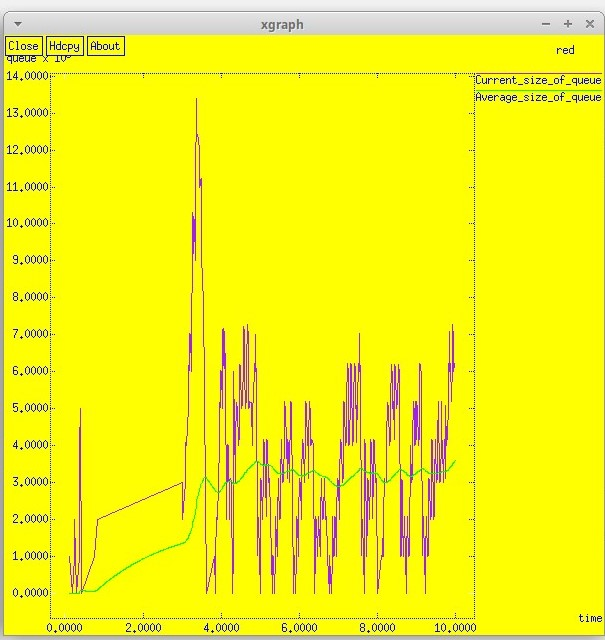{#fig:011 width=70%}

## Выводы

В ходе выполнения лабораторной работы я приобрела навыки моделирования сетей передачи данных с помощью средства имитационного моделирования NS-2, а также провела анализ полученных результатов моделирования. Помимо этого, я ознакомилась с протоколом TCP и алгоритмом управления очередью RED.


# Спасибо за внимание!
