---
## Front matter
title: "Лабораторная работа №2"
subtitle: "Исследование протокола TCP и алгоритма управления очередью RED"
author: "Астраханцева А. А."

## Generic otions
lang: ru-RU
toc-title: "Содержание"

## Bibliography
bibliography: bib/cite.bib
csl: pandoc/csl/gost-r-7-0-5-2008-numeric.csl

## Pdf output format
toc: true # Table of contents
toc-depth: 2
lof: true # List of figures
lot: false # List of tables
fontsize: 12pt
linestretch: 1.5
papersize: a4
documentclass: scrreprt
## I18n polyglossia
polyglossia-lang:
  name: russian
  options:
	- spelling=modern
	- babelshorthands=true
polyglossia-otherlangs:
  name: english
## I18n babel
babel-lang: russian
babel-otherlangs: english
## Fonts
mainfont: PT Serif
romanfont: PT Serif
sansfont: PT Sans
monofont: PT Mono
mainfontoptions: Ligatures=TeX
romanfontoptions: Ligatures=TeX
sansfontoptions: Ligatures=TeX,Scale=MatchLowercase
monofontoptions: Scale=MatchLowercase,Scale=0.9
## Biblatex
biblatex: true
biblio-style: "gost-numeric"
biblatexoptions:
  - parentracker=true
  - backend=biber
  - hyperref=auto
  - language=auto
  - autolang=other*
  - citestyle=gost-numeric
## Pandoc-crossref LaTeX customization
figureTitle: "Рис."
tableTitle: "Таблица"
listingTitle: "Листинг"
lofTitle: "Список иллюстраций"
lotTitle: "Список таблиц"
lolTitle: "Листинги"
## Misc options
indent: true
header-includes:
  - \usepackage{indentfirst}
  - \usepackage{float} # keep figures where there are in the text
  - \floatplacement{figure}{H} # keep figures where there are in the text
---

# Цель работы

Приобретение навыков моделирования сетей передачи данных с помощью средства имитационного моделирования NS-2, а также анализ полученных результатов моделирования. Ознакомление с протоколом TCP и алгоритмом управления очередью RED.

# Задание

1. Выполнение примера описания топологии сети с дисциплиной RED.
2. Выполнение упражнения

# Выполнение лабораторной работы

1. Выполнение примера описания топологии сети с дисциплиной RED.

**Постановка задачи** 
Описание моделируемой сети:
- сеть состоит из 6 узлов;
-  между всеми узлами установлено дуплексное соединение с различными пропускной способностью и задержкой 10 мс;
- узел r1 использует очередь с дисциплиной RED для накопления пакетов, максимальный размер которой составляет 25;
- TCP-источники на узлах s1 и s2 подключаются к TCP-приёмнику на узле s3;
- генераторы трафика FTP прикреплены к TCP-агентам.

Сначала создадим директорию для файлов второй ЛР. Скопируем шаблон, который мы написали в первой ЛР (рис. [-@fig:001]).

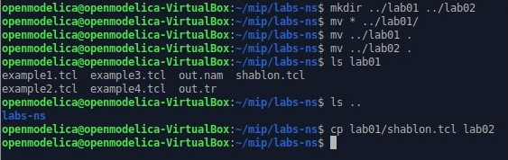{#fig:001 width=70%}

Начнем с создания узлов. Далее зададим необходимые параметры соединений между узлами (рис. [-@fig:002]).

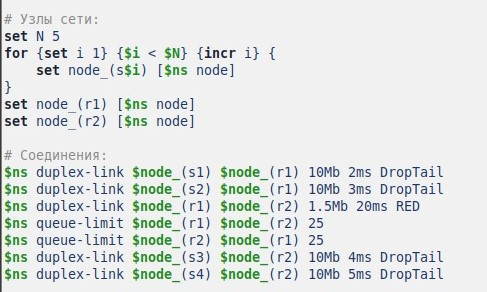{#fig:002 width=70%}

Далее необходимо по условиям задачи создать tcp-агентов и поверх наложить ftp-протокол (рис. [-@fig:003]).

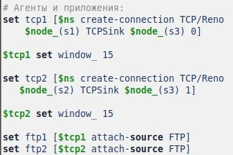{#fig:003 width=70%}

Зададим мониторинг размера окна TCP и мониторинг очереди (рис. [-@fig:004]).

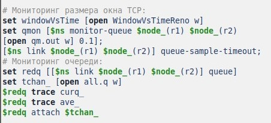{#fig:004 width=70%}

Далее необходимо описать процедуру для формирования файла с данными о размере окна TCP. Потом добавляем at-события (рис. [-@fig:005]).

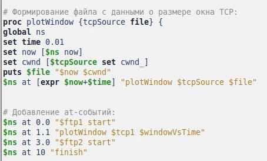{#fig:005 width=70%}

Запуская написанный скрипт, мы увидим 2 открывшихся окна xgraph. Первое окно отображает то, как менялся размер окна (поле Размер окна (Window) (длина 16 бит) содержит количество байт, которое может быть послано после байта, получение которого уже подтверждено ). (рис. [-@fig:006]).

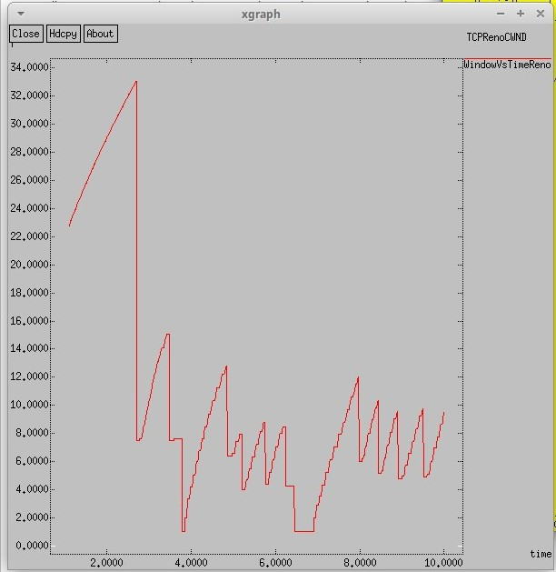{#fig:006 width=70%}

Вторым окном откроется график изменения размера очереди и средней очереди (рис. [-@fig:007]).

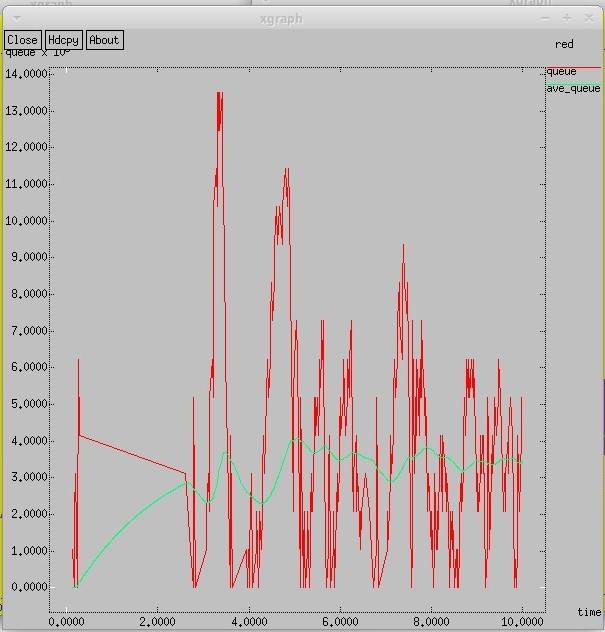{#fig:007 width=70%}

2. Выполнение упражнения

**Постановка задачи**.
- Измените в модели на узле s1 тип протокола TCP с Reno на NewReno, затем на Vegas. Сравните и поясните результаты.
- Внесите изменения при отображении окон с графиками (измените цвет фона, цвет траекторий, подписи к осям, подпись траектории в легенде).

Внесем изменения в имеющийся скрипт. Для начала изменим тип TCP с Reno на Newreno для первого узла.
```
# Агенты и приложения:
set tcp1 [$ns create-connection TCP/Newreno $node_(s1) TCPSink $node_(s3) 0]

$tcp1 set window_ 15

set tcp2 [$ns create-connection TCP/Reno $node_(s2) TCPSink $node_(s3) 1]

```

В процедуре finish для графика изменения длины очереди и средней длины очереди изменяем цвет графика.

```
    set f [open temp.queue w]
    puts $f "TitleText: red"
    puts $f "Device: Postscript"
    puts $f "0.Color: Purple"
    puts $f "1.Color: Green"
```

Изменяем подписи в легенде для графика изменения длины очереди и средней длины очереди изменяем цвет осей.

```
  puts $f \"Current_size_of_queue
    exec cat temp.q >@ $f
    puts $f \n\"Average_size_of_queue
    exec cat temp.a >@ $f
```

Изменяем подписи в легенде и цвет графика для изменения размера окна.

```
    puts $windowVsTime "0.Color: Purple"
    puts $windowVsTime \"Window_size"
```

Снова открываются 2 окна. График изменения размера окна (рис. [-@fig:008]).

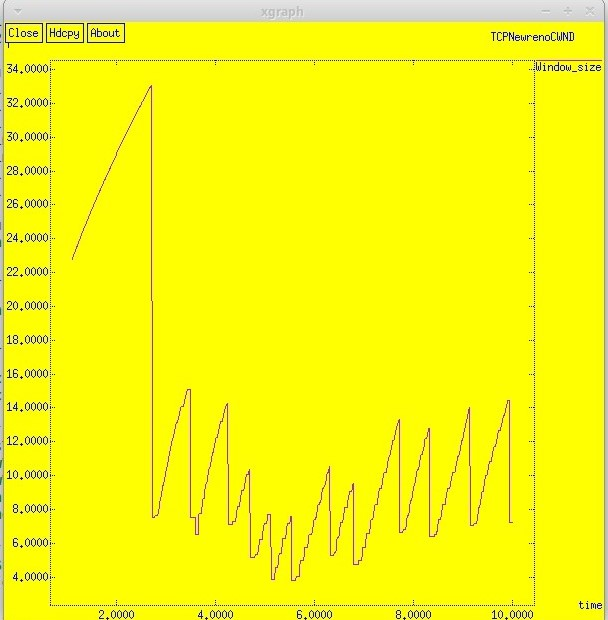{#fig:008 width=70%}

Вторым окном откроется график изменения размера очереди и средней очереди (рис. [-@fig:009]).

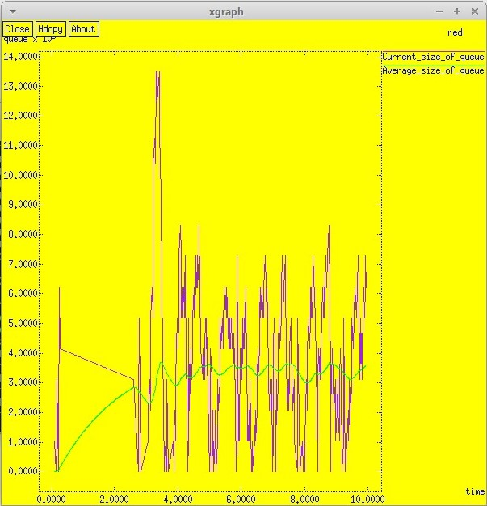{#fig:009 width=70%}

После этого внесем изменения в имеющийся скрипт: изменим тип TCP с Newreno на Vegas для первого узла.
```
# Агенты и приложения:
set tcp1 [$ns create-connection TCP/Vegas $node_(s1) TCPSink $node_(s3) 0]

$tcp1 set window_ 15
set tcp2 [$ns create-connection TCP/Reno $node_(s2) TCPSink $node_(s3) 1]

```

Снова открываются 2 окна. График изменения размера окна (рис. [-@fig:010]).

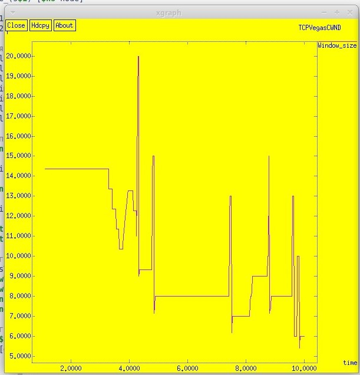{#fig:010 width=70%}

Вторым окном откроется график изменения размера очереди и средней очереди (рис. [-@fig:011]).

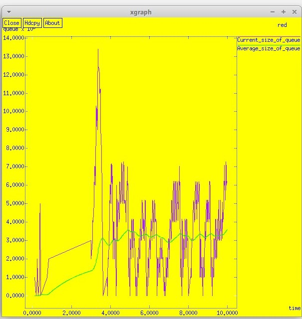{#fig:011 width=70%}


# Выводы

В ходе выполнения лабораторной работы я приобрела навыки моделирования сетей передачи данных с помощью средства имитационного моделирования NS-2, а также провела анализ полученных результатов моделирования. Помимо этого, я ознакомилась с протоколом TCP и алгоритмом управления очередью RED.

