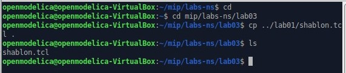
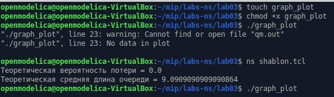
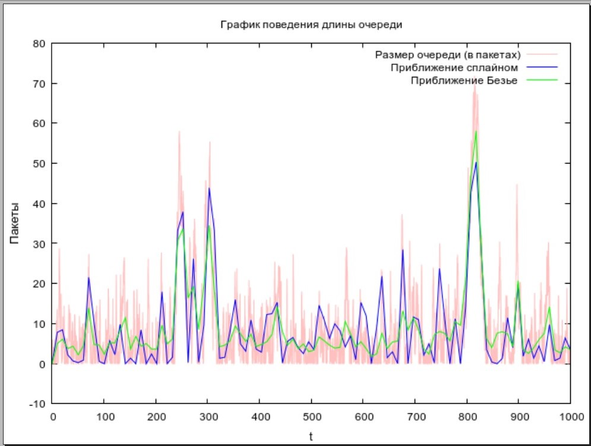

---
## Front matter
lang: ru-RU
title: "Лабораторная работа №3"
subtitle: "Моделирование стохастических процессов"
author: 
  - Астраханцева А. А.
institute:
  - Российский университет дружбы народов, Москва, Россия
date: 22 февраля 2025

## i18n babel
babel-lang: russian
babel-otherlangs: english

## Formatting pdf
toc: false
toc-title: Содержание
slide_level: 2
aspectratio: 169
section-titles: true
theme: metropolis
header-includes:
 - \metroset{progressbar=frametitle,sectionpage=progressbar,numbering=fraction}
---

# Информация

## Докладчик

:::::::::::::: {.columns align=center}
::: {.column width="70%"}

  * Астраханцева Анастасия Александровна
  * НФИбд-01-22, 1132226437
  * Российский университет дружбы народов
  * [1132226437@pfur.ru](mailto:1132226437@pfur.ru)
  * <https://github.com/aaastrakhantseva>

:::
::: {.column width="30%"}


:::
::::::::::::::

# Вводная часть

## Цели лабораторной работы

Приобретение навыков моделирования стохастических процессов с помощью средства имитационного моделирования NS-2, а также знакомство с программой для построения графиков GNUplot.

## Задачи

1. Ознакомление с теоретической сводкой.
2. Написание скрипта для реализации модели массового обслуживания на ns-2
3. Написание скрипта для построения графика в GNUplot

# Выполнение ЛР

## Создание необходимых директорий и файла

{#fig:001 width=70%}

## Скрипт для сиуляции на ns-2 

```
# создание объекта Simulator
set ns [new Simulator]
# открытие на запись файла out.tr для регистрации событий
set tf [open out.tr w]
$ns trace-all $tf
# задаём значения параметров системы
set lambda 30.0
set mu 33.0
# размер очереди для M|M|1 (для M|M|1|R: set qsize R)
set qsize 100000
# устанавливаем длительность эксперимента
set duration 1000.0
```

## Узлы и связи, ограничения на размер очереди

```
# задаём узлы и соединяем их симплексным соединением
# с полосой пропускания 100 Кб/с и задержкой 0 мс,
# очередью с обслуживанием типа DropTail
set n1 [$ns node]
set n2 [$ns node]
set link [$ns simplex-link $n1 $n2 100kb 0ms DropTail]

# наложение ограничения на размер очереди:
$ns queue-limit $n1 $n2 $qsize
```

## Распределения интервалов времени

```
# задаём распределения интервалов времени
# поступления пакетов и размера пакетов
set InterArrivalTime [new RandomVariable/Exponential]
$InterArrivalTime set avg_ [expr 1/$lambda]

set pktSize [new RandomVariable/Exponential]
$pktSize set avg_ [expr 100000.0/(8*$mu)]
```

## Создание агента UDP и присоединение его к источнику

```
# задаём агент UDP и присоединяем его к источнику,
# задаём размер пакета
set src [new Agent/UDP]
$src set packetSize_ 100000
$ns attach-agent $n1 $src

# задаём агент-приёмник и присоединяем его
set sink [new Agent/Null]
$ns attach-agent $n2 $sink
$ns connect $src $sink

```

## Мониторинг очереди и процедура finish

```
# мониторинг очереди
set qmon [$ns monitor-queue $n1 $n2 [open qm.out w] 0.1]
$link queue-sample-timeout

# процедура finish закрывает файлы трассировки
proc finish {} {
global ns tf
$ns flush-trace
close $tf
exit 0
}
```

## Процедура случайного генерирования пакетов и планировщик событий 

```
# процедура случайного генерирования пакетов
proc sendpacket {} {
global ns src InterArrivalTime pktSize
set time [$ns now]
$ns at [expr $time +[$InterArrivalTime value]] "sendpacket"
set bytes [expr round ([$pktSize value])]
$src send $bytes
}
# планировщик событий
$ns at 0.0001 "sendpacket"
$ns at $duration "finish"
```

## Расчет характеристик системы и запуск модели

```
# расчет загрузки системы и вероятности потери пакетов
set rho [expr $lambda/$mu]
set ploss [expr (1-$rho)*pow($rho,$qsize)/(1-pow($rho,($qsize+1)))]
puts "Теоретическая вероятность потери = $ploss"

set aveq [expr $rho*$rho/(1-$rho)]
puts "Теоретическая средняя длина очереди = $aveq"
# запуск модели
$ns run

```

## Скрипт для файла graph_plot

```
#!/usr/bin/gnuplot -persist
# задаём текстовую кодировку,
# тип терминала, тип и размер шрифта
set encoding utf8
set term pngcairo font "Helvetica,9"
# задаём выходной файл графика
set out 'qm.pdf'
# задаём название графика
set title "График поведения длины очереди"
# подписи осей графика
set xlabel "t" font "Helvetica, 10"
set ylabel "Пакеты" font "Helvetica, 10"
```

## Скрипт для файла graph_plot

```
# построение графика, используя значения
# 1-го и 5-го столбцов файла qm.out
plot "qm.out" using ($1):($5) with lines lt rgb "pink" title "Размер очереди (в пакетаx)",\
     "qm.out" using ($1):($5) smooth csplines lt rgb "blue" title "Приближение сплайном ",\
     "qm.out" using ($1):($5) smooth bezier lt rgb "green" title "Приближение Безье "
```

## Запуск симуляции

{#fig:002 width=70%}

## Результат симуляции

{#fig:003 width=70%}

## Выводы

В ходе выполнения лабораторной работы я приобрела навыки моделирования стохастических процессов с помощью средства имитационного моделирования NS-2, а также познакомилась с программой для построения графиков GNUplot. 


# Спасибо за внимание!
