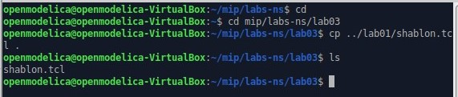
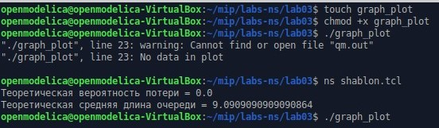
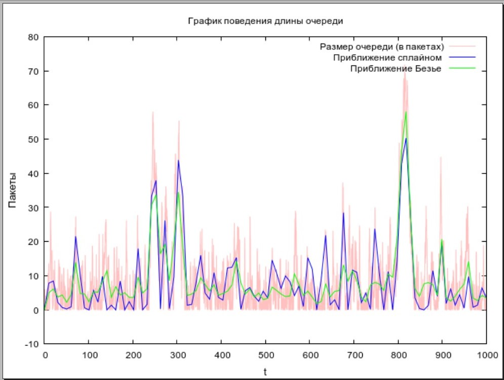

---
## Front matter
title: "Лабораторная работа №3"
subtitle: "Моделирование стохастических процессов"
author: "Астраханцева А. А."

## Generic otions
lang: ru-RU
toc-title: "Содержание"

## Bibliography
bibliography: bib/cite.bib
csl: pandoc/csl/gost-r-7-0-5-2008-numeric.csl

## Pdf output format
toc: true # Table of contents
toc-depth: 2
lof: true # List of figures
lot: false # List of tables
fontsize: 12pt
linestretch: 1.5
papersize: a4
documentclass: scrreprt
## I18n polyglossia
polyglossia-lang:
  name: russian
  options:
	- spelling=modern
	- babelshorthands=true
polyglossia-otherlangs:
  name: english
## I18n babel
babel-lang: russian
babel-otherlangs: english
## Fonts
mainfont: PT Serif
romanfont: PT Serif
sansfont: PT Sans
monofont: PT Mono
mainfontoptions: Ligatures=TeX
romanfontoptions: Ligatures=TeX
sansfontoptions: Ligatures=TeX,Scale=MatchLowercase
monofontoptions: Scale=MatchLowercase,Scale=0.9
## Biblatex
biblatex: true
biblio-style: "gost-numeric"
biblatexoptions:
  - parentracker=true
  - backend=biber
  - hyperref=auto
  - language=auto
  - autolang=other*
  - citestyle=gost-numeric
## Pandoc-crossref LaTeX customization
figureTitle: "Рис."
tableTitle: "Таблица"
listingTitle: "Листинг"
lofTitle: "Список иллюстраций"
lotTitle: "Список таблиц"
lolTitle: "Листинги"
## Misc options
indent: true
header-includes:
  - \usepackage{indentfirst}
  - \usepackage{float} # keep figures where there are in the text
  - \floatplacement{figure}{H} # keep figures where there are in the text
---

# Цель работы

Приобретение навыков моделирования стохастических процессов с помощью средства имитационного моделирования NS-2, а также знакомство с программой для построения графиков GNUplot. 

# Задание

1. Ознакомление с теоретической сводкой.
2. Написание скрипта для реализации модели массового обслуживания на ns-2
3. Написание скрипта для построения графика в GNUplot

# Выполнение лабораторной работы

Для начала  создам директорию для файлов третьей ЛР. В нее скопирую файл shablon.tcl из первой ЛР (В дальнейшем переименую) (рис. [-@fig:001]).

{#fig:001 width=70%}

В созданный файл помещу данный скрип для реализации модели массового обслуживания на ns-2 

```
# создание объекта Simulator
set ns [new Simulator]
# открытие на запись файла out.tr для регистрации событий
set tf [open out.tr w]
$ns trace-all $tf
# задаём значения параметров системы
set lambda 30.0
set mu 33.0
# размер очереди для M|M|1 (для M|M|1|R: set qsize R)
set qsize 100000
# устанавливаем длительность эксперимента
set duration 1000.0
# задаём узлы и соединяем их симплексным соединением
# с полосой пропускания 100 Кб/с и задержкой 0 мс,
# очередью с обслуживанием типа DropTail
set n1 [$ns node]
set n2 [$ns node]
set link [$ns simplex-link $n1 $n2 100kb 0ms DropTail]

# наложение ограничения на размер очереди:
$ns queue-limit $n1 $n2 $qsize

# задаём распределения интервалов времени
# поступления пакетов и размера пакетов
set InterArrivalTime [new RandomVariable/Exponential]
$InterArrivalTime set avg_ [expr 1/$lambda]

set pktSize [new RandomVariable/Exponential]
$pktSize set avg_ [expr 100000.0/(8*$mu)]

# задаём агент UDP и присоединяем его к источнику,
# задаём размер пакета
set src [new Agent/UDP]
$src set packetSize_ 100000
$ns attach-agent $n1 $src

# задаём агент-приёмник и присоединяем его
set sink [new Agent/Null]
$ns attach-agent $n2 $sink
$ns connect $src $sink

# мониторинг очереди
set qmon [$ns monitor-queue $n1 $n2 [open qm.out w] 0.1]
$link queue-sample-timeout

# процедура finish закрывает файлы трассировки
proc finish {} {
global ns tf
$ns flush-trace
close $tf
exit 0
}

# процедура случайного генерирования пакетов
proc sendpacket {} {
global ns src InterArrivalTime pktSize
set time [$ns now]
$ns at [expr $time +[$InterArrivalTime value]] "sendpacket"
set bytes [expr round ([$pktSize value])]
$src send $bytes
}
# планировщик событий
$ns at 0.0001 "sendpacket"
$ns at $duration "finish"

# расчет загрузки системы и вероятности потери пакетов
set rho [expr $lambda/$mu]
set ploss [expr (1-$rho)*pow($rho,$qsize)/(1-pow($rho,($qsize+1)))]
puts "Теоретическая вероятность потери = $ploss"

set aveq [expr $rho*$rho/(1-$rho)]
puts "Теоретическая средняя длина очереди = $aveq"
# запуск модели
$ns run

```


Далее создадим файл graph_plot, сделаем файл исполняемым. Далее в него нужно написать следующий скрипт:
```
#!/usr/bin/gnuplot -persist
# задаём текстовую кодировку,
# тип терминала, тип и размер шрифта

set encoding utf8
set term pngcairo font "Helvetica,9"

# задаём выходной файл графика
set out 'qm.pdf'

# задаём название графика

set title "График поведения длины очереди"
# подписи осей графика

set xlabel "t" font "Helvetica, 10"
set ylabel "Пакеты" font "Helvetica, 10"

# построение графика, используя значения
# 1-го и 5-го столбцов файла qm.out
plot "qm.out" using ($1):($5) with lines lt rgb "pink" title "Размер очереди (в пакетаx)",\
     "qm.out" using ($1):($5) smooth csplines lt rgb "blue" title "Приближение сплайном ",\
     "qm.out" using ($1):($5) smooth bezier lt rgb "green" title "Приближение Безье "
```
После этого запустим симуляцию ns-2, появится файл qm.out (рис. [-@fig:002]).

{#fig:002 width=70%}

Запустим скрипт graph_plot, который создаст нам файл qm.pdf, который будет содержать график изменения длины очереди, приближение сплайном и приближение Безье для данного процесса (рис. [-@fig:003]).

{#fig:003 width=70%}


# Выводы

В ходе выполнения лабораторной работы я приобрела навыки моделирования стохастических процессов с помощью средства имитационного моделирования NS-2, а также познакомилась с программой для построения графиков GNUplot. 


