---
## Front matter
lang: ru-RU
title: "Лабораторная работа №5"
subtitle: "Модель эпидемии (SIR)"
author: 
  - Астраханцева А. А.
institute:
  - Российский университет дружбы народов, Москва, Россия
date: 6 марта 2025

## i18n babel
babel-lang: russian
babel-otherlangs: english

## Formatting pdf
toc: false
toc-title: Содержание
slide_level: 2
aspectratio: 169
section-titles: true
theme: metropolis
header-includes:
 - \metroset{progressbar=frametitle,sectionpage=progressbar,numbering=fraction}
---

# Информация

## Докладчик

:::::::::::::: {.columns align=center}
::: {.column width="70%"}

  * Астраханцева Анастасия Александровна
  * НФИбд-01-22, 1132226437
  * Российский университет дружбы народов
  * [1132226437@pfur.ru](mailto:1132226437@pfur.ru)
  * <https://github.com/aaastrakhantseva>

:::
::: {.column width="30%"}

:::
::::::::::::::

# Вводная часть

## Цели лабораторной работы

Приобретение навыков моделирования математических моделей с помощью средства имитационного моделирования Scilab, xcos и языка Modelica. 

## Задачи

1. Реализовать модель в xcos
2. Реализовать модель с помощью блока Modelica в xcos;
3. Реализовать модель SIR в OpenModelica.
4. Реализовать модель SIR с учётом процесса рождения / гибели особей в xcos (в том числе и с использованием блока Modelica), а также в OpenModelica;
5. Построить графики эпидемического порога при различных значениях параметров
модели (в частности изменяя параметр $\mu$);
6. Сделать анализ полученных графиков в зависимости от выбранных значений
параметров модели.

# Выполнение ЛР

## Описание модели

$$
\begin{cases}
  \dot s = - \beta s(t)i(t) \\
  \dot i = \beta s(t)i(t) - \nu i(t) \\
  \dot r = \nu i(t) ,
\end{cases}
$$

где $\beta$ -- скорость заражения, $\nu$ -- скорость выздоровления.

# Реализация модели в xcos

## Переменные окружения

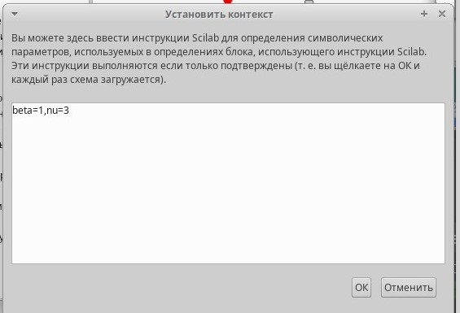{#fig:001 width=70%}

## Описание блоков

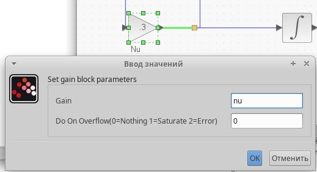{#fig:002 width=70%}

## Описание блоков

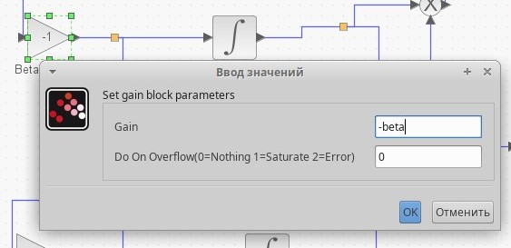{#fig:003 width=70%}

## Описание блоков

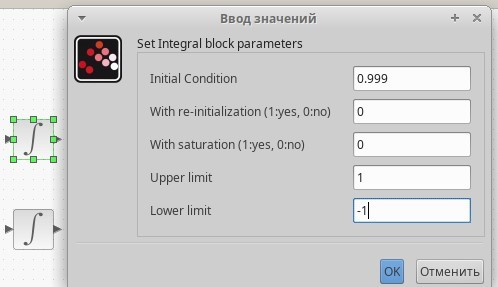{#fig:004 width=70%}

## Описание блоков

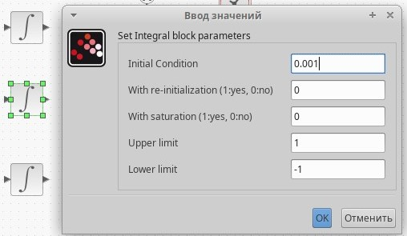{#fig:005 width=70%}

## Описание блоков

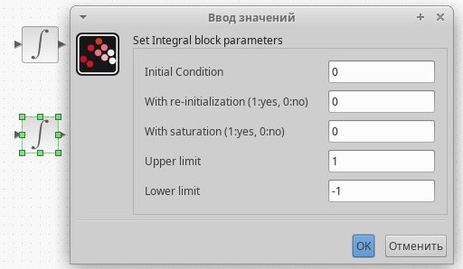{#fig:006 width=70%}

## Настройка моделирования

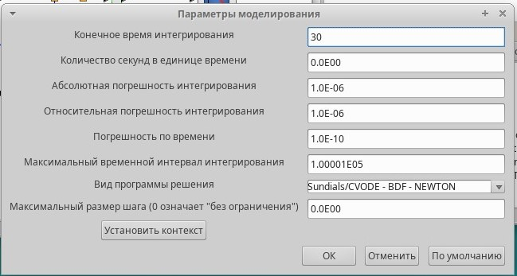{#fig:007 width=70%}

## Описание блоков

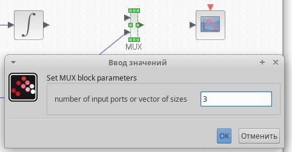{#fig:008 width=70%}

## Описание блоков

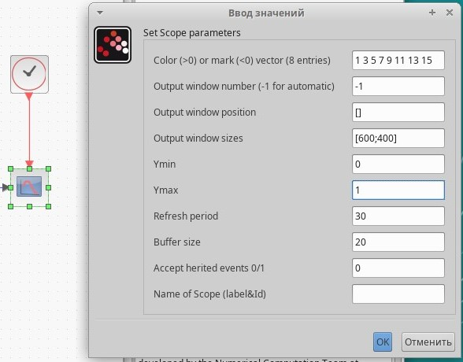{#fig:009 width=70%}

## Описание блоков

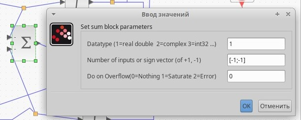{#fig:010 width=70%}

## Полученная схема

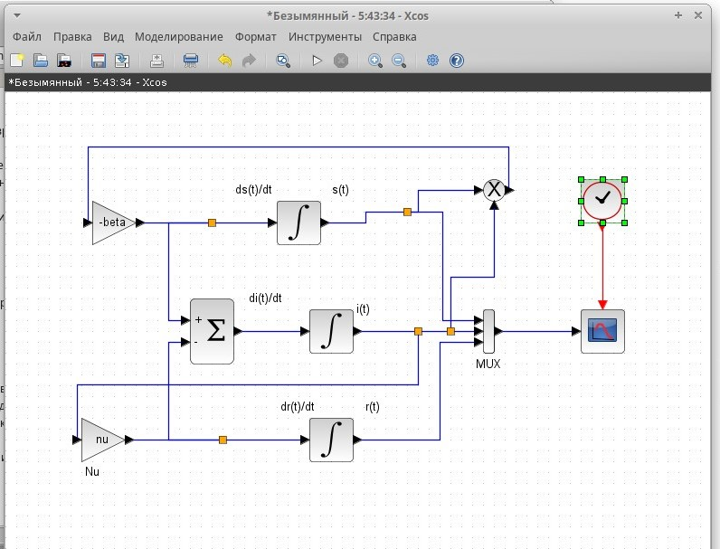{#fig:011 width=70%}

## График распространения эпидемии 

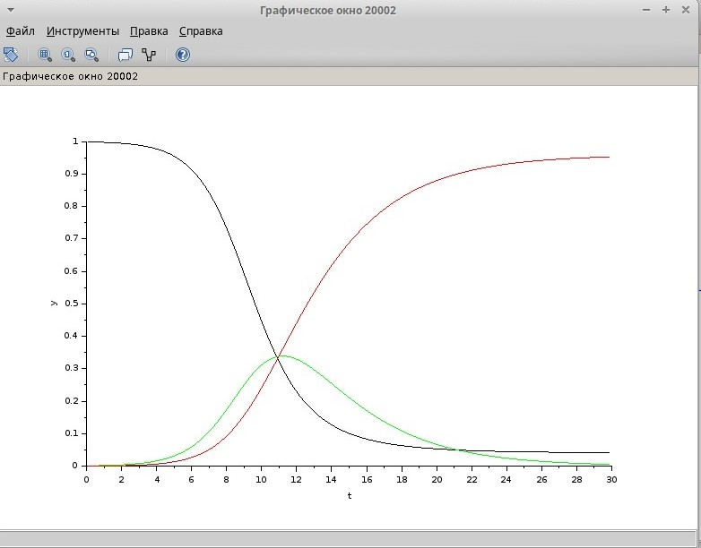{#fig:012 width=70%}

# Реализация модели с помощью блока Modelica в xcos

## Параметры блока Modelica

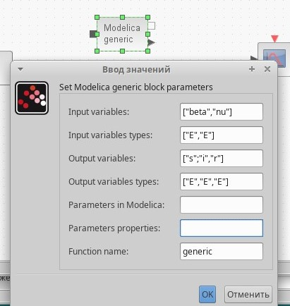{#fig:013 width=70%}

##  Код на языке Modelica

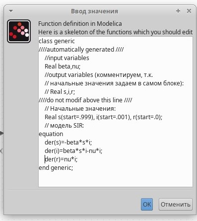{#fig:014 width=70%}

## Полученная схема

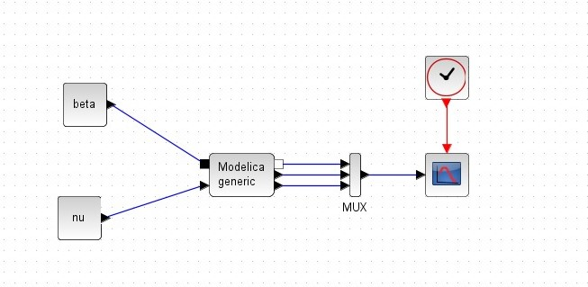{#fig:015 width=70%}

## График распространения эпидемии 

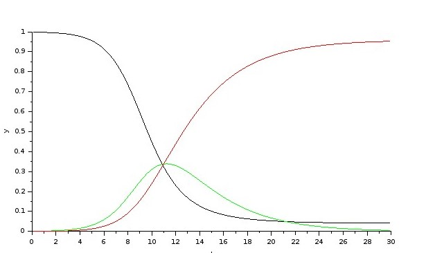{#fig:016 width=70%}

# Реализация модели SIR в OpenModelica

## Создание нового класса в OMEdit

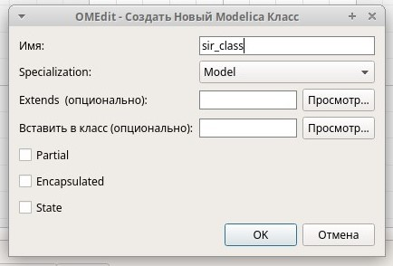{#fig:017 width=70%}

## Параметры моделирования

{#fig:018 width=70%}

## Реализация класса

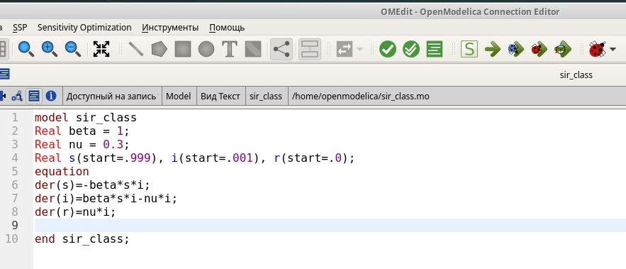{#fig:019 width=70%}

## График распространения эпидемии

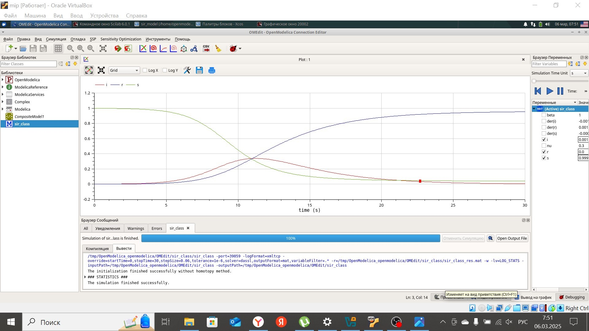{#fig:020 width=70%}

# Задание для самостоятельного выполнения в xcos

## Описание модели

$$
\begin{cases}
  \dot s = - \beta s(t)i(t) + \mu(N - s(t)); \\
  \dot i = \beta s(t)i(t) - \nu i(t) - \mu i(t); \\
  \dot r = \nu i(t) - \mu r(t),
\end{cases}
$$
где $\mu$ — константа, которая равна коэффициенту смертности и рождаемости.

## Переменные окружения

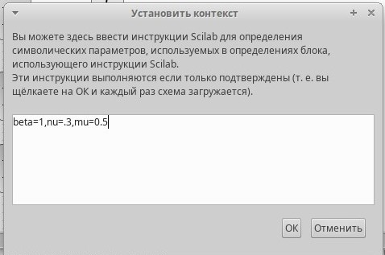{#fig:021 width=70%}

## Полученная схема

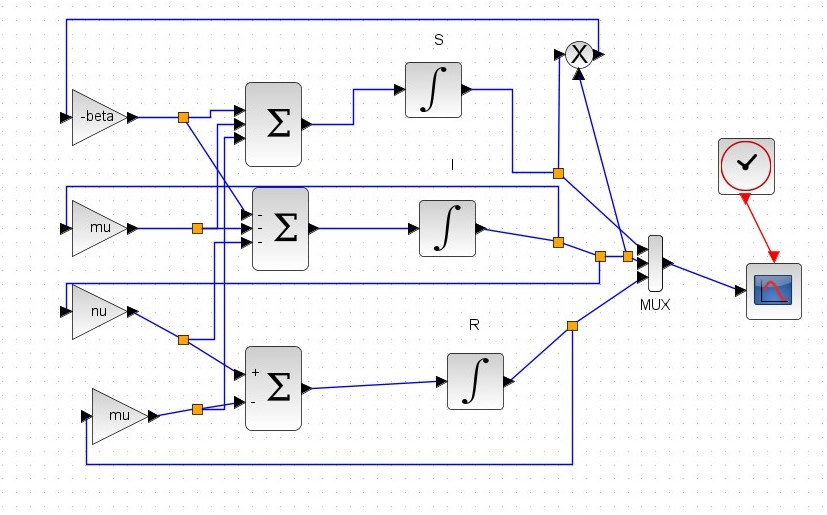{#fig:022 width=70%}

## График распространения эпидемии

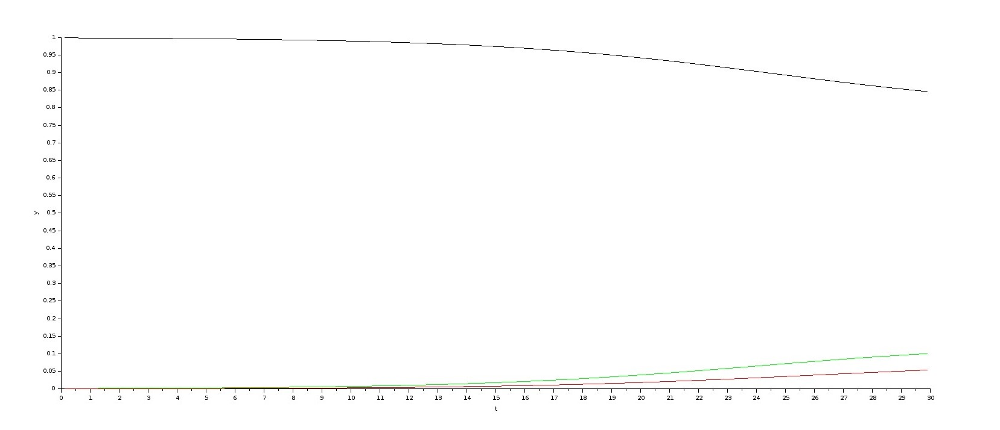{#fig:023 width=70%}

## График распространения эпидемии: время моделирования - 60 секунд

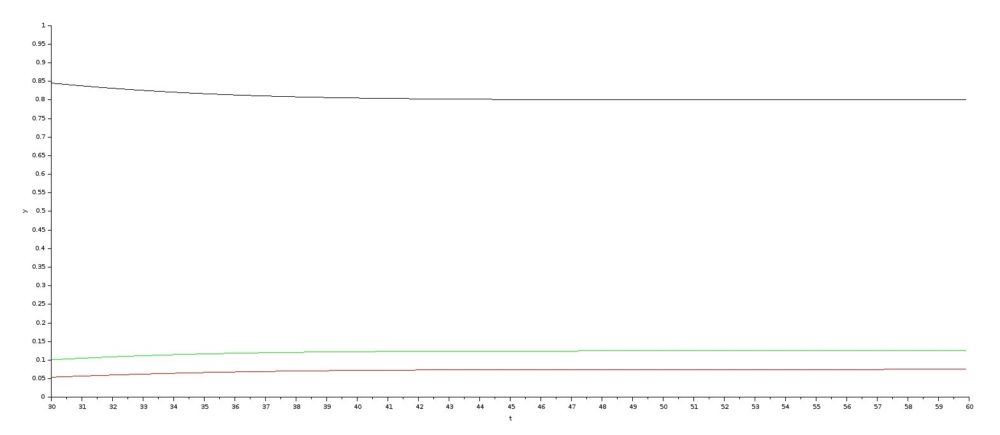{#fig:024 width=70%}

## График распространения эпидемии: $\mu = 0.1$

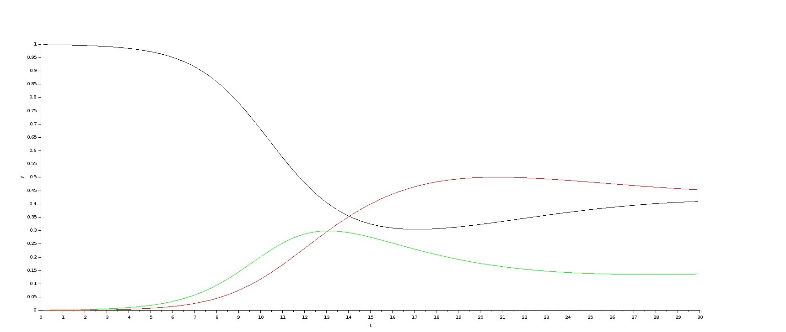{#fig:025 width=70%}

## График распространения эпидемии: $\mu = 0.9$

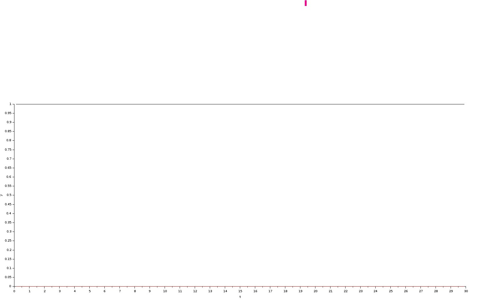{#fig:026 width=70%}

# Задание для самостоятельного выполнения с помощью блока Modelica в xcos

## Параметры блока Modelica

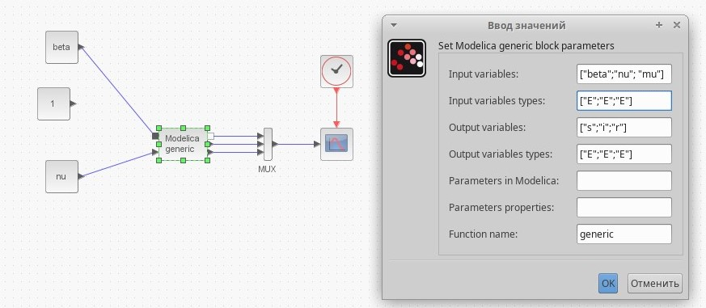{#fig:027 width=70%}

##  Код на языке Modelica

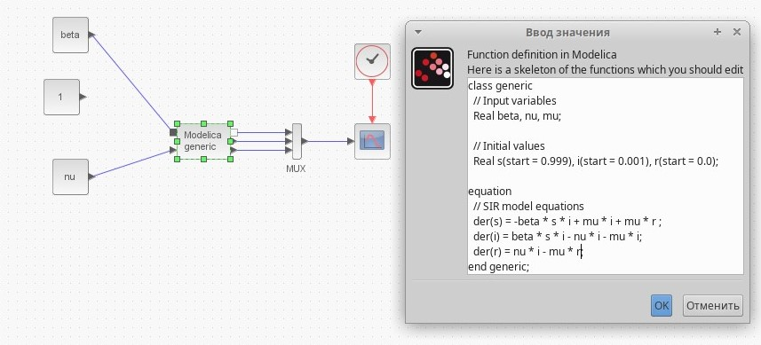{#fig:028 width=70%}

## График распространения эпидемии: $\mu = 0.5, \beta = 3$

{#fig:029 width=70%}

## График распространения эпидемии: $\mu = 0.1$

{#fig:030 width=70%}

# Задание для самостоятельного выполнения в OpenModelica

## Реализация класса

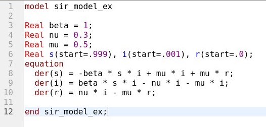{#fig:031 width=70%}

## График распространения эпидемии: $\mu = 0.5, \beta = 3$

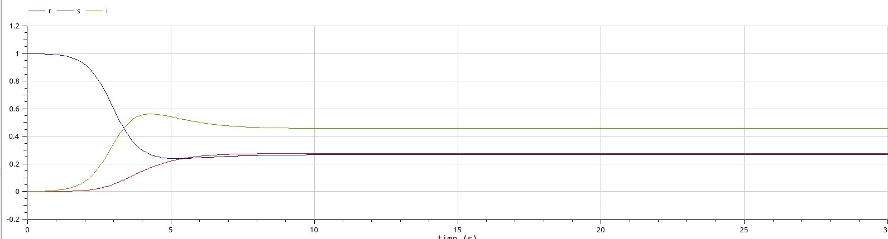{#fig:032 width=70%}

## Выводы

В ходе выполнения лабораторной работы я приобрела навыки моделирования математических моделей с помощью средства имитационного моделирования Scilab, xcos и языка Modelica. 

# Спасибо за внимание!
