---
## Front matter
title: "Лабораторная работа №5"
subtitle: "Модель эпидемии (SIR)"
author: "Астраханцева А. А."

## Generic otions
lang: ru-RU
toc-title: "Содержание"

## Bibliography
bibliography: bib/cite.bib
csl: pandoc/csl/gost-r-7-0-5-2008-numeric.csl

## Pdf output format
toc: true # Table of contents
toc-depth: 2
lof: true # List of figures
lot: false # List of tables
fontsize: 12pt
linestretch: 1.5
papersize: a4
documentclass: scrreprt
## I18n polyglossia
polyglossia-lang:
  name: russian
  options:
	- spelling=modern
	- babelshorthands=true
polyglossia-otherlangs:
  name: english
## I18n babel
babel-lang: russian
babel-otherlangs: english
## Fonts
mainfont: PT Serif
romanfont: PT Serif
sansfont: PT Sans
monofont: PT Mono
mainfontoptions: Ligatures=TeX
romanfontoptions: Ligatures=TeX
sansfontoptions: Ligatures=TeX,Scale=MatchLowercase
monofontoptions: Scale=MatchLowercase,Scale=0.9
## Biblatex
biblatex: true
biblio-style: "gost-numeric"
biblatexoptions:
  - parentracker=true
  - backend=biber
  - hyperref=auto
  - language=auto
  - autolang=other*
  - citestyle=gost-numeric
## Pandoc-crossref LaTeX customization
figureTitle: "Рис."
tableTitle: "Таблица"
listingTitle: "Листинг"
lofTitle: "Список иллюстраций"
lotTitle: "Список таблиц"
lolTitle: "Листинги"
## Misc options
indent: true
header-includes:
  - \usepackage{indentfirst}
  - \usepackage{float} # keep figures where there are in the text
  - \floatplacement{figure}{H} # keep figures where there are in the text
---

# Цель работы

Приобретение навыков моделирования математических моделей с помощью средства имитационного моделирования Scilab, xcos и языка Modelica. 

# Задание

1. Реализовать модель в xcos
2. Реализовать модель с помощью блока Modelica в xcos;
3. Реализовать модель SIR в OpenModelica.
4. Реализовать модель SIR с учётом процесса рождения / гибели особей в xcos (в том числе и с использованием блока Modelica), а также в OpenModelica;
5. Построить графики эпидемического порога при различных значениях параметров
модели (в частности изменяя параметр $\mu$);
6. Сделать анализ полученных графиков в зависимости от выбранных значений
параметров модели.

# Теоретическое введение

Предполагается, что особи популяции размера N могут находиться в трёх различных состояниях:

- S(susceptible, уязвимые) — здоровые особи, которые находятся в группе риска и могут подхватить инфекцию;

- I(infective, заражённые, распространяющие заболевание) — заразившиеся переносчики болезни;

- R(recovered/removed, вылечившиеся) — те, кто выздоровел и перестал распространять болезнь (в эту категорию относят, например, приобретших иммунитет или умерших). Внутри каждой из выделенных групп особи считаются неразличимыми по свойствам. Типичная эволюция особи популяции описывается следующей диаграммой:

*S->I->R*

Считаем, что система замкнута, т.е. N=S+I+R.

Задача о распространении эпидемии описывается системой дифференциальных уравнений:

$$
\begin{cases}
  \dot s = - \beta s(t)i(t) \\
  \dot i = \beta s(t)i(t) - \nu i(t) \\
  \dot r = \nu i(t) ,
\end{cases}
$$

где $\beta$ -- скорость заражения, $\nu$ -- скорость выздоровления.


# Реализация модели в xcos

Откроем окно Scilab, далее - инструменты - визуальное программирование xcos. Зафиксируем начальные данные: $$\beta = 1, \nu = 0, 3, s(0) = 0, 999, i(0) = 0, 001, r(0) = 0$$. В меню "Моделирование -> Задать переменные окружения" зададим значения переменных $\beta$ и $\nu$ (рис. [-@fig:001]).

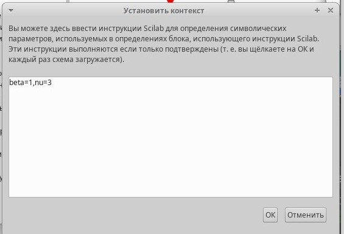{#fig:001 width=70%}

Далее начнем добавлять блоки: $GAINBLK_f$ — в данном случае позволяет задать значения коэффициентов $\beta$ и $\nu$ (рис. [-@fig:002] - [-@fig:003]).

{#fig:002 width=70%}

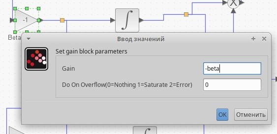{#fig:003 width=70%}

Разместим блоки интегрирования - INTEGRAL_m: В параметрах верхнего и среднего блока интегрирования необходимо задать начальные значения $$s(0) = 0, 999 и i(0) = 0, 001$$ (рис. [-@fig:004] - [-@fig:006]).

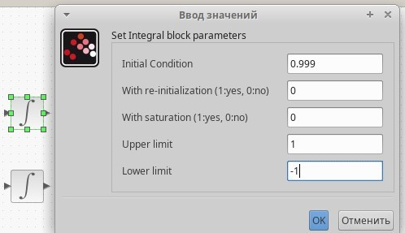{#fig:004 width=70%}

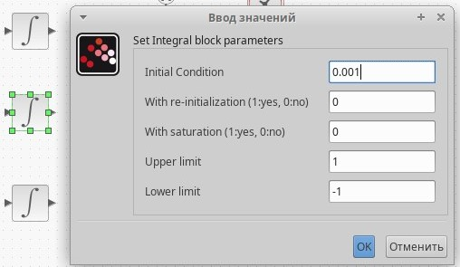{#fig:005 width=70%}

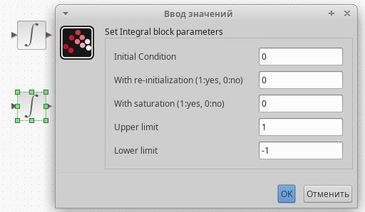{#fig:006 width=70%}

В меню "Моделирование -> Установка" необходимо задать конечное время интегрирования, равным времени моделирования (в данном случае 30) (рис. [-@fig:007]).

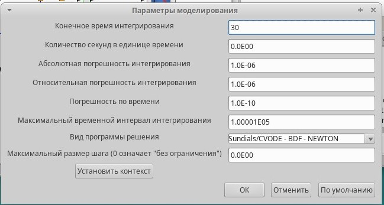{#fig:007 width=70%}

Для мультиплексора устанавливаем значение входных каналов равным 3 (рис. [-@fig:008]).

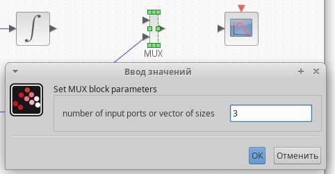{#fig:008 width=70%}

Для регистрирующего устройства - блока $CSCOPE$ - устанавливаем максимальное (1) и минимальное значение по оси Oy (рис. [-@fig:009]).

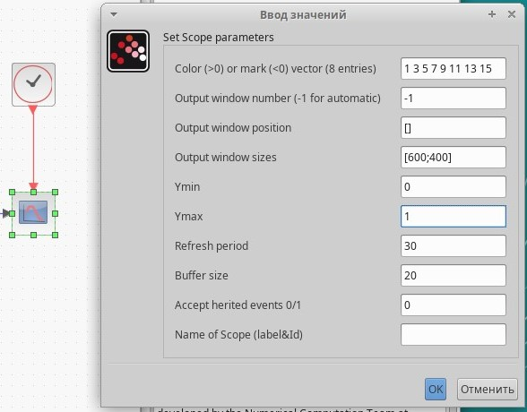{#fig:009 width=70%}

У блока суммирования изменяем значение на входе на -1 (рис. [-@fig:010]).

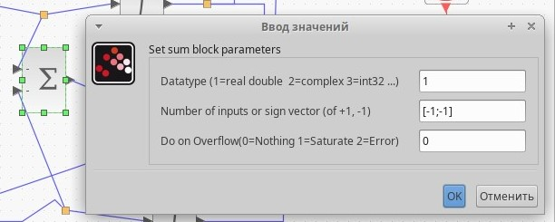{#fig:010 width=70%}

Получаем такую схему  (рис. [-@fig:011]).

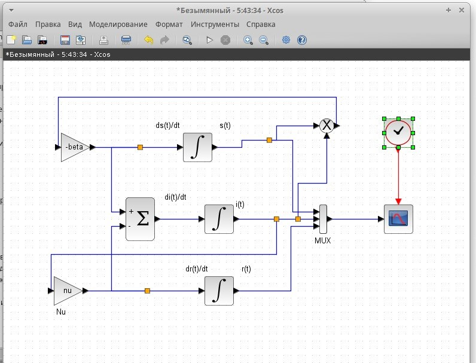{#fig:011 width=70%}

При запуске симуляции рисуется график распространения эпидемии (рис. [-@fig:012]).

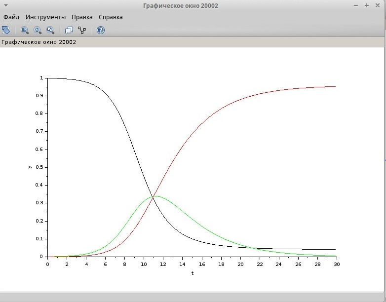{#fig:012 width=70%}

# Реализация модели с помощью блока Modelica в xcos

Для реализации модели с помощью языка Modelica помимо блоков CLOCK_c, CSCOPE, TEXT_f и MUX требуются блоки CONST_m — задаёт константу; MBLOCK (Modelica generic) — блок реализации кода на языке Modelica. Параметры блока Modelica представлены на рис. [-@fig:013]. Переменные на входе (“$\beta$”, “$\nu$”) и выходе (“s”, “i”, “r”) блока заданы как внешние (“E”).

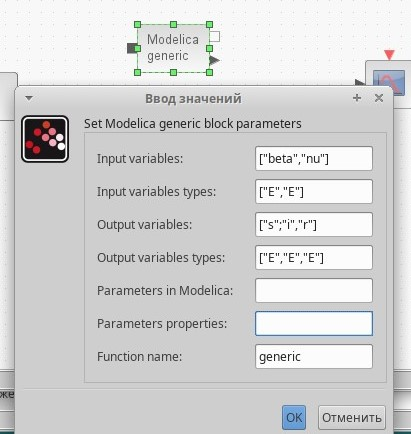{#fig:013 width=70%}

Код на языке Modelica: (рис. [-@fig:014])
```
class generic
////automatically generated ////
//input variables
Real beta,nu;
//output variables (комментируем, т.к.
// начальные значения задаем в самом блоке):
// Real s,i,r;
////do not modif above this line ////
// Начальные значения:
Real s(start=.999), i(start=.001), r(start=.0);
// модель SIR:
equation
der(s)=-beta*s*i;
der(i)=beta*s*i-nu*i;
der(r)=nu*i;
end generic;
```

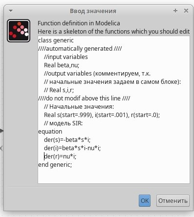{#fig:014 width=70%}

Получаем такую схему (рис. [-@fig:015]).

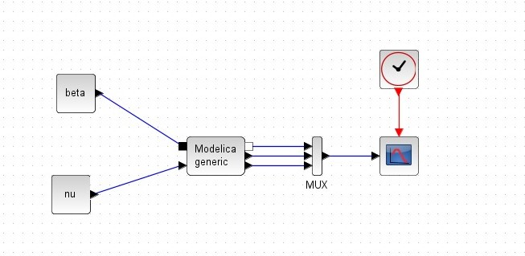{#fig:015 width=70%}

При запуске симуляции рисуется график распространения эпидемии (рис. [-@fig:016]).

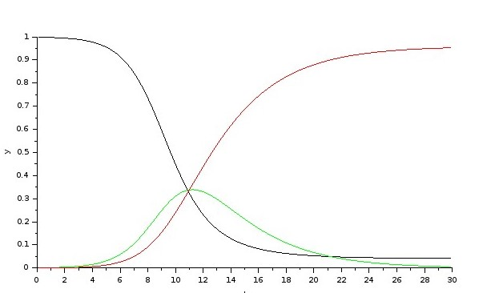{#fig:016 width=70%}

# Реализация модели SIR в OpenModelica

Открываем OMEdit, создаем новый класс (рис. [-@fig:017]).

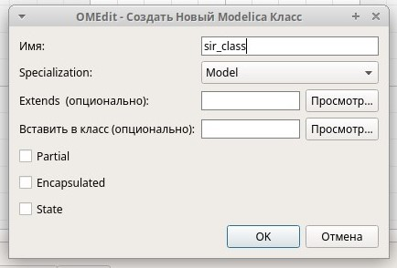{#fig:017 width=70%}

Задаем параметры моделирования, а именно - время - 30 секунд (рис. [-@fig:018]).

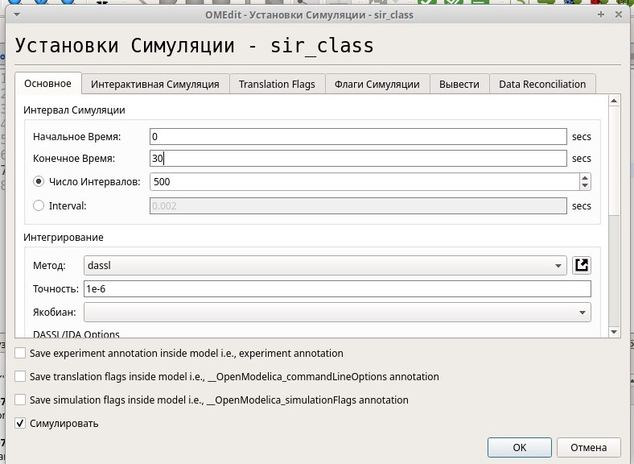{#fig:018 width=70%}

Реализация класса (рис. [-@fig:019]).

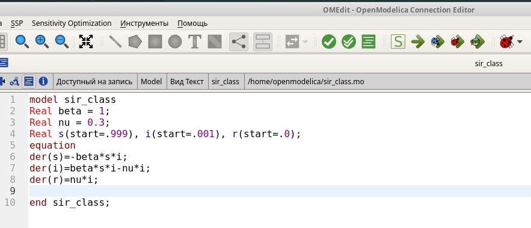{#fig:019 width=70%}

При запуске симуляции рисуется график распространения эпидемии. Он аналогичен тем, что были построены с помощью xcos (рис. [-@fig:020]).

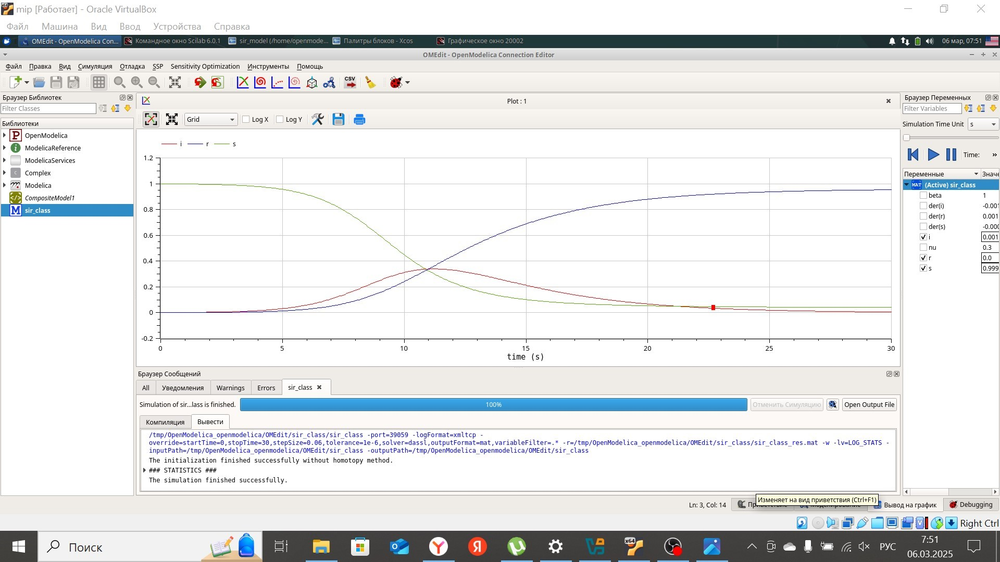{#fig:020 width=70%}

# Задание для самостоятельного выполнения в xcos

В дополнение к предположениям, которые были сделаны для модели SIR, предположим, что учитываются демографические процессы, в частности, что смертность в популяции полностью уравновешивает рождаемость, а все рожденные индивидуумы появляются на свет абсолютно здоровыми. Тогда получим следующую систему уравнений:

$$
\begin{cases}
  \dot s = - \beta s(t)i(t) + \mu(N - s(t)); \\
  \dot i = \beta s(t)i(t) - \nu i(t) - \mu i(t); \\
  \dot r = \nu i(t) - \mu r(t),
\end{cases}
$$
где $\mu$ — константа, которая равна коэффициенту смертности и рождаемости.

Зададим значения переменных $\beta$, $\nu$ и $\mu$ (рис. [-@fig:021]).

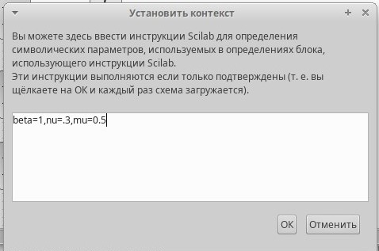{#fig:021 width=70%}

Получаем такую схему  (рис. [-@fig:022]).

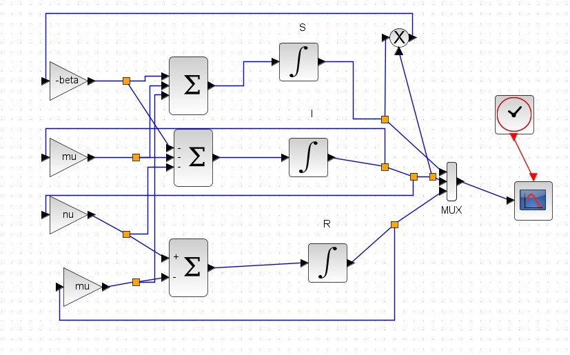{#fig:022 width=70%}

При запуске симуляции рисуется график распространения эпидемии (рис. [-@fig:023]).

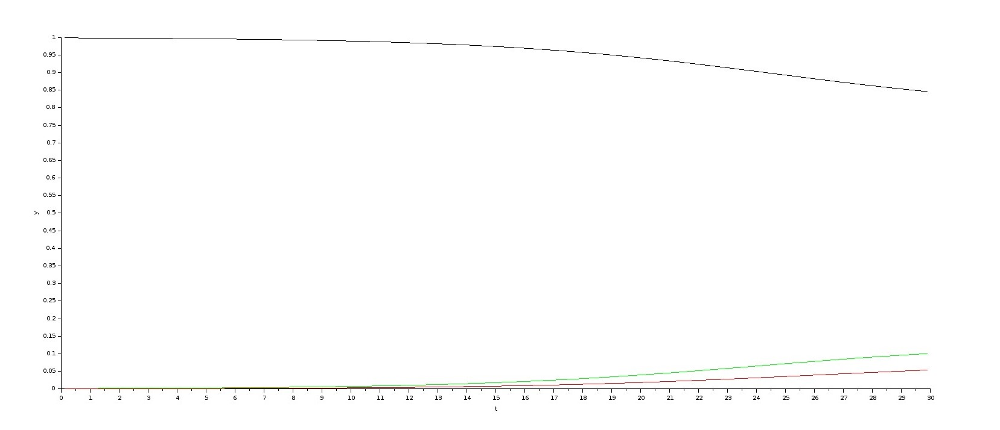{#fig:023 width=70%}

Далее я решила увеличить время моделирования до 60 секунд, оставив значение $\mu = 0.5$ (рис. [-@fig:024]).

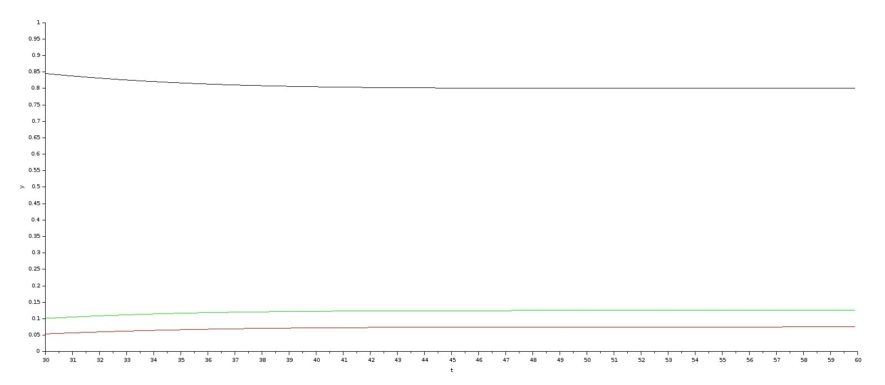{#fig:024 width=70%}

Другие варианты графиков распространения эпидемии (рис. [-@fig:025] - [-@fig:026]).

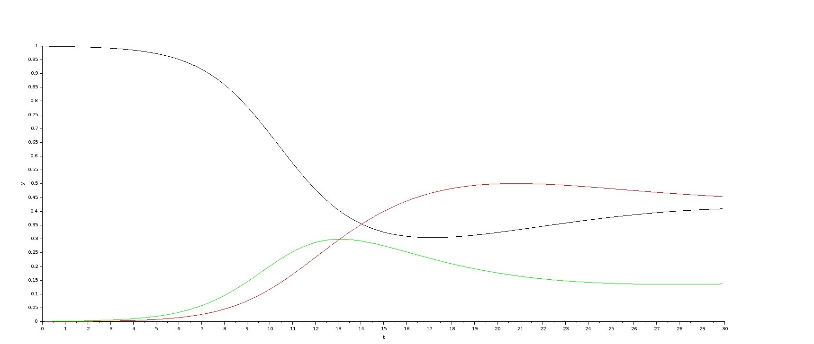{#fig:025 width=70%}

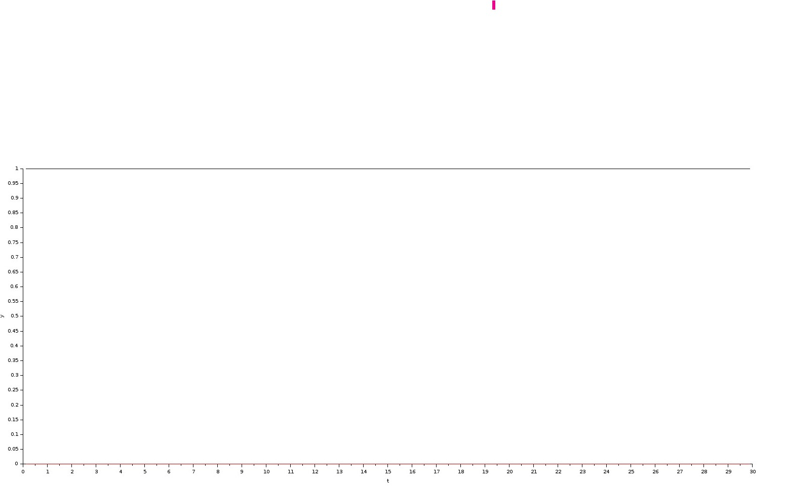{#fig:026 width=70%}

# Задание для самостоятельного выполнения с помощью блока Modelica в xcos

Параметры блока Modelica представлены на рис. [-@fig:027]. Переменные на входе (“$\beta$”, “$\nu$”) и выходе (“s”, “i”, “r”) блока заданы как внешние (“E”).

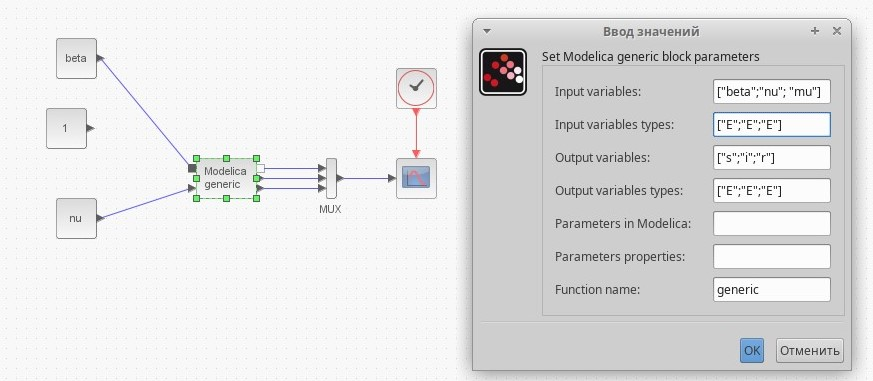{#fig:027 width=70%}

Код на языке Modelica: (рис. [-@fig:028])

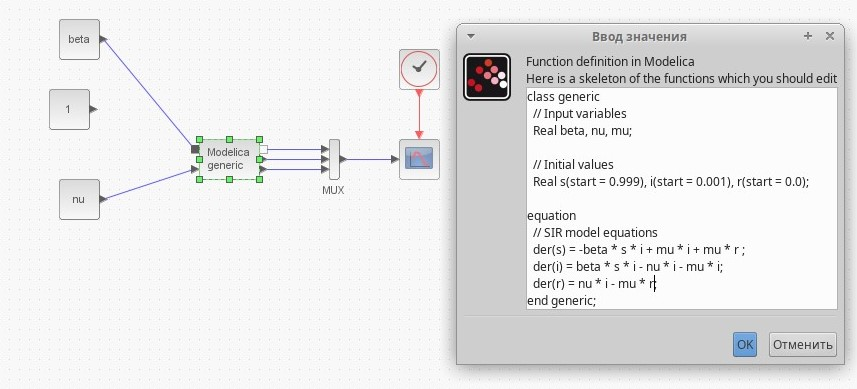{#fig:028 width=70%}

Другие варианты графиков распространения эпидемии (рис. [-@fig:029] - [-@fig:030]).

{#fig:029 width=70%}

{#fig:030 width=70%}

# Задание для самостоятельного выполнения в OpenModelica

Реализация класса (рис. [-@fig:031]).

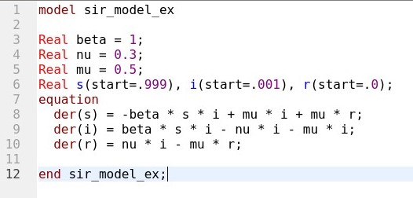{#fig:031 width=70%}

При запуске симуляции рисуется график распространения эпидемии. Он аналогичен тем, что были построены с помощью xcos (рис. [-@fig:032]).

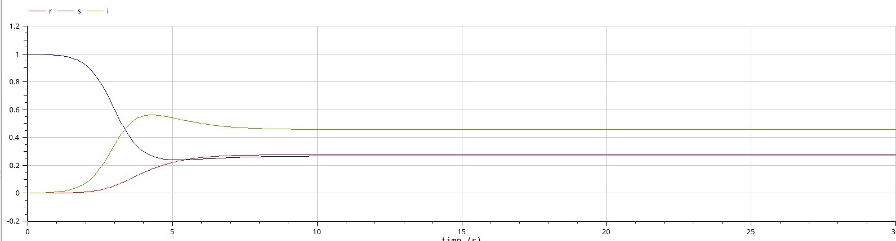{#fig:032 width=70%}

# Выводы

В ходе выполнения лабораторной работы я приобрела навыки моделирования математических моделей с помощью средства имитационного моделирования Scilab, xcos и языка Modelica. 


