---
## Front matter
lang: ru-RU
title: "Лабораторная работа №6"
subtitle: "Модель «хищник–жертва»"

author: 
  - Астраханцева А. А.
institute:
  - Российский университет дружбы народов, Москва, Россия
date: 15 марта 2025

## i18n babel
babel-lang: russian
babel-otherlangs: english

## Formatting pdf
toc: false
toc-title: Содержание
slide_level: 2
aspectratio: 169
section-titles: true
theme: metropolis
header-includes:
 - \metroset{progressbar=frametitle,sectionpage=progressbar,numbering=fraction}
---

# Информация

## Докладчик

:::::::::::::: {.columns align=center}
::: {.column width="70%"}

  * Астраханцева Анастасия Александровна
  * НФИбд-01-22, 1132226437
  * Российский университет дружбы народов
  * [1132226437@pfur.ru](mailto:1132226437@pfur.ru)
  * <https://github.com/aaastrakhantseva>

:::
::: {.column width="30%"}

:::
::::::::::::::

# Вводная часть

## Цели лабораторной работы

Реализовать модель «хищник–жертва» с помощью средства имитационного моделирования Scilab, xcos и языка Modelica.

## Задачи

1. Реализовать модель в xcos
2. Реализовать модель с помощью блока Modelica в xcos;
3. Реализовать модель в OpenModelica (упражнение).

# Выполнение ЛР

## Описание модели

$$
\begin{cases}
  \dot x = ax - bxy; \\
  \dot y = cxy - dy,
\end{cases}
$$

где $x$ — количество жертв; $y$ — количество хищников;  $a$ — коэффициент рождаемости жертв; $b$ — коэффициент убыли жертв; $c$ — коэффициент рождения хищников; $d$ — коэффициент убыли хищников.

# Реализация модели в xcos

## Переменные окружения

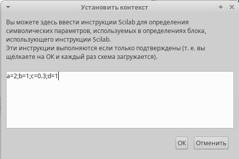{#fig:001 width=70%}

## Описание блоков

:::::::::::::: {.columns align=center}
::: {.column width="70%"}

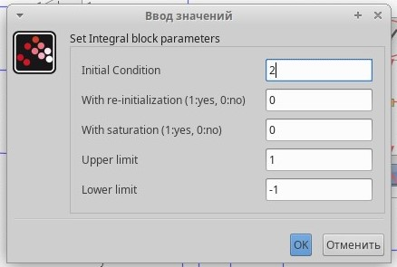{#fig:002 width=70%}

:::
::: {.column width="30%"}

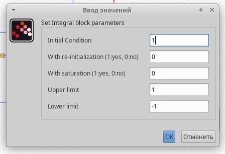{#fig:003 width=70%}

:::
::::::::::::::

## Полученная схема

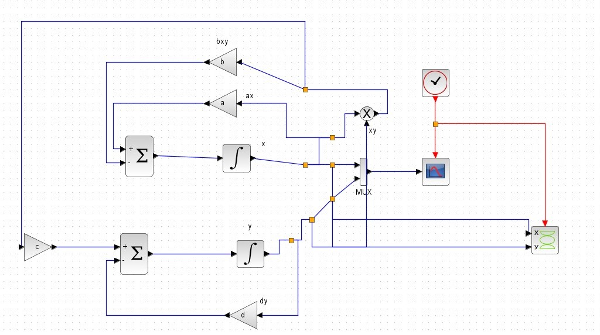{#fig:004 width=70%}

## График изменения численности хищников и жертв

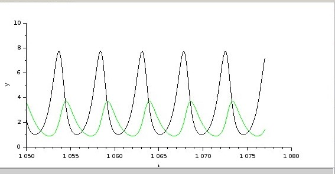{#fig:005 width=70%}

## Изображение фазового портрета

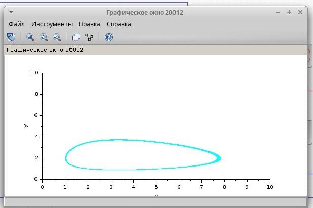{#fig:006 width=70%}

# Реализация модели с помощью блока Modelica в xcos

## Параметры блока Modelica

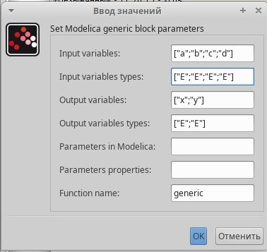{#fig:008 width=70%}

##  Код на языке Modelica

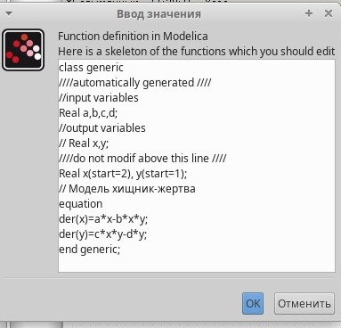{#fig:009 width=70%}

## Полученная схема

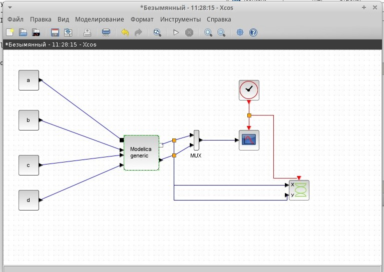{#fig:007 width=70%}

## График изменения численности хищников и жертв

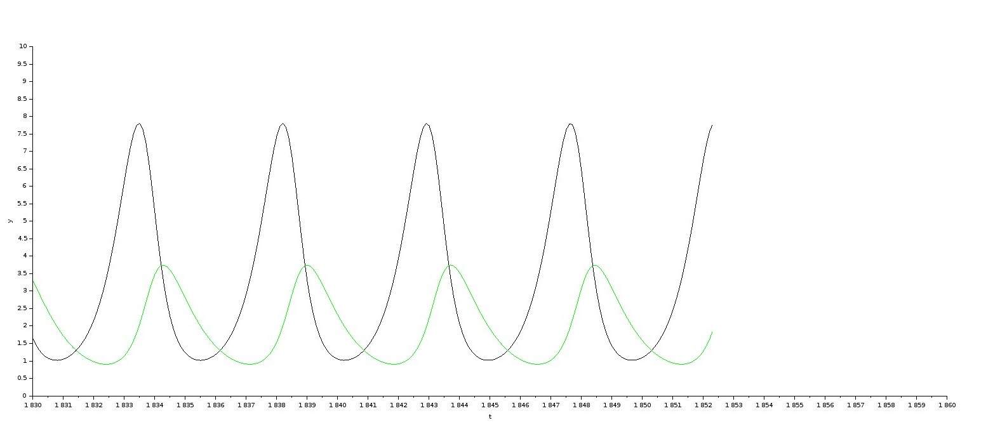{#fig:010 width=70%}

## Изображение фазового портрета

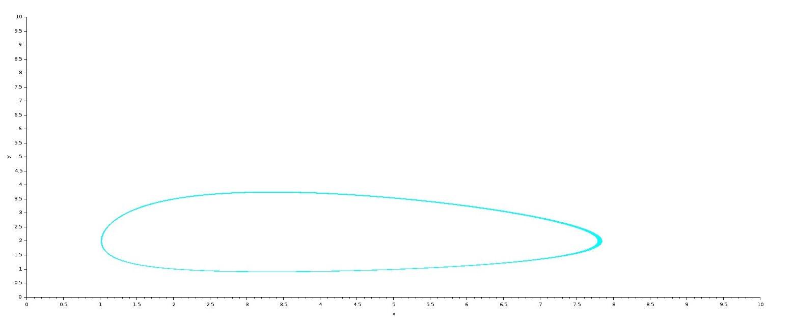{#fig:011 width=70%}

# Реализация модели в OpenModelica

## Код модели на языке OpenModelic

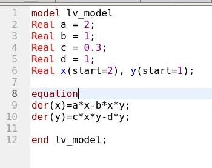{#fig:012 width=70%}

## График изменения численности хищников и жертв

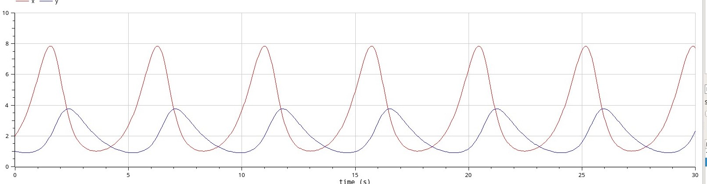{#fig:013 width=70%}

## Изображение фазового портрета

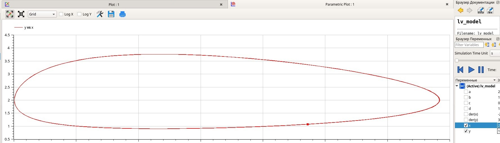{#fig:014 width=70%}

## Выводы

В ходе выполнения лабораторной работы я реализовала модель «хищник–жертва» с помощью средства имитационного моделирования Scilab, xcos и языка Modelica. 

# Спасибо за внимание!
