---
## Front matter
title: "Лабораторная работа №6"
subtitle: "Модель «хищник–жертва»"
author: "Астраханцева А. А."

## Generic otions
lang: ru-RU
toc-title: "Содержание"

## Bibliography
bibliography: bib/cite.bib
csl: pandoc/csl/gost-r-7-0-5-2008-numeric.csl

## Pdf output format
toc: true # Table of contents
toc-depth: 2
lof: true # List of figures
lot: false # List of tables
fontsize: 12pt
linestretch: 1.5
papersize: a4
documentclass: scrreprt
## I18n polyglossia
polyglossia-lang:
  name: russian
  options:
	- spelling=modern
	- babelshorthands=true
polyglossia-otherlangs:
  name: english
## I18n babel
babel-lang: russian
babel-otherlangs: english
## Fonts
mainfont: PT Serif
romanfont: PT Serif
sansfont: PT Sans
monofont: PT Mono
mainfontoptions: Ligatures=TeX
romanfontoptions: Ligatures=TeX
sansfontoptions: Ligatures=TeX,Scale=MatchLowercase
monofontoptions: Scale=MatchLowercase,Scale=0.9
## Biblatex
biblatex: true
biblio-style: "gost-numeric"
biblatexoptions:
  - parentracker=true
  - backend=biber
  - hyperref=auto
  - language=auto
  - autolang=other*
  - citestyle=gost-numeric
## Pandoc-crossref LaTeX customization
figureTitle: "Рис."
tableTitle: "Таблица"
listingTitle: "Листинг"
lofTitle: "Список иллюстраций"
lotTitle: "Список таблиц"
lolTitle: "Листинги"
## Misc options
indent: true
header-includes:
  - \usepackage{indentfirst}
  - \usepackage{float} # keep figures where there are in the text
  - \floatplacement{figure}{H} # keep figures where there are in the text
---
# Цель работы

Реализовать модель «хищник–жертва» с помощью средства имитационного моделирования Scilab, xcos и языка Modelica. 

# Задание

1. Реализовать модель в xcos
2. Реализовать модель с помощью блока Modelica в xcos;
3. Реализовать модель в OpenModelica (упражнение).


# Теоретическое введение

Модель «хищник–жертва» (модель Лотки — Вольтерры) представляет собой модель межвидовой конкуренции. В математической форме модель имеет вид:

$$
\begin{cases}
  \dot x = ax - bxy; \\
  \dot y = cxy - dy,
\end{cases}
$$

где $x$ — количество жертв; $y$ — количество хищников; $a, b, c, d$ — коэффициенты, отражающие взаимодействия между видами: $a$ — коэффициент рождаемости жертв; $b$ — коэффициент убыли жертв; $c$ — коэффициент рождения хищников; $d$ — коэффициент убыли хищников.


# Реализация модели в xcos

Откроем окно Scilab, далее - инструменты - визуальное программирование xcos.
Зафиксируем начальные данные: $a = 2, \, b = 1, \, c = 0.3, \, d = 1, \, x(0) = 2, \, y(0) = 1$. В меню "Моделирование -> Задать переменные окружения" зададим значения переменных  $a, \, b, \, c, \, d$ (рис. [-@fig:001]).

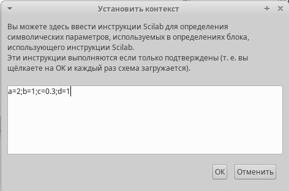{#fig:001 width=70%}


Разместим блоки интегрирования - INTEGRAL_m: В параметрах блоков интегрирования необходимо задать начальные значения $x(0) = 2, y(0) = 1$ (рис. [-@fig:002] - [-@fig:003]).

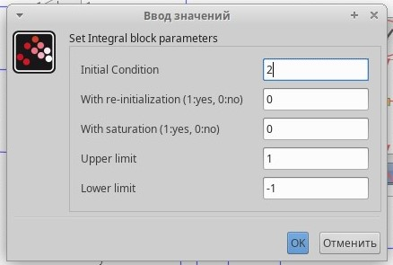{#fig:002 width=70%}

{#fig:003 width=70%}


В меню "Моделирование -> Установка" необходимо задать конечное время интегрирования, равным времени моделирования (в данном случае 30). Для регистрирующего устройства - блока CSCOPE - устанавливаем максимальное и минимальное значение по оси Oy [0;10]. Получаем такую схему  (рис. [-@fig:004]).

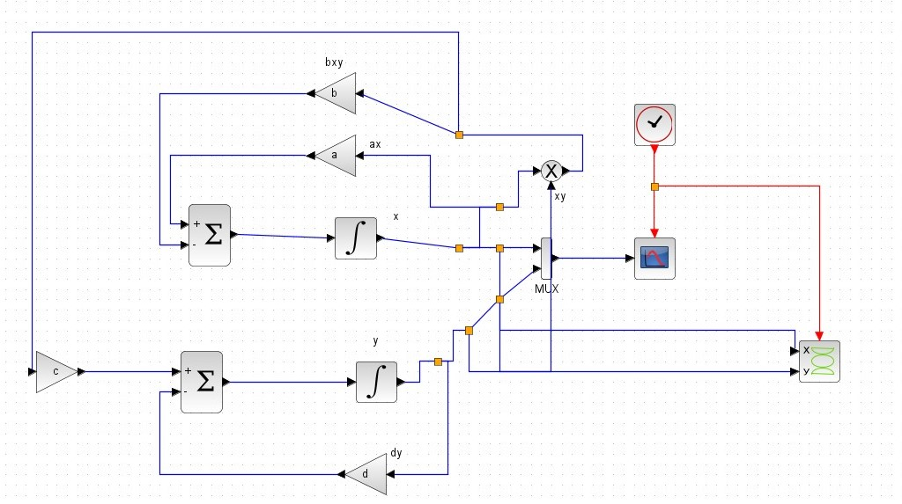{#fig:004 width=70%}

Динамика изменения численности хищников и жертв модели при $a = 2, b = 1, c = 0, 3, d = 1, x(0) = 2, y(0) = 1$ (рис. [-@fig:005]).

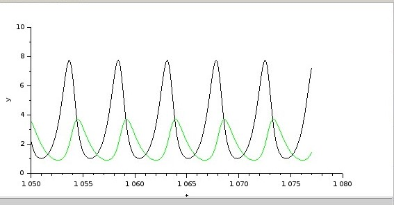{#fig:005 width=70%}

Также мы получили изображение фазового портрета (рис. [-@fig:006]).

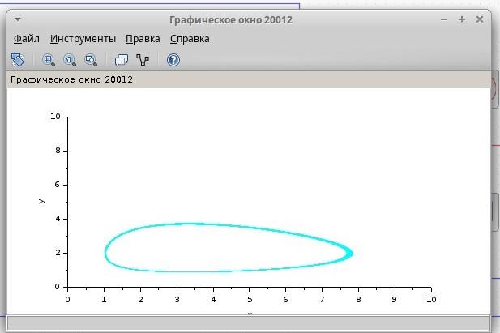{#fig:006 width=70%}

# Реализация модели с помощью блока Modelica в xcos

Для реализации модели с помощью языка Modelica потребуются следующие блоки xcos: CLOCK_c, CSCOPE, CSCOPXY, TEXT_f, MUX, CONST_m и MBLOCK (Modelica generic). Как и ранее, задаём значения коэффициентов $a, b, c, d$ (см. рис. [-@fig:001]). Готовая модель «хищник–жертва» представлена на (рис. [-@fig:007]).
Параметры блока Modelica представлены на (рис. [-@fig:008]). Переменные на входе ($a, b, c, d$) и выходе ($x, y$) блока заданы как внешние ($E$).

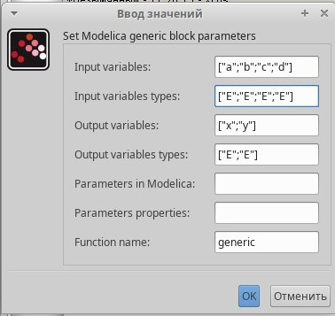{#fig:008 width=70%}

Код на языке Modelica: (рис. [-@fig:009])
```
class generic
////automatically generated ////
//input variables
Real a,b,c,d;
//output variables
// Real x,y;
////do not modif above this line ////
Real x(start=2), y(start=1);
// Модель хищник-жертва
equation
der(x)=a*x-b*x*y;
der(y)=c*x*y-d*y;
end generic;
```

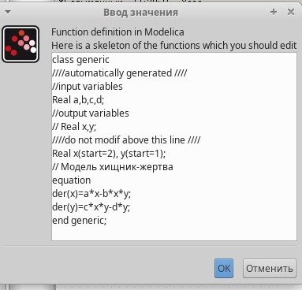{#fig:009 width=70%}

Получаем такую схему (рис. [-@fig:007]).

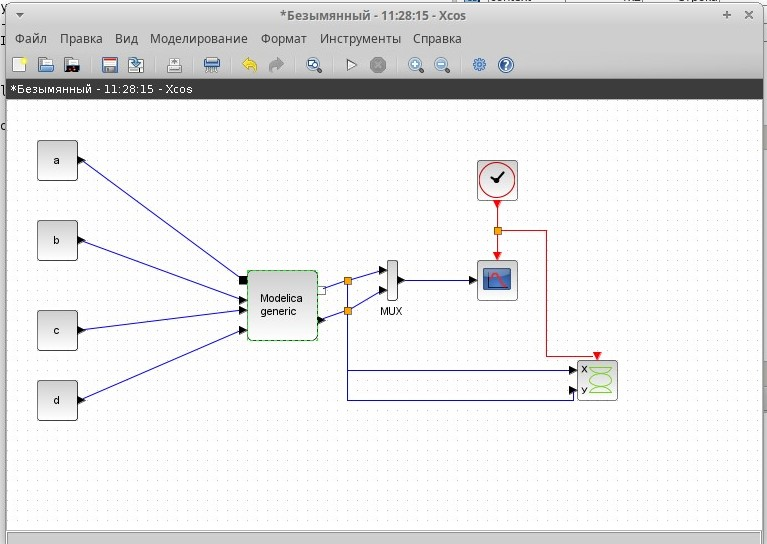{#fig:007 width=70%}

При запуске симуляции рисуется график изменения численности хищников и жертв (рис. [-@fig:010]).

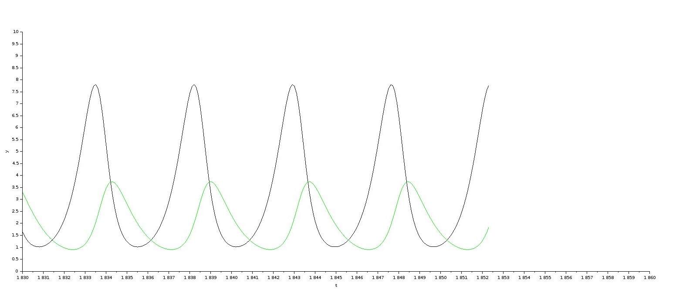{#fig:010 width=70%}

Изображение фазового портрета представлено на рис. [-@fig:011].

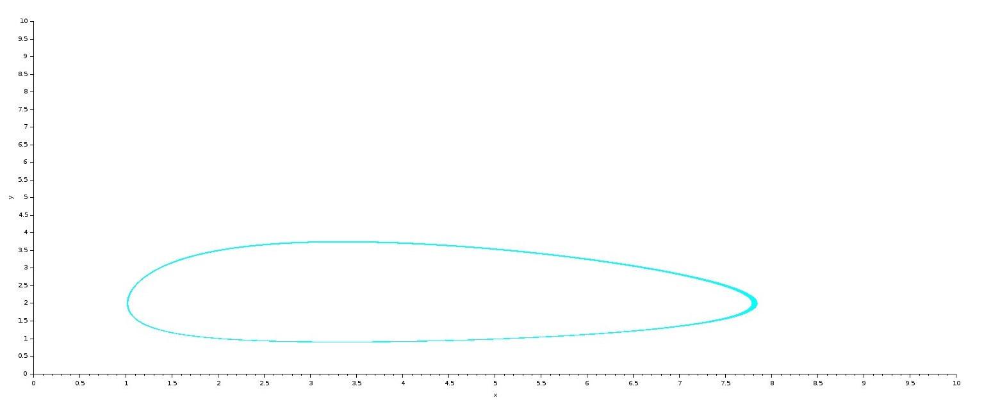{#fig:011 width=70%}

# Реализация модели в OpenModelica

Реализация модели на языке OpenModelica (рис. [-@fig:012]).

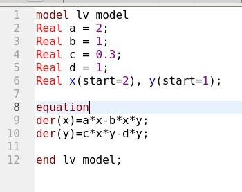{#fig:012 width=70%}

При запуске симуляции рисуется график изменения численности хищников и жертв (рис. [-@fig:013]).

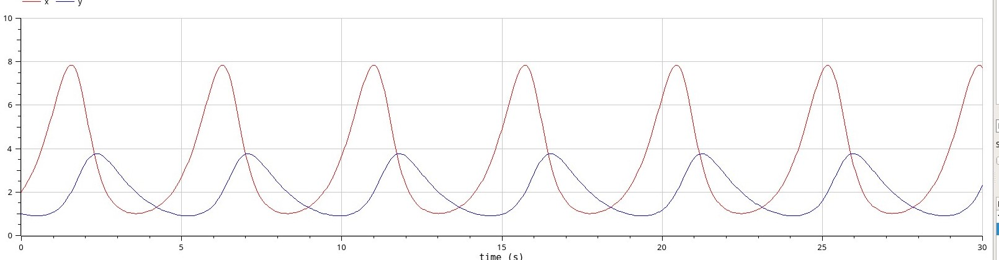{#fig:013 width=70%}

Изображение фазового портрета представлено на рис. [-@fig:014].

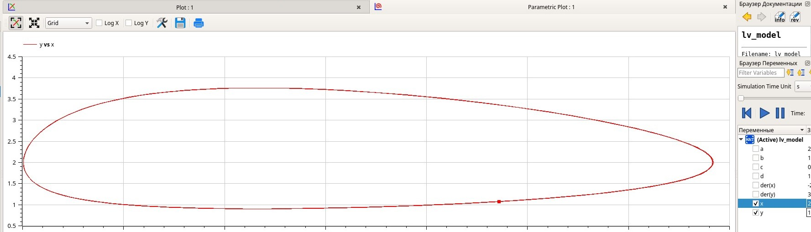{#fig:014 width=70%}


# Выводы

В ходе выполнения лабораторной работы я реализовала модель «хищник–жертва» с помощью средства имитационного моделирования Scilab, xcos и языка Modelica. 

# Список литературы{.unnumbered}

1. Королькова А.В., Кулябов Д.С. Руководство к лабораторной работе №6. Моделирование информационных процессов. Модель «хищник–жертва» - 2025. — 5 с.

::: {#refs}
:::


