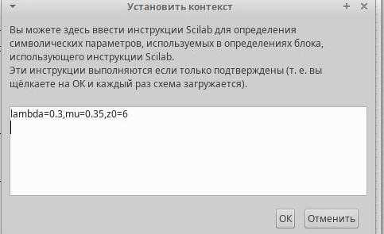
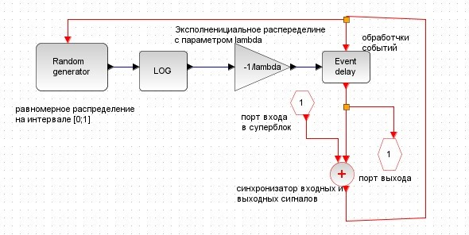
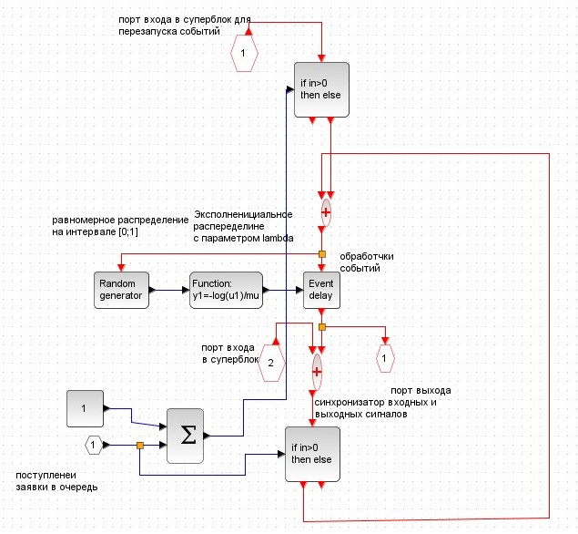
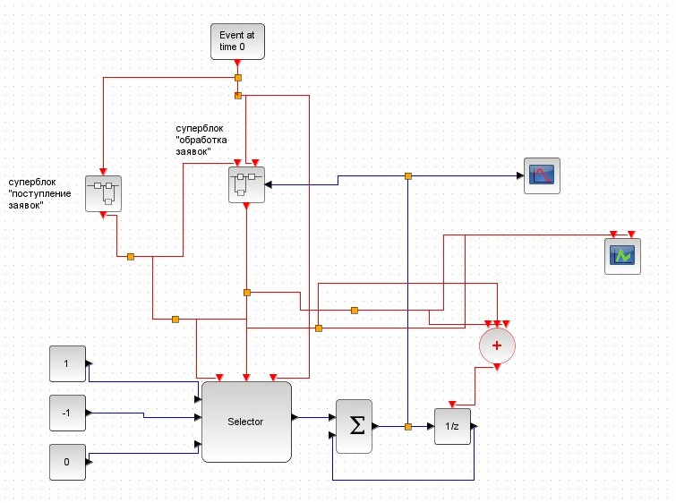
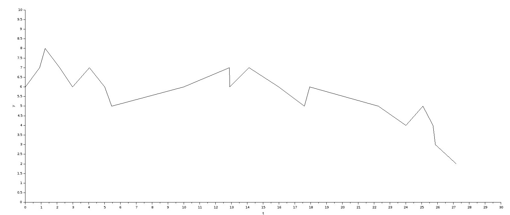
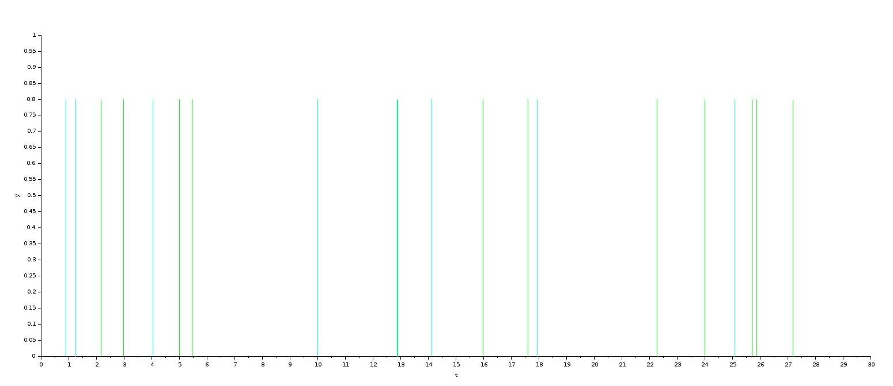

---
## Front matter
lang: ru-RU
title: "Лабораторная работа №7"
subtitle: Модель $M|M|1|\infty$

author: 
  - Астраханцева А. А.
institute:
  - Российский университет дружбы народов, Москва, Россия
date: 20 марта 2025

## i18n babel
babel-lang: russian
babel-otherlangs: english

## Formatting pdf
toc: false
toc-title: Содержание
slide_level: 2
aspectratio: 169
section-titles: true
theme: metropolis
header-includes:
 - \metroset{progressbar=frametitle,sectionpage=progressbar,numbering=fraction}
---

# Информация

## Докладчик

:::::::::::::: {.columns align=center}
::: {.column width="70%"}

  * Астраханцева Анастасия Александровна
  * НФИбд-01-22, 1132226437
  * Российский университет дружбы народов
  * [1132226437@pfur.ru](mailto:1132226437@pfur.ru)
  * <https://github.com/aaastrakhantseva>

:::
::: {.column width="30%"}

:::
::::::::::::::

# Вводная часть

## Цели лабораторной работы

Реализовать модель $M|M|1|\infty$ с помощью средства имитационного моделирования Scilab, xcos.

# Выполнение ЛР

## Описание модели

Теория массового обслуживания (или теория очередей) является разделом теории вероятностей, целью которого является изучение и оптимизация систем массового обслуживания (СМО). СМО представляют собой модели, в которых заявки поступают в систему, где они обслуживаются в соответствии с определенной дисциплиной. Одной из наиболее простых и широко используемых моделей СМО является система типа $M|M|1|\infty$.

# Реализация модели в xcos

## Переменные окружения

{#fig:001 width=70%}

## Суперблок поступления заявок

{#fig:002 width=70%}

## Суперблок обработки заявок

{#fig:003 width=70%}

## Готовая модель $M|M|1|\infty$ 

{#fig:004 width=70%}

## Динамика размера очереди

{#fig:005 width=70%}

## Поступление (голубой) и обработка (зеленый) заявок

{#fig:006 width=70%}

## Выводы

В ходе выполнения лабораторной работы я реализовала модель $M|M|1|\infty$ с помощью средства имитационного моделирования Scilab, xcos.

## Список литературы{.unnumbered}

1. Королькова А.В., Кулябов Д.С. Руководство к лабораторной работе №7. Моделирование информационных процессов. Модель «$M|M|1|\infty$» - 2025. — 4 с.

2. Плескунов М.А. Теория массового обслуживания : учебное пособие / М‑во науки и высшего образования РФ, Урал. федер. ун‑т. — Екатеринбург : Изд‑во Урал. ун‑та, 2022. — 264 с.

3. Гнеденко Б.В., Коваленко И.Н. Введение в теорию массового обслуживания. — М.: Наука, 2017. — 432 с.
