---
## Front matter
lang: ru-RU
title: "Лабораторная работа №8"
subtitle: "Модель TCP/AQM"
author: 
  - Астраханцева А. А.
institute:
  - Российский университет дружбы народов, Москва, Россия
date: 29 марта 2025

## i18n babel
babel-lang: russian
babel-otherlangs: english

## Formatting pdf
toc: false
toc-title: Содержание
slide_level: 2
aspectratio: 169
section-titles: true
theme: metropolis
header-includes:
 - \metroset{progressbar=frametitle,sectionpage=progressbar,numbering=fraction}
---

# Информация

## Докладчик

:::::::::::::: {.columns align=center}
::: {.column width="70%"}

  * Астраханцева Анастасия Александровна
  * НФИбд-01-22, 1132226437
  * Российский университет дружбы народов
  * [1132226437@pfur.ru](mailto:1132226437@pfur.ru)
  * <https://github.com/aaastrakhantseva>

:::
::: {.column width="30%"}


:::
::::::::::::::

# Вводная часть

## Цели лабораторной работы

Реализовать модель TCP/AQM в xcos и OpenModelica. 

## Задачи

1. Построить модель TCP/AQM в xcos;
2. Построить графики динамики изменения размера TCP окна $W(t)$ и размера очереди $Q(t)$;
3. Построить модель TCP/AQM в OpenModelica;
параметров модели.

# Выполнение ЛР

## Описание модели

1. Упрощенная динамика размера TCP-окна:
   $$
   \dot{W}(t) = \frac{1}{R} - \frac{W(t)W(t - R)}{2R}KQ(t - R)
   $$

2. Упрощенная динамика размера очереди:
   $$
   \dot{Q}(t) = 
   \begin{cases}
   \frac{NW(t)}{R} - C, & Q(t) > 0 \\
   \max\left(\frac{NW(t)}{R} - C, 0\right), & Q(t) = 0
   \end{cases}
   $$

# Реализация модели в xcos

## Переменные окружения

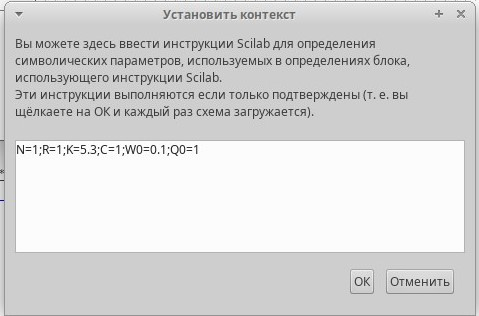{#fig:001 width=70%}

## Описание блоков

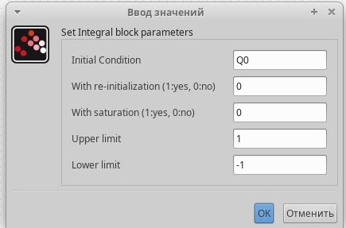{#fig:002 width=70%}

## Описание блоков

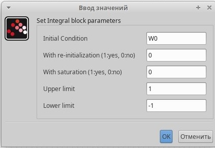{#fig:003 width=70%}

## Описание блоков

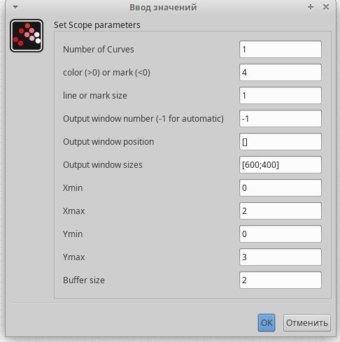{#fig:004 width=70%}

## Описание блоков

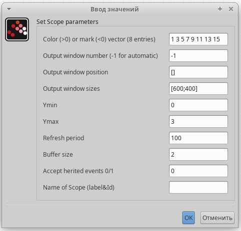{#fig:005 width=70%}

## Полученная схема

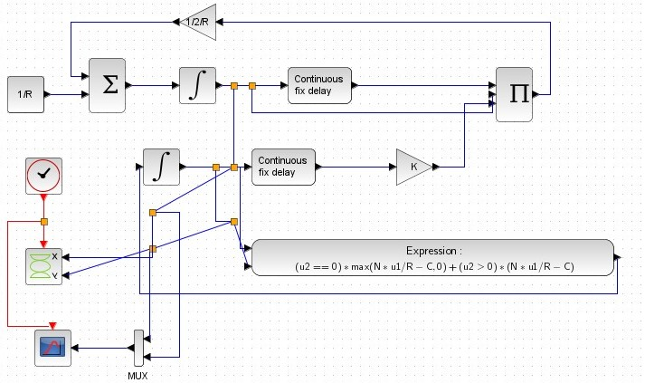{#fig:007 width=70%}

## График размера окна, размера очереди и фазовый портрет

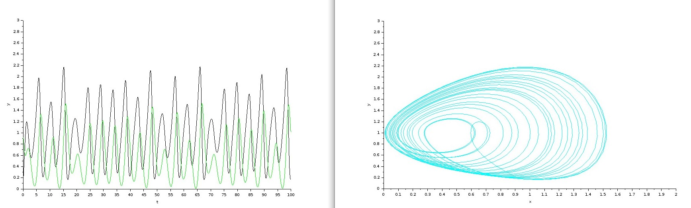{#fig:008 width=90%}

## График размера окна, размера очереди и фазовый портрет при $C = 0.9$

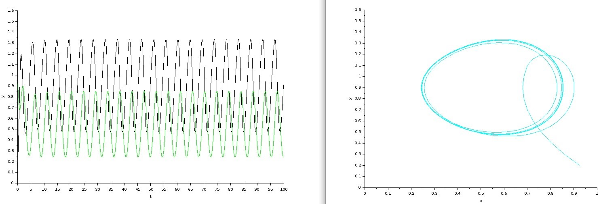{#fig:009 width=70%}

# Реализация модели в OpenModelica

##  Код на языке Modelica

```
model lab8
  parameter Real N=1;
  parameter Real R=1;
  parameter Real K=5.3;
  parameter Real C=0.9;
  Real W(start=0.1);
  Real Q(start=1);
equation
  der(W)= 1/R - W*delay(W, R)/(2*R)*K*delay(Q, R);
  der(Q)= if (Q==0) then max(N*W/R-C,0) else (N*W/R-C);
end lab8;

```

## График размера окна, размера очереди в OpenModelica

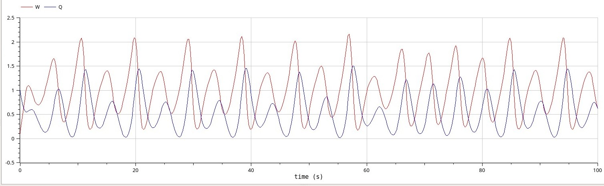{#fig:010 width=70%}

## График фазового портрета в OpenModelica

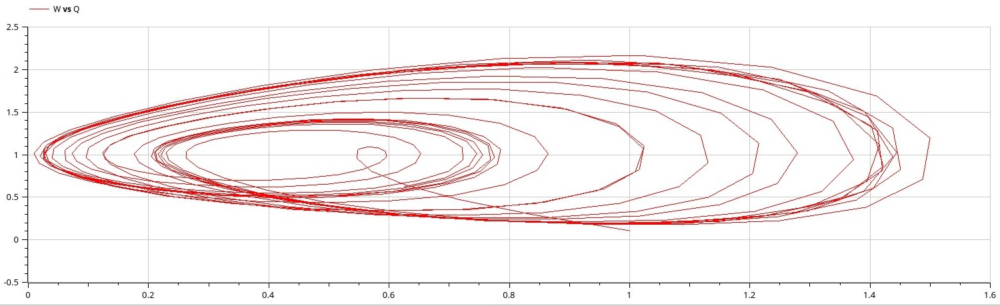{#fig:011 width=70%}

## График размера окна, размера очереди в OpenModelica при $C = 0.9$

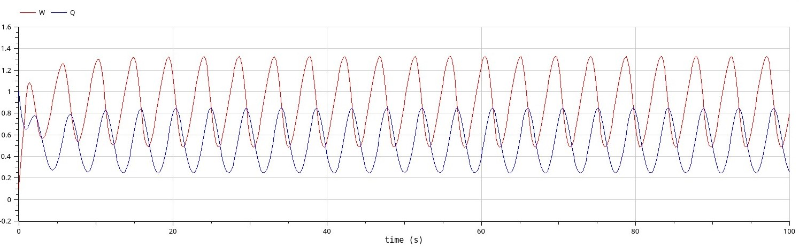{#fig:012 width=70%}

## График фазового портрета в OpenModelica при $C = 0.9$

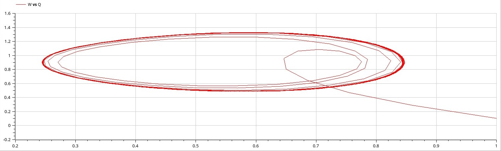{#fig:013 width=70%}


## Выводы

В ходе выполнения лабораторной работы я реализовала модель TCP/AQM в xcos и OpenModelica.

# Спасибо за внимание!
