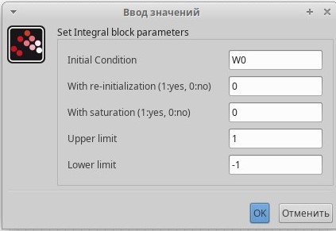

---
## Front matter
title: "Лабораторная работа №8"
subtitle: "Модель TCP/AQM"
author: "Астраханцева А. А."

## Generic otions
lang: ru-RU
toc-title: "Содержание"

## Bibliography
bibliography: bib/cite.bib
csl: pandoc/csl/gost-r-7-0-5-2008-numeric.csl

## Pdf output format
toc: true # Table of contents
toc-depth: 2
lof: true # List of figures
lot: false # List of tables
fontsize: 12pt
linestretch: 1.5
papersize: a4
documentclass: scrreprt
## I18n polyglossia
polyglossia-lang:
  name: russian
  options:
	- spelling=modern
	- babelshorthands=true
polyglossia-otherlangs:
  name: english
## I18n babel
babel-lang: russian
babel-otherlangs: english
## Fonts
mainfont: PT Serif
romanfont: PT Serif
sansfont: PT Sans
monofont: PT Mono
mainfontoptions: Ligatures=TeX
romanfontoptions: Ligatures=TeX
sansfontoptions: Ligatures=TeX,Scale=MatchLowercase
monofontoptions: Scale=MatchLowercase,Scale=0.9
## Biblatex
biblatex: true
biblio-style: "gost-numeric"
biblatexoptions:
  - parentracker=true
  - backend=biber
  - hyperref=auto
  - language=auto
  - autolang=other*
  - citestyle=gost-numeric
## Pandoc-crossref LaTeX customization
figureTitle: "Рис."
tableTitle: "Таблица"
listingTitle: "Листинг"
lofTitle: "Список иллюстраций"
lotTitle: "Список таблиц"
lolTitle: "Листинги"
## Misc options
indent: true
header-includes:
  - \usepackage{indentfirst}
  - \usepackage{float} # keep figures where there are in the text
  - \floatplacement{figure}{H} # keep figures where there are in the text
---

# Цель работы

Реализовать модель TCP/AQM в xcos и OpenModelica.

# Задание

1. Построить модель TCP/AQM в xcos;
2. Построить графики динамики изменения размера TCP окна $W(t)$ и размера очереди $Q(t)$;
3. Построить модель TCP/AQM в OpenModelica;
параметров модели.

# Теоретическое введение

Уравнения модели описывают динамику изменения размера TCP-окна и очереди:

1. Динамика размера TCP-окна:
   $$
   \dot{W}(t) = \frac{1}{R(t)} - \frac{W(t)W(t - R(t))}{2R(t - R(t))}p(t - R(t))
   $$
   Это уравнение учитывает фазу медленного старта TCP и алгоритм избежания перегрузок. Размер окна увеличивается на $$ \frac{1}{W} $$ при получении каждого подтверждения и сокращается вдвое при потере пакета[1].

2. Динамика размера очереди:
   $$
   \dot{Q}(t) = 
   \begin{cases}
   \frac{N(t)W(t)}{R(t)} - C, & Q(t) > 0 \\
   \max\left(\frac{N(t)W(t)}{R(t)} - C, 0\right), & Q(t) = 0
   \end{cases}
   $$
   Это уравнение описывает разницу между средней интенсивностью поступления пакетов и пропускной способностью сети.

3. Время двойного оборота:
   $$
   R(t) = \frac{Q(t)}{C} + \tau_p
   $$
   где $$ \tau_p $$ — задержка распространения пакета по сети[1].

## Упрощение Модели

Для упрощения модели предполагается, что $$ N(t) \equiv N $$, $$ R(t) \equiv R $$, и $$ p(t) = KQ(t) $$, где $$ K $$ — константа. Это приводит к упрощенным уравнениям:

1. Упрощенная динамика размера TCP-окна:
   $$
   \dot{W}(t) = \frac{1}{R} - \frac{W(t)W(t - R)}{2R}KQ(t - R)
   $$

2. Упрощенная динамика размера очереди:
   $$
   \dot{Q}(t) = 
   \begin{cases}
   \frac{NW(t)}{R} - C, & Q(t) > 0 \\
   \max\left(\frac{NW(t)}{R} - C, 0\right), & Q(t) = 0
   \end{cases}
   $$

Эти уравнения описывают систему с обратной связью, где управление осуществляется через вероятностную функцию сброса пакетов, пропорциональную длине очереди.


# Реализация модели в xcos

Откроем окно Scilab, далее - инструменты - визуальное программирование xcos. Зафиксируем начальные данные: $N = 1, R = 1, K = 5.3, C = 1, W (0) = 0.1, Q(0) = 1$. В меню "Моделирование -> Задать переменные окружения" зададим значения переменных (рис. [-@fig:001]).

{#fig:001 width=70%}

Разместим блоки интегрирования - INTEGRAL_m: В параметрах необходимо задать начальные значения $W (0) = 0.1, Q(0) = 1$. Поскольку эти значения я записала в переменные среды, в параметры блоков интегрирования помещу названия переменных (рис. [-@fig:002] - [-@fig:003]).

{#fig:002 width=70%}

{#fig:003 width=70%}

Для регистрирующих устройств, используемых для пос трения графиков, устанавливаем ограничения по осям (рис. [-@fig:004] - [-@fig:005]).

{#fig:004 width=70%}

{#fig:005 width=70%}

В блок для записи выражения записываем уравнение для вычисления размена очереди (рис. [-@fig:006]).

{#fig:006 width=70%}

Получаем такую схему  (рис. [-@fig:007]).

{#fig:007 width=70%}

При запуске симуляции рисуются графики размера окна, размера очереди и фазовый портрет (рис. [-@fig:008]).

{#fig:008 width=70%}

Если изменить скорость обработки пакетов на $C = 0.9$, то получим следующие графики (рис. [-@fig:009]).

{#fig:009 width=70%}


# Реализация модели в OpenModelica

Открываем OMEdit, создаем новый класс. Записываем в него код для моделирования: 

```
model lab8
  parameter Real N=1;
  parameter Real R=1;
  parameter Real K=5.3;
  parameter Real C=0.9;
  Real W(start=0.1);
  Real Q(start=1);
equation
  der(W)= 1/R - W*delay(W, R)/(2*R)*K*delay(Q, R);
  der(Q)= if (Q==0) then max(N*W/R-C,0) else (N*W/R-C);
end lab8;

```

При запуске симуляции рисуются графики размера окна, размера очереди и фазовый портрет. Они аналогичен тем, что были построены с помощью xcos (рис. [-@fig:010] - [-@fig:011]).

{#fig:010 width=70%}

{#fig:011 width=70%}

Если изменить скорость обработки пакетов на $C = 0.9$, то снова получим графики, аналогичные тем, что были построены с помощью xcos (рис. [-@fig:012] - [-@fig:013]).

{#fig:012 width=70%}

{#fig:013 width=70%}


# Выводы

В ходе выполнения лабораторной работы я реализовала модель TCP/AQM в xcos и OpenModelica.

# Список литературы{.unnumbered}

1. Королькова А.В., Кулябов Д.С. Руководство к лабораторной работе №8. Моделирование информационных процессов. Модель «TCP/AQM» - 2025. — 5 с.

2. Реализация модели в OpenModelica. Хильдинг Элмквист, Свен Эрик Маттссон, Мартин Оттер. Modelica – A Unified Object-Oriented Language for Physical Systems Modeling. – Springer, 2019.

3. Общие сведения о компьютерных сетях. Kurose, J. F., & Ross, K. W. Computer networking: A top-down approach. – 7-е изд. – Pearson, 2017.

4. Моделирование трафика [Электронный ресурс] // Википедия. Свободная энциклопедия. URL: https://ru.wikipedia.org/wiki/Моделирование_трафика (дата обращения: 29.03.2025).

5. Мохаммед Ала Абдулрахман Саид. Методы декомпозиции показателей качества обслуживания трафика в сети следующего поколения: диссертация на соискание ученой степени кандидата технических наук. – Москва, 2017. – 128 с. URL: https://dis.mtuci.ru/upload/srd/Dis-Mohammed-AAS/dis-Mohammed-AAS.pdf.


