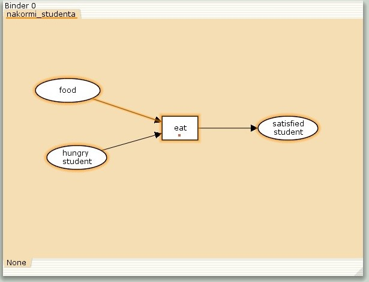
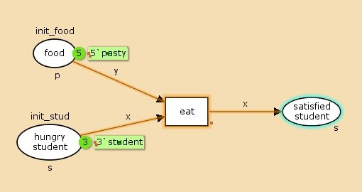
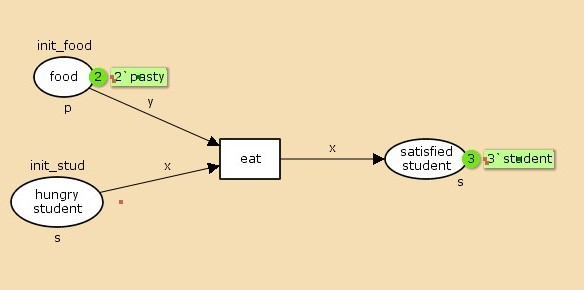
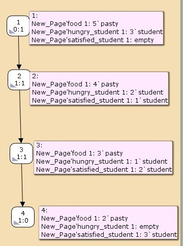

---
## Front matter
lang: ru-RU
title: "Лабораторная работа №9"
subtitle: "Модель «Накорми студентов»"
author: 
  - Астраханцева А. А.
institute:
  - Российский университет дружбы народов, Москва, Россия
date: 4 апреля 2025

## i18n babel
babel-lang: russian
babel-otherlangs: english

## Formatting pdf
toc: false
toc-title: Содержание
slide_level: 2
aspectratio: 169
section-titles: true
theme: metropolis
header-includes:
 - \metroset{progressbar=frametitle,sectionpage=progressbar,numbering=fraction}
---

# Информация

## Докладчик

:::::::::::::: {.columns align=center}
::: {.column width="70%"}

  * Астраханцева Анастасия Александровна
  * НФИбд-01-22, 1132226437
  * Российский университет дружбы народов
  * [1132226437@pfur.ru](mailto:1132226437@pfur.ru)
  * <https://github.com/aaastrakhantseva>

:::
::: {.column width="30%"}


:::
::::::::::::::

# Вводная часть

## Цели лабораторной работы

Реализовать модель «Накорми студентов» с помощью CPN Tools.

# Выполнение ЛР

## Описание модели

Рассмотрим пример студентов, обедающих пирогами. Голодный студент становится сытым после того, как съедает пирог.

Таким образом, имеем:

* два типа фишек: «пироги» и «студенты»;
* три позиции: «голодный студент», «пирожки», «сытый студент»;
* один переход: «съесть пирожок».

# Реализация модели в CPN Tools

## Отрисовка графа модели

{#fig:001 width=70%}

## Декларации модели

{#fig:002 width=70%}

## Работающая модель

{#fig:003 width=70%}

## Запуск модели

{#fig:004 width=70%}

## Описание отчета

```  
 Statistics
------------------------------------------------------------------------

  State Space
     Nodes:  4
     Arcs:   3
     Secs:   0
     Status: Full

  Scc Graph
     Nodes:  4
     Arcs:   3
     Secs:   0

``` 

## Описание отчета
 
``` 
 Boundedness Properties
-----------------------------------------------
  Best Integer Bounds
                             Upper      Lower
     New_Page'food 1         5          2
     New_Page'hungry_student 1
                             3          0
     New_Page'satisfied_student 1
                             3          0
``` 

## Описание отчета

``` 
 Best Upper Multi-set Bounds
     New_Page'food 1     5`pasty
     New_Page'hungry_student 1
                         3`student
     New_Page'satisfied_student 1
                         3`student

  Best Lower Multi-set Bounds
     New_Page'food 1     2`pasty
     New_Page'hungry_student 1
                         empty
     New_Page'satisfied_student 1
                         empty
``` 
:::
::::::::::::::


## Граф пространства состояний

{#fig:005 width=70%}


## Выводы

В ходе выполнения лабораторной работы я реализовала модель «Накорми студентов» с помощью CPN Tools.

# Спасибо за внимание!
