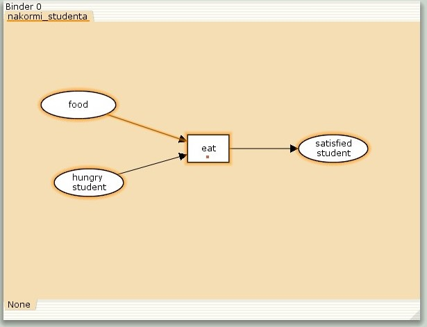
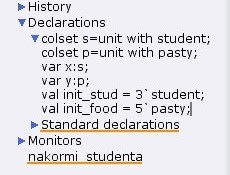
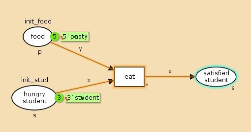
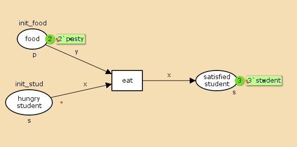
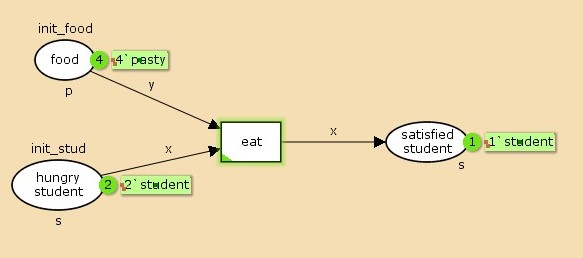

---
## Front matter
title: "Лабораторная работа №9"
subtitle: "Модель «Накорми студентов»"
author: "Астраханцева А. А."

## Generic otions
lang: ru-RU
toc-title: "Содержание"

## Bibliography
bibliography: bib/cite.bib
csl: pandoc/csl/gost-r-7-0-5-2008-numeric.csl

## Pdf output format
toc: true # Table of contents
toc-depth: 2
lof: true # List of figures
lot: false # List of tables
fontsize: 12pt
linestretch: 1.5
papersize: a4
documentclass: scrreprt
## I18n polyglossia
polyglossia-lang:
  name: russian
  options:
	- spelling=modern
	- babelshorthands=true
polyglossia-otherlangs:
  name: english
## I18n babel
babel-lang: russian
babel-otherlangs: english
## Fonts
mainfont: PT Serif
romanfont: PT Serif
sansfont: PT Sans
monofont: PT Mono
mainfontoptions: Ligatures=TeX
romanfontoptions: Ligatures=TeX
sansfontoptions: Ligatures=TeX,Scale=MatchLowercase
monofontoptions: Scale=MatchLowercase,Scale=0.9
## Biblatex
biblatex: true
biblio-style: "gost-numeric"
biblatexoptions:
  - parentracker=true
  - backend=biber
  - hyperref=auto
  - language=auto
  - autolang=other*
  - citestyle=gost-numeric
## Pandoc-crossref LaTeX customization
figureTitle: "Рис."
tableTitle: "Таблица"
listingTitle: "Листинг"
lofTitle: "Список иллюстраций"
lotTitle: "Список таблиц"
lolTitle: "Листинги"
## Misc options
indent: true
header-includes:
  - \usepackage{indentfirst}
  - \usepackage{float} # keep figures where there are in the text
  - \floatplacement{figure}{H} # keep figures where there are in the text
---

# Цель работы

Реализовать модель «Накорми студентов» с помощью CPN Tools.

# Теоретическое введение

CPN Tools — специальное программное средство, предназначенное для моделирования иерархических временных раскрашенных сетей Петри. Такие сети эквивалентны машине Тьюринга и составляют универсальную алгоритмическую систему, позволяющую описать произвольный объект. CPN Tools позволяет визуализировать модель с помощью графа сети Петри и применить язык программирования CPN ML (Colored Petri Net Markup Language) для формализованного описания модели.

Назначение CPN Tools:

* разработка сложных объектов и моделирование процессов в различных прикладных областях, в том числе:
* моделирование производственных и бизнес-процессов;
* моделирование систем управления производственными системами и роботами;
* спецификация и верификация протоколов, оценка пропускной способности сетей и качества обслуживания, проектирование телекоммуникационных устройств и сетей.

Основные функции CPN Tools:

* создание (редактирование) моделей;
* анализ поведения моделей с помощью имитации динамики сети Петри;
* построение и анализ пространства состояний модели


# Реализация модели в xcos

Рассмотрим пример студентов, обедающих пирогами. Голодный студент становится сытым после того, как съедает пирог.

Таким образом, имеем:

* два типа фишек: «пироги» и «студенты»;
* три позиции: «голодный студент», «пирожки», «сытый студент»;
* один переход: «съесть пирожок».

Для запуска CPN Tools в терминале нужно прописать команду `cpntools &`. Рисуем граф сети. Для этого с помощью контекстного меню создаём новую сеть, добавляем позиции, переход и дуги  (рис. [-@fig:001]).

{#fig:001 width=70%}

2. В меню задаём новые декларации модели: типы фишек, начальные значения позиций, выражения для дуг. Для этого наведя мышку на меню `Standart declarations`, правой кнопкой вызываем контекстное меню и выбираем `New Decl`. После этого задаем тип `s` фишкам, относящимся к студентам, тип `p` — фишкам, относящимся к пирогам, задаём значения переменных `x` и `y` для дуг и начальные значения мультимножеств `init_stud` и `init_food` (рис. [-@fig:002]):

```cpn
colset s=unit with student;
colset p=unit with pasty;
var x:s;
var y:p;
val init_stud = 3`student;
val init_food = 5`pasty;
```

{#fig:002 width=70%}


В результате получаем работающую модель (рис. [-@fig:003]).

{#fig:003 width=70%}

После запуска фишки типа «пирожки» из позиции «еда» и фишки типа «студенты» из позиции «голодный студент», пройдя через переход «кушать», попадают в позицию «сытый студент» и преобразуются в тип «студенты» (рис. [-@fig:004]).

{#fig:004 width=70%}

## Выполнение упражнения

Прежде чем приступить к вычислению пространства состояний, необходимо сформировать код для этого пространства. Это делается с помощью инструмента "Войти в пространство состояний", который может занять некоторое время.
Если ожидается небольшое пространство состояний, можно напрямую применить инструмент "Вычислить пространство состояний" к странице сети.

После вычисления пространства состояний формируем отчёт. Чтобы сохранить отчёт, используем инструмент "Сохранить отчет о пространстве состояний" и указываем имя файла.
Получим такой отчет: 
``` 
CPN Tools state space report for:
<unsaved net>
Report generated: Thu Apr  3 22:23:04 2025


 Statistics
------------------------------------------------------------------------

  State Space
     Nodes:  4
     Arcs:   3
     Secs:   0
     Status: Full

  Scc Graph
     Nodes:  4
     Arcs:   3
     Secs:   0


 Boundedness Properties
------------------------------------------------------------------------

  Best Integer Bounds
                             Upper      Lower
     New_Page'food 1         5          2
     New_Page'hungry_student 1
                             3          0
     New_Page'satisfied_student 1
                             3          0

  Best Upper Multi-set Bounds
     New_Page'food 1     5`pasty
     New_Page'hungry_student 1
                         3`student
     New_Page'satisfied_student 1
                         3`student

  Best Lower Multi-set Bounds
     New_Page'food 1     2`pasty
     New_Page'hungry_student 1
                         empty
     New_Page'satisfied_student 1
                         empty


 Home Properties
------------------------------------------------------------------------

  Home Markings
     [4]


 Liveness Properties
------------------------------------------------------------------------

  Dead Markings
     [4]

  Dead Transition Instances
     None

  Live Transition Instances
     None


 Fairness Properties
------------------------------------------------------------------------
     No infinite occurrence sequences.
```

Из отчёта можно получить следующие сведения:

1. Структура пространства состояний: Пространство состояний состоит из 4 состояний и 3 переходов между ними. Модель построена быстро, за 0 секунд, что указывает на её небольшой размер.
2. Граф сильно связных компонентов (SCC): Все состояния образуют единый граф SCC.
3. Ограниченность ресурсов:
    - Еда (food): Максимальное количество — 5 порций, минимальное — 2 порции. Пища расходуется, но не восполняется.
4. Гарантированное завершение:
  - Существует терминальное состояние, достижимое из любой маркировки.
  - В финальном состоянии все студенты сыты, остаётся 2 порции еды.
5. Отсутствие циклов:
  - Нет бесконечных последовательностей переходов.
  - Вывод: Модель описывает одноразовый процесс обслуживания без возможности повторения. 
  
Построенный граф пространства состояний (рис. [-@fig:005]).

{#fig:005 width=70%}


# Выводы

В ходе выполнения лабораторной работы я реализовала модель «Накорми студентов» с помощью CPN Tools.

# Список литературы{.unnumbered}

1. Королькова А.В., Кулябов Д.С. Руководство к лабораторной работе №9. Моделирование информационных процессов. Модель «Накорми студентов» - 2025. — 4 с.
2. Modeling with Coloured Petri Nets [Электронный ресурс] // URL: https://cpntools.org/2018/01/16/getting-started.
3. Jensen K., Kristensen L.M., Wells L. Coloured Petri Nets and CPN Tools for Modelling and Validation of Concurrent Systems // Software Tools for Technology Transfer. 2007. — URL: https://cs.au.dk/fileadmin/site_files/cs/research_areas/centers_and_projects/sttt2007.pdf.
4. Ratzer A.V., Wells L., Lassen H.M., et al. CPN Tools for Editing, Simulating, and Analysing Coloured Petri Nets // ICATPN Proceedings, 2003 — URL: https://api.semanticscholar.org/CorpusID:12059006.
5. Beaudouin-Lafon M., Mackay W.E., Andersen P., et al. Editing and Simulating Coloured Petri Nets // CPNTools.doc, University of Aarhus, 2000 — URL: https://www.lri.fr/~mbl/papers/PN2000/paper.pdf.


