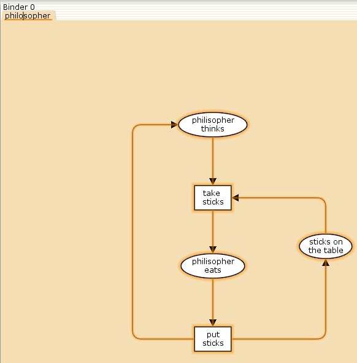
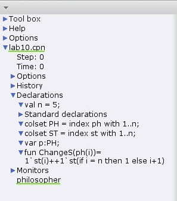
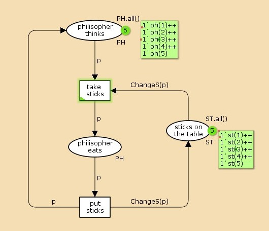
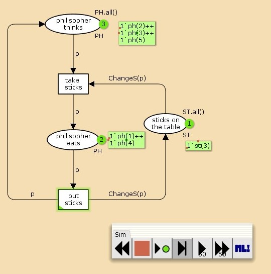
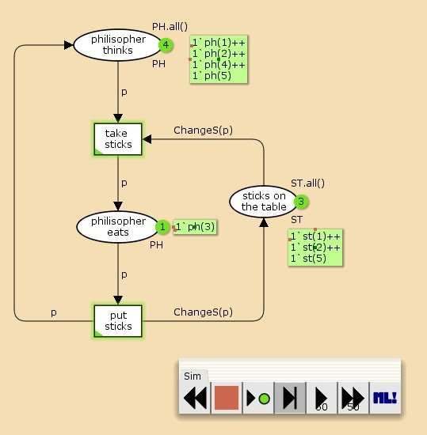
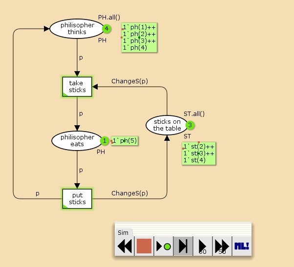
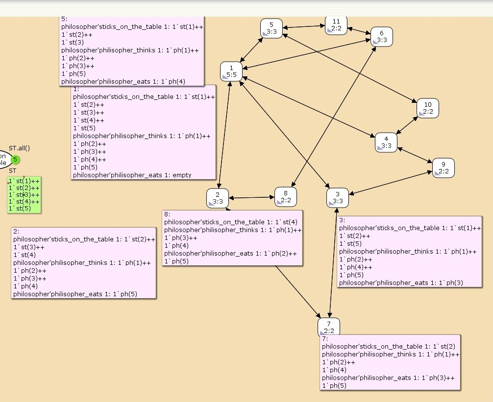

---
## Front matter
lang: ru-RU
title: "Лабораторная работа №10"
subtitle: "Задача об обедающих мудрецах"
author: 
  - Астраханцева А. А.
institute:
  - Российский университет дружбы народов, Москва, Россия
date: 11 апреля 2025

## i18n babel
babel-lang: russian
babel-otherlangs: english

## Formatting pdf
toc: false
toc-title: Содержание
slide_level: 2
aspectratio: 169
section-titles: true
theme: metropolis
header-includes:
 - \metroset{progressbar=frametitle,sectionpage=progressbar,numbering=fraction}
---

# Информация

## Докладчик

:::::::::::::: {.columns align=center}
::: {.column width="70%"}

  * Астраханцева Анастасия Александровна
  * НФИбд-01-22, 1132226437
  * Российский университет дружбы народов
  * [1132226437@pfur.ru](mailto:1132226437@pfur.ru)
  * <https://github.com/aaastrakhantseva>

:::
::: {.column width="30%"}


:::
::::::::::::::

# Вводная часть

## Цели лабораторной работы

Реализовать модель задачи об обедающих мудрецах с помощью CPN Tools.

# Выполнение ЛР

## Описание модели

Пять мудрецов сидят за круглым столом и могут пребывать в двух состояниях —
думать и есть. Между соседями лежит одна палочка для еды. Для приёма пищи
необходимы две палочки. Палочки — пересекающийся ресурс. Необходимо синхронизировать процесс еды так, чтобы мудрецы не умерли с голода.

# Реализация модели в CPN Tools

## Отрисовка графа модели

{#fig:001 width=70%}

## Декларации модели

{#fig:002 width=70%}

## Работающая модель

{#fig:003 width=70%}

## Запуск модели. 2 мудреца обедают

{#fig:004 width=70%}

## Запуск модели. Обедает мудрец номер 3

{#fig:005 width=70%}


## Запуск модели. Обедает мудрец номер 5

{#fig:006 width=70%}

## Описание отчета

```  
 Statistics
------------------------------------------------------------------------
  State Space
     Nodes:  11
     Arcs:   30
     Secs:   0
     Status: Full

  Scc Graph
     Nodes:  1
     Arcs:   0
     Secs:   0

``` 

## Описание отчета
 
``` 
 
 Boundedness Properties
------------------------------------------------------------------------

  Best Integer Bounds
                             Upper      Lower
     philosopher'philisopher_eats 1
                             2          0
     philosopher'philisopher_thinks 1
                             5          3
     philosopher'sticks_on_the_table 1
                             5          1

``` 

## Описание отчета

``` 
  Best Upper Multi-set Bounds
     philosopher'philisopher_eats 1     philosopher'sticks_on_the_table 1
1`ph(1)++                               1`st(1)++
1`ph(2)++                               1`st(2)++
1`ph(3)++                               1`st(3)++
1`ph(4)++                               1`st(4)++
1`ph(5)                                 1`st(5)
     philosopher'philisopher_thinks 1
                         1`ph(1)++
1`ph(2)++
1`ph(3)++
1`ph(4)++
1`ph(5)
``` 

## Описание отчета

``` 
   Best Lower Multi-set Bounds
     philosopher'philisopher_eats 1
                         empty
     philosopher'philisopher_thinks 1
                         empty
     philosopher'sticks_on_the_table 1
                         empty

 Home Properties
------------------------------------------------------------------------

  Home Markings
     All

``` 

## Описание отчета

``` 
   Liveness Properties
------------------------------------------------------------------------
  Dead Markings
     None

  Dead Transition Instances
     None

  Live Transition Instances
     All

 Fairness Properties
------------------------------------------------------------------------
       philosopher'put_sticks 1              Impartial
       philosopher'take_sticks 1             Impartial

``` 


 


## Граф пространства состояний

{#fig:007 width=70%}


## Выводы

В ходе выполнения лабораторной работы я реализовала задачу обедающий мудрецов с помощью CPN Tools.

# Спасибо за внимание!
