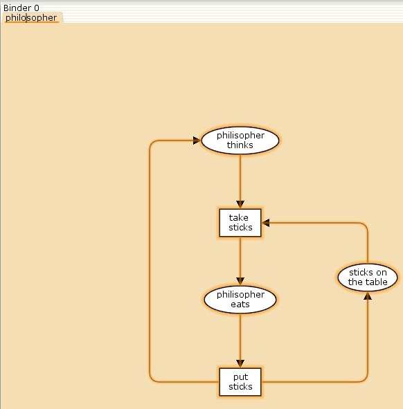
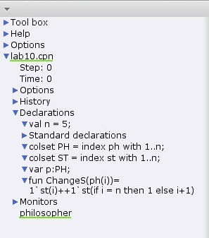
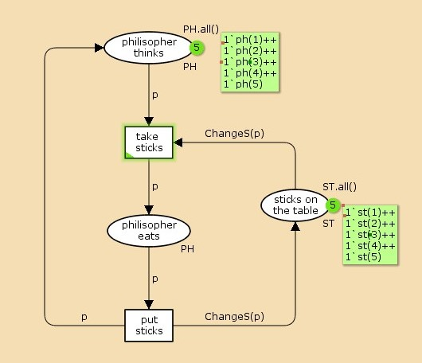
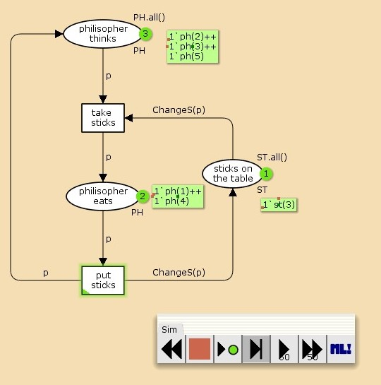
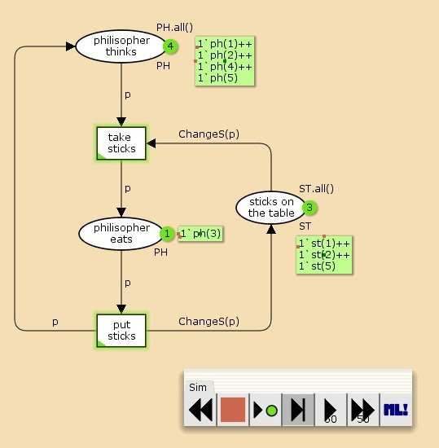
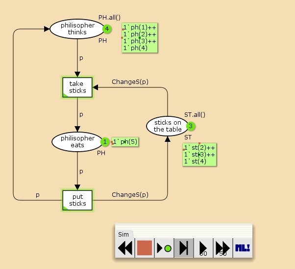
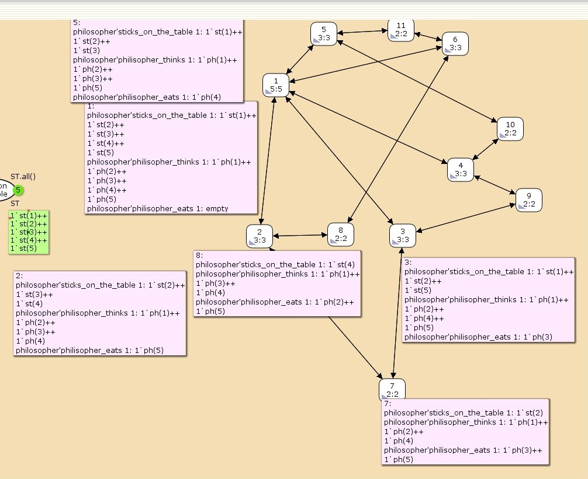

---
## Front matter
title: "Лабораторная работа №10"
subtitle: "Задача об обедающих мудрецах"
author: "Астраханцева А. А."

## Generic otions
lang: ru-RU
toc-title: "Содержание"

## Bibliography
bibliography: bib/cite.bib
csl: pandoc/csl/gost-r-7-0-5-2008-numeric.csl

## Pdf output format
toc: true # Table of contents
toc-depth: 2
lof: true # List of figures
lot: false # List of tables
fontsize: 12pt
linestretch: 1.5
papersize: a4
documentclass: scrreprt
## I18n polyglossia
polyglossia-lang:
  name: russian
  options:
	- spelling=modern
	- babelshorthands=true
polyglossia-otherlangs:
  name: english
## I18n babel
babel-lang: russian
babel-otherlangs: english
## Fonts
mainfont: PT Serif
romanfont: PT Serif
sansfont: PT Sans
monofont: PT Mono
mainfontoptions: Ligatures=TeX
romanfontoptions: Ligatures=TeX
sansfontoptions: Ligatures=TeX,Scale=MatchLowercase
monofontoptions: Scale=MatchLowercase,Scale=0.9
## Biblatex
biblatex: true
biblio-style: "gost-numeric"
biblatexoptions:
  - parentracker=true
  - backend=biber
  - hyperref=auto
  - language=auto
  - autolang=other*
  - citestyle=gost-numeric
## Pandoc-crossref LaTeX customization
figureTitle: "Рис."
tableTitle: "Таблица"
listingTitle: "Листинг"
lofTitle: "Список иллюстраций"
lotTitle: "Список таблиц"
lolTitle: "Листинги"
## Misc options
indent: true
header-includes:
  - \usepackage{indentfirst}
  - \usepackage{float} # keep figures where there are in the text
  - \floatplacement{figure}{H} # keep figures where there are in the text
---

# Цель работы

Реализовать модель задачи об обедающих мудрецах с помощью CPN Tools.

# Теоретическое введение

CPN Tools — специальное программное средство, предназначенное для моделирования иерархических временных раскрашенных сетей Петри. Такие сети эквивалентны машине Тьюринга и составляют универсальную алгоритмическую систему, позволяющую описать произвольный объект. CPN Tools позволяет визуализировать модель с помощью графа сети Петри и применить язык программирования CPN ML (Colored Petri Net Markup Language) для формализованного описания модели.

Назначение CPN Tools:

* разработка сложных объектов и моделирование процессов в различных прикладных областях, в том числе:
* моделирование производственных и бизнес-процессов;
* моделирование систем управления производственными системами и роботами;
* спецификация и верификация протоколов, оценка пропускной способности сетей и качества обслуживания, проектирование телекоммуникационных устройств и сетей.

Основные функции CPN Tools:

* создание (редактирование) моделей;
* анализ поведения моделей с помощью имитации динамики сети Петри;
* построение и анализ пространства состояний модели


# Реализация модели в xcos

Пять мудрецов сидят за круглым столом и могут пребывать в двух состояниях —
думать и есть. Между соседями лежит одна палочка для еды. Для приёма пищи
необходимы две палочки. Палочки — пересекающийся ресурс. Необходимо синхронизировать процесс еды так, чтобы мудрецы не умерли с голода.

Для запуска CPN Tools в терминале нужно прописать команду `cpntools &`. Рисуем граф сети. Для этого с помощью контекстного меню создаём новую сеть, добавляем позиции, переход и дуги. 

Начальные данные:

– позиции: мудрец размышляет (philosopher thinks), мудрец ест (philosopher eats), палочки находятся на столе (sticks on the table)

– переходы: взять палочки (take sticks), положить палочки (put sticks)  (рис. [-@fig:001]).

{#fig:001 width=70%}

2.2. В меню задаём новые декларации модели: типы фишек, начальные значения позиций, выражения для дуг (рис. [-@fig:002]):

– `n` — число мудрецов и палочек `(n = 5)`;

– `p` — фишки, обозначающие мудрецов, имеют перечисляемый тип `PH` от `1` до `n`;

– `s` — фишки, обозначающие палочки, имеют перечисляемый тип `ST` от `1` до `n`;

– функция `ChangeS(p)` ставит в соответствие мудрецам палочки (возвращает номера палочек, используемых мудрецами); по условию задачи мудрецы сидят по кругу и мудрец `p(i)` может взять `i` и `i + 1` палочки, поэтому функция `ChangeS(p)` определяется следующим образом:
```
fun ChangeS (ph(i))=
1`st(i)++st(if i = n then 1 else i+1)
```


{#fig:002 width=70%}


В результате получаем работающую модель (рис. [-@fig:003]).

{#fig:003 width=70%}

После запуска модели наблюдаем, что одновременно палочками могут воспользоваться только два из пяти мудрецов (рис. [-@fig:004]).

{#fig:004 width=70%}

Также замечаем, что разные философы могут переходить из состояния "думающих" в "едящих" (рис. [-@fig:005] - [-@fig:006]).

{#fig:005 width=70%}

{#fig:006 width=70%}

## Выполнение упражнения

Прежде чем приступить к вычислению пространства состояний, необходимо сформировать код для этого пространства. Это делается с помощью инструмента "Войти в пространство состояний", который может занять некоторое время.
Если ожидается небольшое пространство состояний, можно напрямую применить инструмент "Вычислить пространство состояний" к странице сети.

После вычисления пространства состояний формируем отчёт. Чтобы сохранить отчёт, используем инструмент "Сохранить отчет о пространстве состояний" и указываем имя файла.
Получим такой отчет: 
``` 
CPN Tools state space report for:
/home/openmodelica/Documents/cpntools/lab10.cpn
Report generated: Fri Apr 11 18:38:11 2025


 Statistics
------------------------------------------------------------------------

  State Space
     Nodes:  11
     Arcs:   30
     Secs:   0
     Status: Full

  Scc Graph
     Nodes:  1
     Arcs:   0
     Secs:   0


 Boundedness Properties
------------------------------------------------------------------------

  Best Integer Bounds
                             Upper      Lower
     philosopher'philisopher_eats 1
                             2          0
     philosopher'philisopher_thinks 1
                             5          3
     philosopher'sticks_on_the_table 1
                             5          1

  Best Upper Multi-set Bounds
     philosopher'philisopher_eats 1
                         1`ph(1)++
1`ph(2)++
1`ph(3)++
1`ph(4)++
1`ph(5)
     philosopher'philisopher_thinks 1
                         1`ph(1)++
1`ph(2)++
1`ph(3)++
1`ph(4)++
1`ph(5)
     philosopher'sticks_on_the_table 1
                         1`st(1)++
1`st(2)++
1`st(3)++
1`st(4)++
1`st(5)

  Best Lower Multi-set Bounds
     philosopher'philisopher_eats 1
                         empty
     philosopher'philisopher_thinks 1
                         empty
     philosopher'sticks_on_the_table 1
                         empty


 Home Properties
------------------------------------------------------------------------

  Home Markings
     All


 Liveness Properties
------------------------------------------------------------------------

  Dead Markings
     None

  Dead Transition Instances
     None

  Live Transition Instances
     All


 Fairness Properties
------------------------------------------------------------------------
       philosopher'put_sticks 1
                         Impartial
       philosopher'take_sticks 1
                         Impartial


```

Отчет предоставляет информацию о состоянии пространства состояний, связности графа сильно связных компонентов (Scc Graph), ограниченности, домашних разметках, живости и справедливости переходов.

- Пространство Состояний: Полностью построено с 11 узлами и 30 дугами, что указывает на небольшую и простую модель.

- Граф Сильно Связных Компонентов: Одна компонента без дуг, что может указывать на детерминированное поведение.

- Ограниченность: Модель имеет целочисленные ограничения на количество философов и палочек, например, от 0 до 2 философов, которые едят, и от 1 до 5 палочек на столе.

- Домашние Разметки и Живость: Все состояния достижимы из начального состояния и обратно, нет мертвых разметок или переходов, что указывает на стабильность и отсутствие блокировок.

- Справедливость: Переходы по взятию и положению палочек беспристрастны.

Построенный граф пространства состояний (рис. [-@fig:007]).

{#fig:007 width=70%}


# Выводы

В ходе выполнения лабораторной работы я реализовала задачу обедающий мудрецов с помощью CPN Tools.

# Список литературы{.unnumbered}

1. Королькова А.В., Кулябов Д.С. Руководство к лабораторной работе №10. Моделирование информационных процессов. Задача об обедающих мудрецах - 2025. — 3 с.
2. Modeling with Coloured Petri Nets [Электронный ресурс] // URL: https://cpntools.org/2018/01/16/getting-started.
3. Jensen K., Kristensen L.M., Wells L. Coloured Petri Nets and CPN Tools for Modelling and Validation of Concurrent Systems // Software Tools for Technology Transfer. 2007. — URL: https://cs.au.dk/fileadmin/site_files/cs/research_areas/centers_and_projects/sttt2007.pdf.
4. Ratzer A.V., Wells L., Lassen H.M., et al. CPN Tools for Editing, Simulating, and Analysing Coloured Petri Nets // ICATPN Proceedings, 2003 — URL: https://api.semanticscholar.org/CorpusID:12059006.
5. Beaudouin-Lafon M., Mackay W.E., Andersen P., et al. Editing and Simulating Coloured Petri Nets // CPNTools.doc, University of Aarhus, 2000 — URL: https://www.lri.fr/~mbl/papers/PN2000/paper.pdf.


