---
## Front matter
lang: ru-RU
title: "Лабораторная работа №11"
subtitle: "Модель системы массового обслуживания $M|M|1$"
author: 
  - Астраханцева А. А.
institute:
  - Российский университет дружбы народов, Москва, Россия
date: 18 апреля 2025

## i18n babel
babel-lang: russian
babel-otherlangs: english

## Formatting pdf
toc: false
toc-title: Содержание
slide_level: 2
aspectratio: 169
section-titles: true
theme: metropolis
header-includes:
 - \metroset{progressbar=frametitle,sectionpage=progressbar,numbering=fraction}
---

# Информация

## Докладчик

:::::::::::::: {.columns align=center}
::: {.column width="70%"}

  * Астраханцева Анастасия Александровна
  * НФИбд-01-22, 1132226437
  * Российский университет дружбы народов
  * [1132226437@pfur.ru](mailto:1132226437@pfur.ru)
  * <https://github.com/aaastrakhantseva>

:::
::: {.column width="30%"}


:::
::::::::::::::

# Вводная часть

## Цели лабораторной работы

Реализовать модель $M|M|1$ в CPN tools.

# Выполнение ЛР

## Описание модели

В систему поступает поток заявок двух типов, распределённый по пуассоновскому закону. Заявки поступают в очередь сервера на обработку. Дисциплина очереди - FIFO. Если сервер находится в режиме ожидания (нет заявок на сервере), то заявка поступает на обработку сервером.

# Реализация модели в CPN Tools

## Граф сети системы обработки заявок в очереди

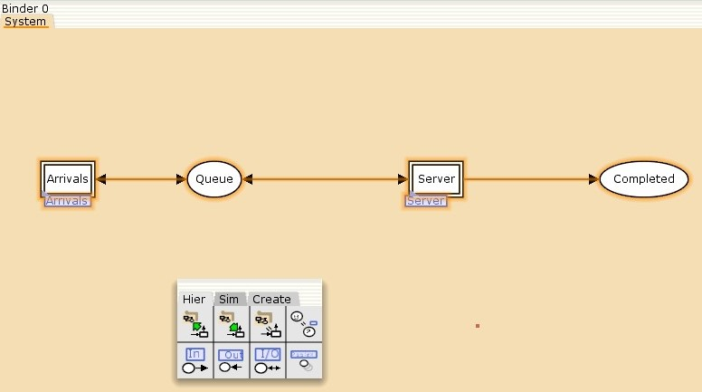{#fig:001 width=70%}

## Граф генератора заявок системы

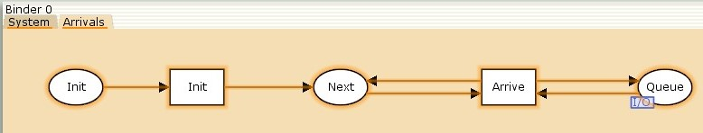{#fig:002 width=70%}

## Граф процесса обработки заявок на сервере системы

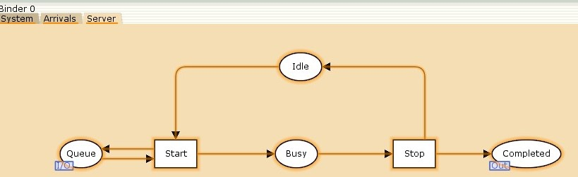{#fig:003 width=70%}

## Декларации системы

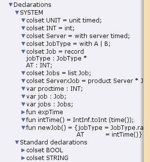{#fig:004 width=70%}

## Параметры элементов основного графа системы обработки заявок в очереди

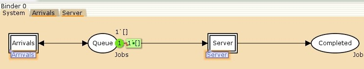{#fig:005 width=70%}


## Параметры элементов генератора заявок системы

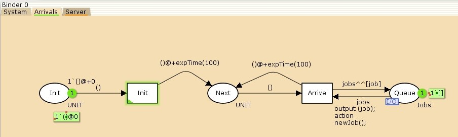{#fig:006 width=70%}

## Параметры элементов обработчика заявок системы

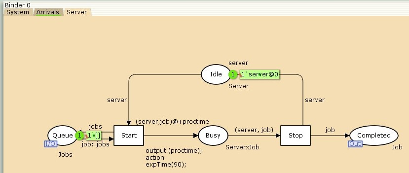{#fig:007 width=70%}

# Мониторинг параметров моделируемой системы

## Функция Predicate монитора Ostanovka

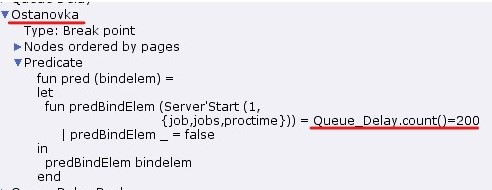{#fig:008 width=70%}

## Функция Observer монитора Queue Delay

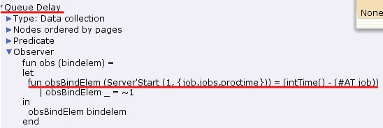{#fig:009 width=70%}

## Файл Queue_Delay.log

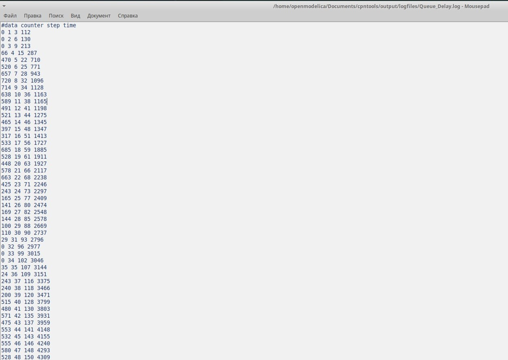{#fig:010 width=70%}

## Отрисока графика с помощью gnuplot

```
gnuplot
set termnal png
set output "plot.png"
plot "Queue_Delay.log" using ($4):($1) with lines
quit
```


## График изменения задержки в очереди

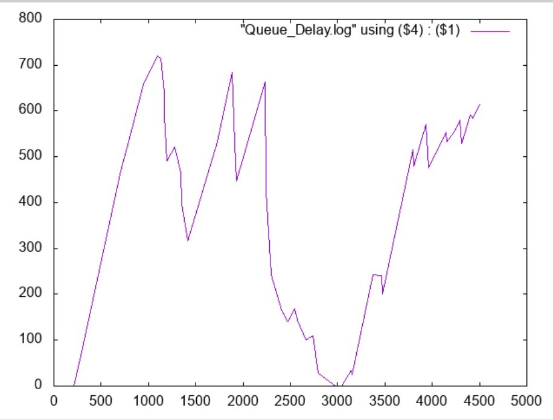{#fig:011 width=70%}

## Функция Observer монитора Queue Delay Real

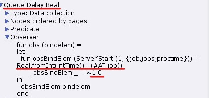{#fig:012 width=70%}

## Содержимое Queue_Delay_Real.log

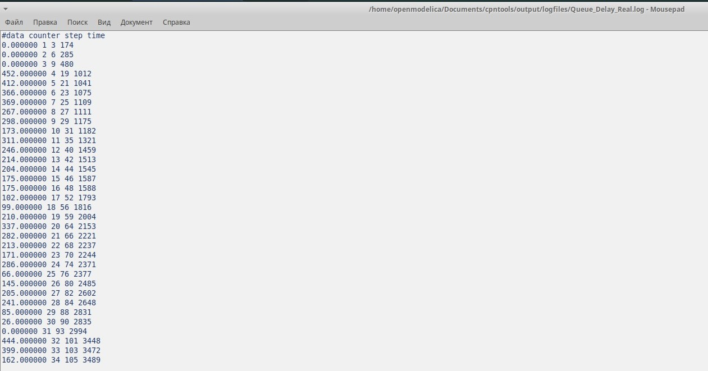{#fig:013 width=70%}

## Функция Observer монитора Long Delay Time

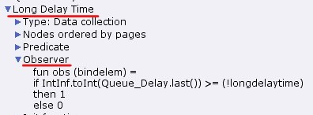{#fig:014 width=70%}

## Определение longdelaytime в декларациях

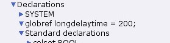{#fig:015 width=70%}

## Содержимое Long_Delay_Time.log

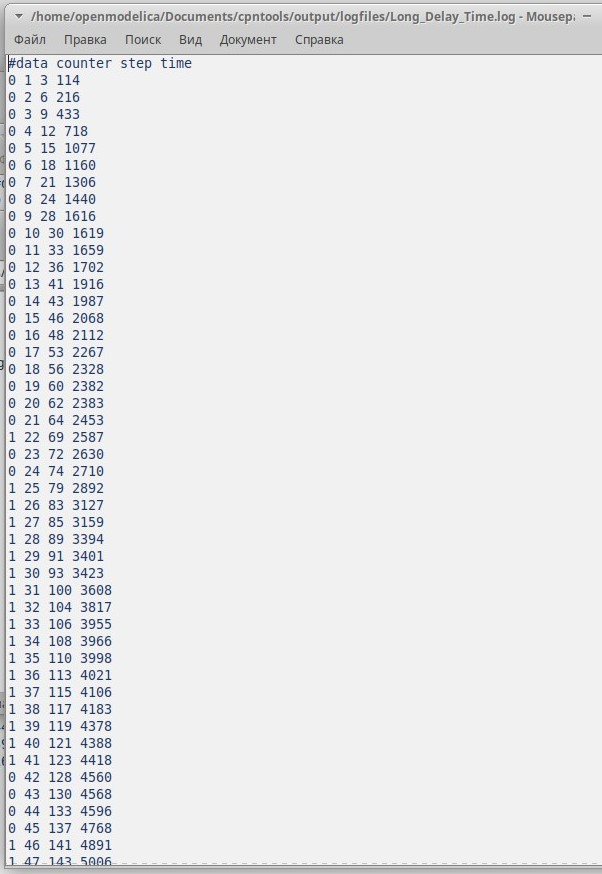{#fig:016 width=70%}
 
## Отрисока графика с помощью gnuplot

```
gnuplot
set termnal png
set output "plot2.png"
set yrange [0:1.2]
plot [0:] [0:1.2] "Long_Delay_Time.log" using ($4):($1) with lines
quit
```


## Периоды времени, когда значения задержки в очереди превышали заданное значение

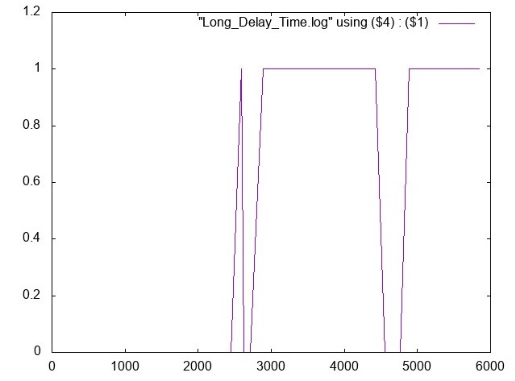{#fig:017 width=70%}


## Выводы

В процессе выполнения данной лабораторной работы я реализовала модель системы массового обслуживания $M|M|1$ в CPN Tools.

# Спасибо за внимание!
