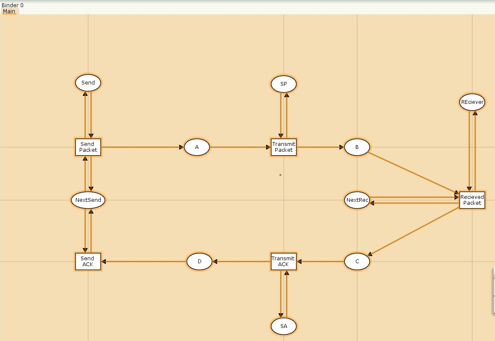
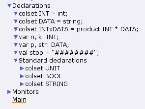
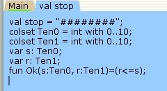
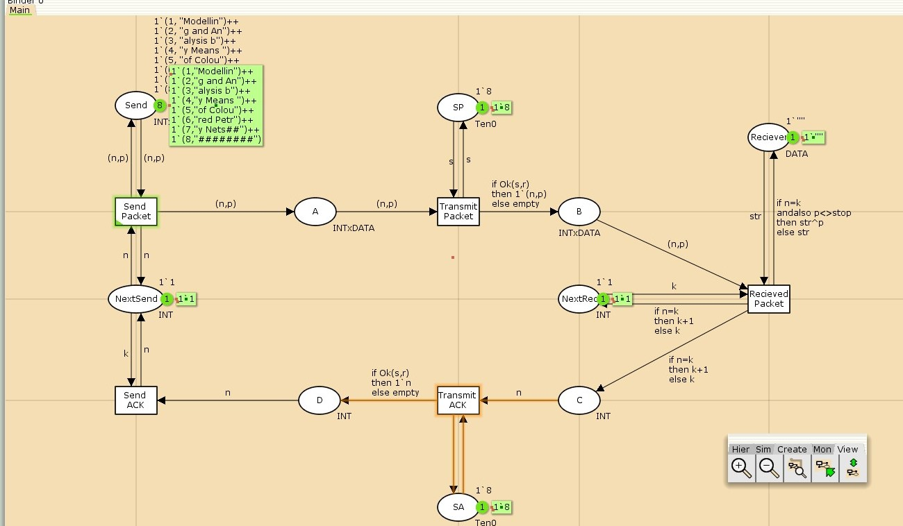
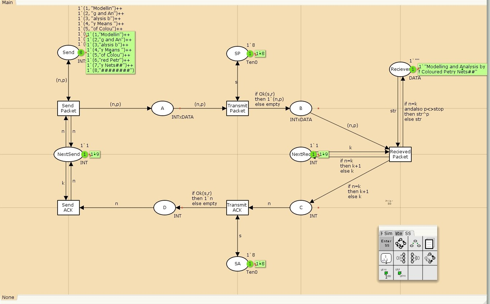
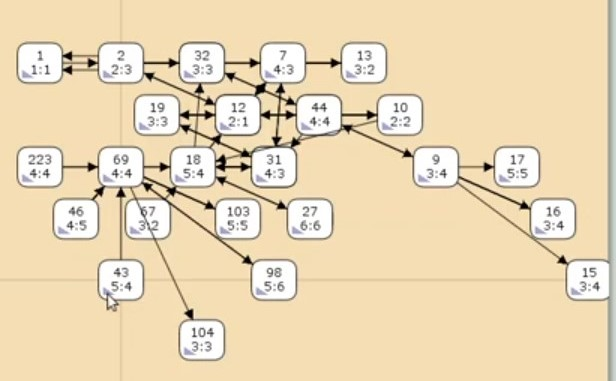

---
## Front matter
lang: ru-RU
title: "Лабораторная работа №12"
subtitle: "Пример моделирования простого протокола передачи данных"
author: 
  - Астраханцева А. А.
institute:
  - Российский университет дружбы народов, Москва, Россия
date: 26 апреля 2025

## i18n babel
babel-lang: russian
babel-otherlangs: english

## Formatting pdf
toc: false
toc-title: Содержание
slide_level: 2
aspectratio: 169
section-titles: true
theme: metropolis
header-includes:
 - \metroset{progressbar=frametitle,sectionpage=progressbar,numbering=fraction}
---

# Информация

## Докладчик

:::::::::::::: {.columns align=center}
::: {.column width="70%"}

  * Астраханцева Анастасия Александровна
  * НФИбд-01-22, 1132226437
  * Российский университет дружбы народов
  * [1132226437@pfur.ru](mailto:1132226437@pfur.ru)
  * <https://github.com/aaastrakhantseva>

:::
::: {.column width="30%"}


:::
::::::::::::::

# Вводная часть

## Цели лабораторной работы

**Цель**

Реализовать простой протокол передачи данных в CPN Tools.

**Задание**

- Реализовать простой протокол передачи данных в CPN Tools.
- Вычислить пространство состояний, сформировать отчет о нем и построить граф.

# Выполнение ЛР

## Описание модели

Рассмотрим ненадёжную сеть передачи данных, состоящую из источника, получателя.
Перед отправкой очередной порции данных источник должен получить от получателя подтверждение о доставке предыдущей порции данных.

Считаем, что пакет состоит из номера пакета и строковых данных. Передавать
будем сообщение «Modelling and Analysis by Means of Coloured Petry Nets», разбитое
по 8 символов

# Реализация модели в CPN Tools

## Отрисовка графа модели

{#fig:001 width=70%}

## Декларации модели

{#fig:002 width=70%}

## Декларации модели

{#fig:003 width=70%}

## Работающая модель

{#fig:004 width=70%}


## Запуск модели

{#fig:005 width=70%}

## Описание отчета

```  
Statistics
------------------------------------------------------------------------

  State Space
     Nodes:  8914
     Arcs:   131231
     Secs:   300
     Status: Partial

  Scc Graph
     Nodes:  4653
     Arcs:   107318
     Secs:   36

``` 

## Описание отчета
 
``` 
Boundedness Properties
------------------------------------------------------------------------

  Best Integer Bounds
                             Upper      Lower
     Main'A 1                19         0
     Main'B 1                9          0
     Main'C 1                6          0
     Main'D 1                4          0
     Main'NextRec 1          1          1
     Main'NextSend 1         1          1
     Main'Reciever 1         1          1
     Main'SA 1               1          1
     Main'SP 1               1          1
     Main'Send 1             8          8

``` 

## Описание отчета

Свойства ограниченности (Boundedness):

Верхние границы для позиций:

Main'A 1: макс. 19 маркеров

Main'B 1: макс. 9 маркеров

Main'C 1: макс. 6 маркеров

Main'D 1: макс. 4 маркера

Позиции Main'SA 1 и Main'SP 1 имеют фиксированное количество маркеров (1`8).

Позиция Main'Send 1 содержит 8 маркеров с различными значениями.

## Описание отчета

``` 
 Home Properties
------------------------------------------------------------------------

  Home Markings
     None

 Liveness Properties
------------------------------------------------------------------------

  Dead Markings
     3115 [8914,8913,8912,8911,8910,...]

  Dead Transition Instances
     None

  Live Transition Instances
     None

``` 

## Описание отчета

```
 Fairness Properties
------------------------------------------------------------------------
       Main'Recieved_Packet 1 No Fairness
       Main'Send_ACK 1        No Fairness
       Main'Send_Packet 1     Impartial
       Main'Transmit_ACK 1    No Fairness
       Main'Transmit_Packet 1 Impartial

```


## Граф пространства состояний

{#fig:007 width=70%}


## Выводы

В процессе выполнения данной лабораторной работы я реализовала простой протокол передачи данных в CPN Tools и проведен анализ его пространства состояний.


