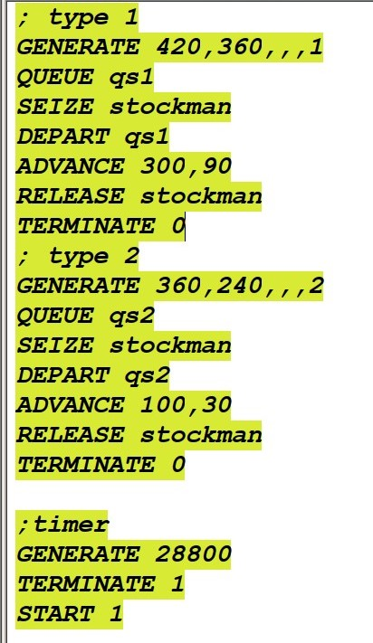
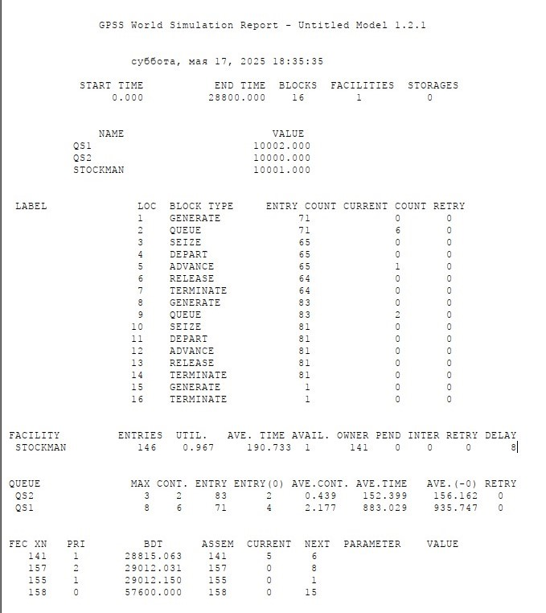
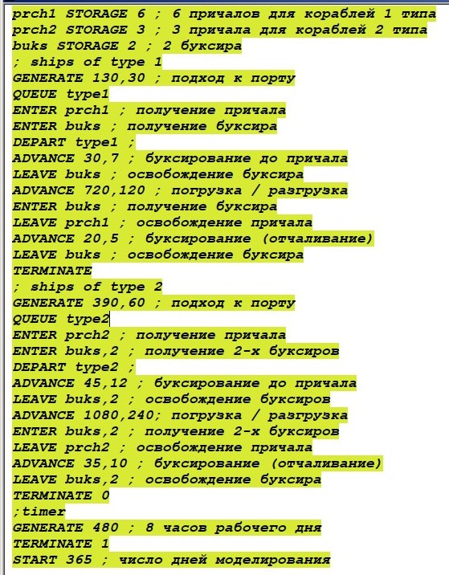
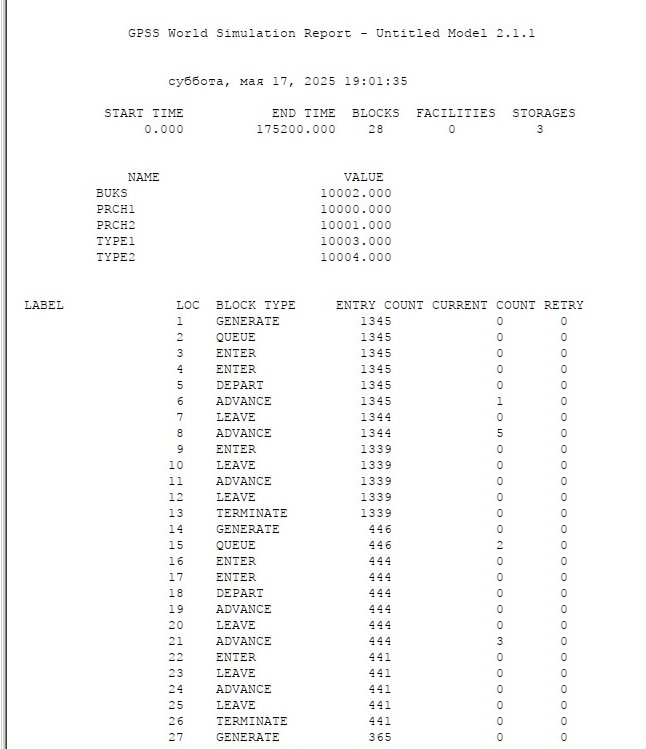
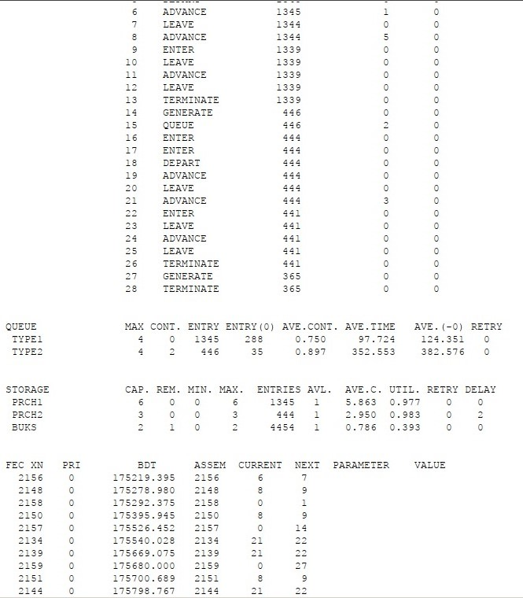

---
## Front matter
title: "Отчёт по лабораторной работе №15"
subtitle: "Модели обслуживания с приоритетами"
author: "Астраханцева А. А."

## Generic otions
lang: ru-RU
toc-title: "Содержание"

## Bibliography
bibliography: bib/cite.bib
csl: pandoc/csl/gost-r-7-0-5-2008-numeric.csl

## Pdf output format
toc: true # Table of contents
toc-depth: 2
lof: true # List of figures
lot: true # List of tables
fontsize: 12pt
linestretch: 1.5
papersize: a4
documentclass: scrreprt
## I18n polyglossia
polyglossia-lang:
  name: russian
  options:
	- spelling=modern
	- babelshorthands=true
polyglossia-otherlangs:
  name: english
## I18n babel
babel-lang: russian
babel-otherlangs: english
## Fonts
mainfont: PT Serif
romanfont: PT Serif
sansfont: PT Sans
monofont: PT Mono
mainfontoptions: Ligatures=TeX
romanfontoptions: Ligatures=TeX
sansfontoptions: Ligatures=TeX,Scale=MatchLowercase
monofontoptions: Scale=MatchLowercase,Scale=0.9
## Biblatex
biblatex: true
biblio-style: "gost-numeric"
biblatexoptions:
  - parentracker=true
  - backend=biber
  - hyperref=auto
  - language=auto
  - autolang=other*
  - citestyle=gost-numeric
## Pandoc-crossref LaTeX customization
figureTitle: "Рис."
tableTitle: "Таблица"
listingTitle: "Листинг"
lofTitle: "Список иллюстраций"
lotTitle: "Список таблиц"
lolTitle: "Листинги"
## Misc options
indent: true
header-includes:
  - \usepackage{indentfirst}
  - \usepackage{float} # keep figures where there are in the text
  - \floatplacement{figure}{H} # keep figures where there are in the text
---

# Цель работы

Реализовать модели обслуживания с приоритетами и провести анализ результатов.

# Задание

Реализовать с помощью gpss:

- Модель обслуживания механиков на складе;

- Модель обслуживания в порту судов двух типов;

# Теоретическое введение

GPSS (General Purpose Simulation System) — это один из первых специализированных языков программирования для имитационного моделирования, созданный в 1961 году американским инженером Джеффри Гордоном в корпорации IBM. Первоначально язык разрабатывался для нужд моделирования сложных логистических и производственных процессов в промышленных и военных системах, где требовался учёт случайных событий и взаимодействия большого количества объектов во времени.

GPSS стал знаковым инструментом в истории моделирования: он заложил основы событийного подхода и ввёл понятие транзакта как активного объекта, перемещающегося по блокам логики системы. Эти концепции впоследствии легли в основу многих других языков и программных сред моделирования. Благодаря модульной структуре и простой записи моделей, GPSS получил широкое распространение в университетах и научных учреждениях как средство обучения и анализа дискретных систем.

Практическое применение GPSS охватывает широкий спектр задач:

- Организация работы производственных цехов: моделирование потока деталей между станками, учёт времени обработки, простоев и загрузки оборудования;

- Системы массового обслуживания: моделирование очередей в банках, поликлиниках, аэропортах с целью оценки времени ожидания и необходимости в дополнительном персонале;

- Логистика и склады: моделирование перемещения товаров между зонами хранения, погрузки и разгрузки, анализ загрузки транспортных средств;

- Транспорт: моделирование движения автобусов, поездов, планирование расписаний с учётом времени на посадку и высадку пассажиров;

- Военные приложения: планирование операций снабжения, имитация действий в сложных логистических цепочках.

Одним из достоинств GPSS является то, что язык допускает использование случайных величин (например, времени обслуживания или интервалов между заявками), что позволяет создавать реалистичные модели, приближенные к поведению реальных систем. Также GPSS даёт возможность легко собирать статистику по ключевым метрикам: времени пребывания объектов в системе, загрузке ресурсов, количеству отказов и пр.

Несмотря на то, что с момента своего создания прошло более шестидесяти лет, GPSS продолжает использоваться как в учебных целях, так и в инженерной практике благодаря своей простоте, наглядности и эффективности в решении прикладных задач, связанных с анализом и оптимизацией дискретных процессов.

[@Korolkova2025; @sosnovikov2023].

# Выполнение лабораторной работы

##  Модель обслуживания механиков на складе

На фабрике на складе работает один кладовщик, который выдает запасные части механикам, обслуживающим станки. Время, необходимое для удовлетворения запроса, зависит от типа запасной части. Запросы бывают двух категорий. Для первой категории интервалы времени прихода механиков 420 &plusmn; 360 сек., время обслуживания — 300 &plusmn; 90 сек. Для второй категории интервалы времени прихода механиков
360 &plusmn; 240 сек., время обслуживания — 100 &plusmn; 30 сек.

Порядок обслуживания механиков кладовщиком такой: запросы первой категории обслуживаются только в том случае, когда в очереди нет ни одного запроса второй категории. Внутри одной категории дисциплина обслуживания — «первым пришел – первым обслужился». Необходимо создать модель работы кладовой, моделирование выполнять в течение восьмичасового рабочего дня.

Есть два различных типа заявок, поступающих на обслуживание к одному устройству. Различаются распределения интервалов приходов и времени обслуживания для этих типов заявок. Приоритеты запросов задаются путем использования для операнда `E` блока `GENERATE` запросов второй категории большего значения, чем для запросов первой категории.

Таким образом, имеем (рис. @fig:001).

{#fig:001 width=70%}

После запуска симуляции получаем отчёт (рис. @fig:002).

{#fig:002 width=70%}

Результаты работы модели:

- модельное время в начале моделирования: `START TIME`=0.0;

- абсолютное время или момент, когда счетчик завершений принял значение 0: `END TIME`=28800.0;

- количество блоков, использованных в текущей модели, к моменту завершения моделирования: `BLOCKS`=16;

- количество одноканальных устройств, использованных в модели к моменту завершения моделирования: `FACILITIES`=1;

- количество многоканальных устройств, использованных в текущей модели к моменту завершения моделирования: 
`STORAGES`=0. Имена, используемые в программе модели: `QS1`, `QS2`, `STOCKMAN`. 

Далее идёт информация о блоках текущей модели, в частности, `ENTRY COUNT` -- количество транзактов, вошедших в блок с начала процедуры моделирования. 

Затем идёт информация об одноканальном устройстве `FACILITY` (кладовщик, который выдает запасные части механикам), откуда видим, что кладовщику попало 141 обращение от механиков (значение поля `ENTRIES`=146), последнее обращение, которое клавовщик принял в работу - 141 до окончания рабочего времени (значение поля `OWNER`=141). Полезность работы оператора составила 0, 967. При этом среднее время занятости оператора составило 190, 733 мин.

Далее информация об очереди:

- `QUEUE` = `QS1` -- имя объекта типа «очередь»;

- `MAX` = 3 -- в очереди находилось не более одной ожидающей заявки от клиента;

- `CONT` = 2 -- на момент завершения моделирования в очереди было 2 обращения;

- `ENTRIES` = 83 -- общее число обращений, прошедших через очередь в течение периода моделирования;

- `ENTRIES(O)` = 2 -- число обащений, попавших к кладовщику без ожидания в очереди;

- `AVE.CONT` = 0, 439 обращений в среднем были в очереди;

- `AVE.TIME` = 152.399 минут в среднем обращения провели в очереди (с учётом всех входов в очередь);

- `AVE.(–0)` = 156.162 минут в среднем обращения провели в очереди (без учета «нулевых» входов в очередь).

- `QUEUE` = `QS2` -- имя объекта типа «очередь»;

- `MAX` = 8 -- в очереди находилось не более одной ожидающей заявки от клиента;

- `CONT` = 6 -- на момент завершения моделирования в очереди было 2 обращения;

- `ENTRIES` = 71 -- общее число обращений, прошедших через очередь в течение периода моделирования;

- `ENTRIES(O)` = 4 -- число обащений, попавших к кладовщику без ожидания в очереди;

- `AVE.CONT` = 2, 177 обращений в среднем были в очереди;

- `AVE.TIME` = 883, 029 минут в среднем обращения провели в очереди (с учётом всех входов в очередь);

- `AVE.(–0)` = 935, 747 минут в среднем обращения провели в очереди (без учета «нулевых» входов в очередь).

В конце отчёта идёт информация о будущих событиях.

## Модель обслуживания в порту судов двух типов

Морские суда двух типов прибывают в порт, где происходит их разгрузка. В порту есть два буксира, обеспечивающих ввод и вывод кораблей из порта. К первому типу судов относятся корабли малого тоннажа, которые требуют использования одного буксира. Корабли второго типа имеют большие размеры, и для их ввода и вывода из порта требуется два буксира. Из-за различия размеров двух типов кораблей необходимы и причалы различного размера. Кроме того, корабли имеют различное время погрузки/разгрузки. Требуется построить модель системы, в которой можно оценить время ожидания кораблями каждого типа входа в порт. Время ожидания входа в порт включает время ожидания освобождения причала и буксира. Корабль, ожидающий освобождения причала, не обслуживается буксиром до тех пор, пока не будет предоставлен нужный причал. Корабль второго типа не займёт буксир до тех пор, пока ему не будут доступны оба буксира (рис. @fig:003, @fig:004, @fig:005).

Параметры модели:

– для корабля первого типа:

– интервал прибытия: 130 &plusmn; 30 мин;

– время входа в порт: 30 &plusmn; 7 мин;

– количество доступных причалов: 6;

– время погрузки/разгрузки: 12 &plusmn; 2 час;

– время выхода из порта: 20 &plusmn; 5 мин;

– для корабля второго типа:

– интервал прибытия: 390 &plusmn; 60 мин;

– время входа в порт: 45 &plusmn; 12 мин;

– количество доступных причалов: 3;

– время погрузки/разгрузки: 18 &plusmn; 4 час;

– время выхода из порта: 35 &plusmn; 10 мин.

– время моделирования: 365 дней по 8 часов.

{#fig:003 width=70%}

{#fig:004 width=70%}

{#fig:005 width=70%}

**Задание**: проанализировать отчёт.

Результаты работы модели:

- модельное время в начале моделирования: `START TIME`=0.0;

- абсолютное время или момент, когда счетчик завершений принял значение 0: `END TIME`= 175200.0 (365 дней по 3 часов в день);

- количество блоков, использованных в текущей модели, к моменту завершения моделирования: `BLOCKS`=28;

- количество одноканальных устройств, использованных в модели к моменту завершения моделирования: `FACILITIES`=0;

- количество многоканальных устройств, использованных в текущей модели к моменту завершения моделирования: 
`STORAGES`=3. Имена, используемые в программе модели: `BUKS`, `PRCH1`, `PRCH2`, `TYPE1`, `TYPE2`. 

Далее идёт информация о блоках текущей модели, в частности, `ENTRY COUNT` -- количество транзактов, вошедших в блок с начала процедуры моделирования. 

Затем идёт информация об многоканальных устройствах `STORAGE`. В данной части отчета модно узнать об емкости многоканальных устройств, минимальных и максимальных количествах используемых устройств (каналов), количество транзакотов (в рамках данной задачи -- судов), полезность утройств и среднее число испоьзуемых каналов.

Далее информация об очереди:

Имеются 2 объекта типа "очередь" - `TYPE1`, `TYPE2`. В данной части отчета расположена инфомация о максимальном кол-ве транзактов (судов) в очереди кажого типа, среднее время пребывания о очереди, среднее кол-во судов в очереди и т. д.

В конце отчёта идёт информация о будущих событиях. 

# Выводы

В ходе данной лабораторной работы я реализовала модели обслуживания с приоритетами и провела анализ результатов.

# Список литературы{.unnumbered}

::: {#refs}
:::
