---
## Front matter
lang: ru-RU
title: "Лабораторная работа №16"
subtitle: "Задачи оптимизации. Модель двух стратегий обслуживания"
author:
  - Астраханцева А. А.
institute:
  - Группа НФИбд-01-22
  - Российский университет дружбы народов, Москва, Россия
date: 23 мая 2025

## i18n babel
babel-lang: russian
babel-otherlangs: english

## Formatting pdf
toc: false
toc-title: Содержание
slide_level: 2
aspectratio: 169
section-titles: true
theme: metropolis
header-includes:
 - \metroset{progressbar=frametitle,sectionpage=progressbar,numbering=fraction}
 - '\makeatletter'
 - '\beamer@ignorenonframefalse'
 - '\makeatother'
---

# Информация

## Докладчик

:::::::::::::: {.columns align=center}
::: {.column width="70%"}

  * Астраханцева Анастасия Александровна
  * НФИбд-01-22, 1132226437
  * Российский университет дружбы народов
  * [1132226437@pfur.ru](mailto:1132226437@pfur.ru)
  * <https://github.com/aaastrakhantseva>

:::
::: {.column width="30%"}

:::
::::::::::::::

# Вводная часть

## Цели и задачи

Реализовать с помощью gpss модель двух стратегий обслуживания и оценить оптимальные параметры.

## Задание

Реализовать с помощью gpss:

- модель с двумя очередями;

- модель с одной очередью;

- изменить модели, чтобы определить оптимальное число пропускных пунктов.

## Постановка задачи

На пограничном контрольно -пропускном пункте транспорта имеются 2 пункта пропуска. Интервалы времени между поступлением автомобилей имеют экспоненциальное распределение со средним значением $\mu$. Время прохождения автомобилями пограничного контроля имеет равномерное распределение на интервале [a, b].
Предлагается две стратегии обслуживания прибывающих автомобилей:

1. автомобили образуют две очереди и обслуживаются соответствующими пунктами
пропуска;
2. автомобили образуют одну общую очередь и обслуживаются освободившимся
пунктом пропуска.
Исходные данные: $\mu$ = 1, 75 мин, a = 1 мин, b = 7 мин.

## Модель с двумя очередями и пунками

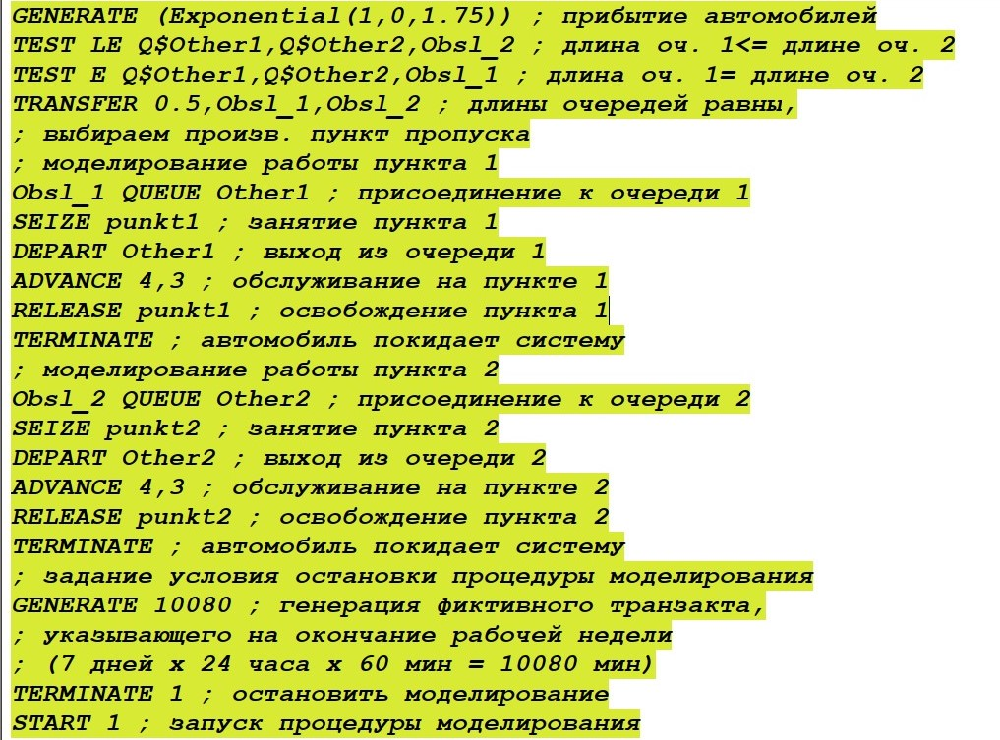{#fig:001 width=70%}

## Отчёт по модели с двумя очередями и пунками

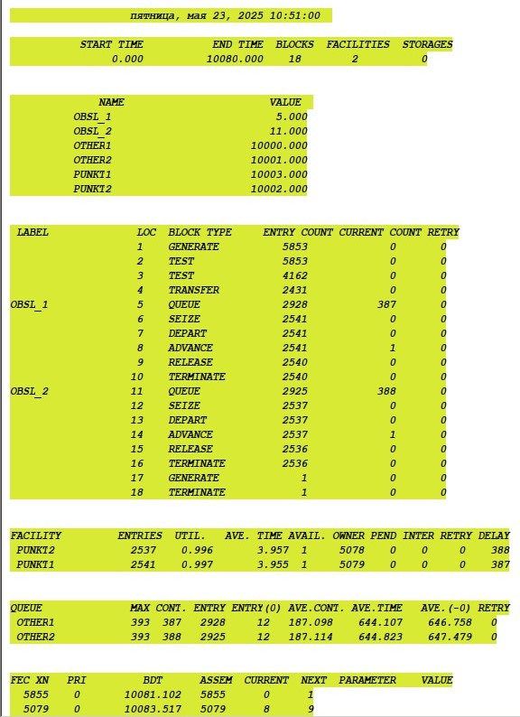{#fig:002 width=70%}

## Модель с одной очередью и двумя пунками

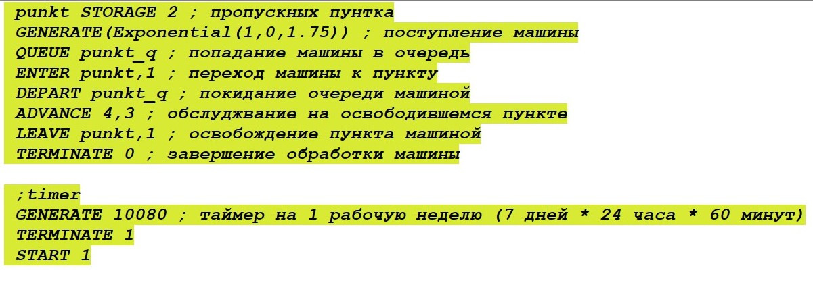{#fig:003 width=70%}

## Отчёт по модели с одной очередью и двумя пунками

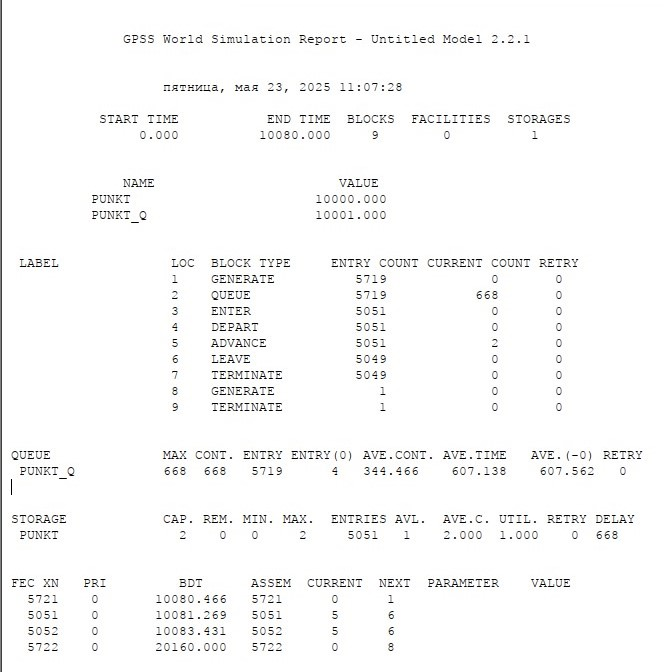{#fig:004 width=70%}

## Сравнительная таблица 

: Сравнение стратегий {#tbl:sravn}

| Показатель                 | стратегия 1 |         |          |  стратегия 2 |
|----------------------------|-------------|---------|----------|--------------|
|                            | пункт 1     | пункт 2 | в целом  |              |
| Поступило автомобилей      | 2928        | 2925    | 5853     | 5719         |
| Обслужено автомобилей      | 2540        | 2536    | 5076     | 5049         |
| Коэффициент загрузки       | 0,997       | 0,996   | 0,9965   | 1            |
| Максимальная длина очереди | 393         | 393     | 786      | 668          |
| Средняя длина очереди      | 187,098     | 187,114 | 374,212  | 344,466      |
| Среднее время ожидания     | 644,107     | 644,823 | 644,465  | 607,138      |

## Подбор оптимального числа пропускных пунктов для первой стратегии

– изменив модели, определить оптимальное число пропускных пунктов (от 1 до 4) для каждой стратегии при условии, что:

  – коэффициент загрузки пропускных пунктов принадлежит интервалу [0, 5; 0, 95];

  – среднее число автомобилей, одновременно находящихся на контрольно-пропускном пункте, не должно превышать 3;

  – среднее время ожидания обслуживания не должно превышать 4 мин.

## Модель с одной очередью и одинм пунктом

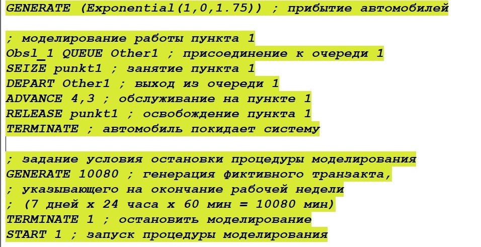{#fig:005 width=70%}

## Отчёт по модели с одной очередью и одинм пунктом

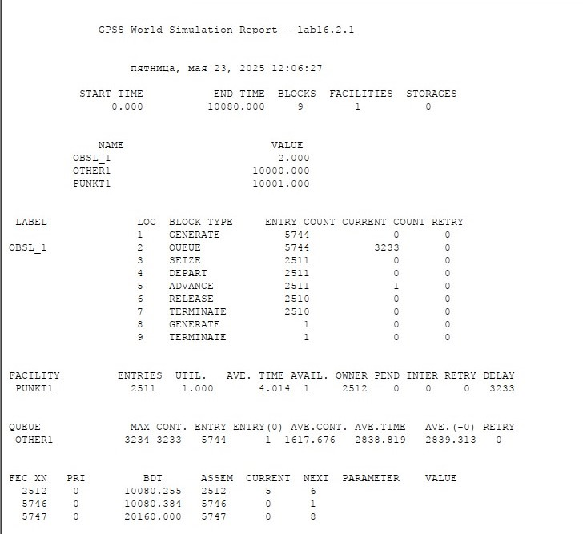{#fig:006 width=70%}

## Модель с тремя очередями и пунктами ч.1

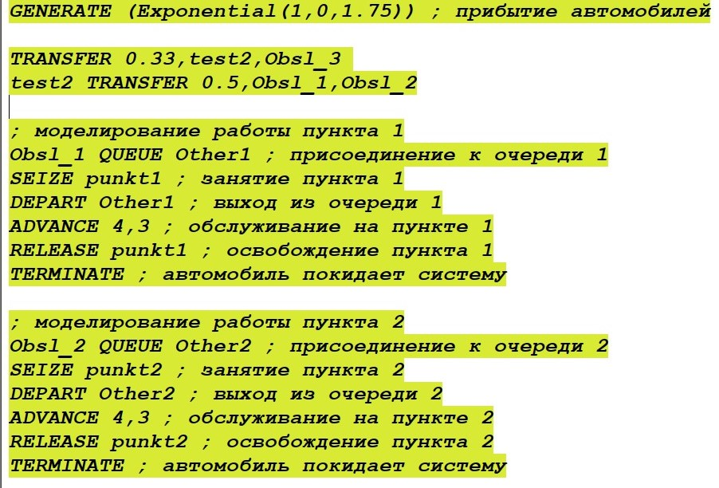{#fig:007 width=70%}

## Модель с тремя очередями и пунктами ч.2

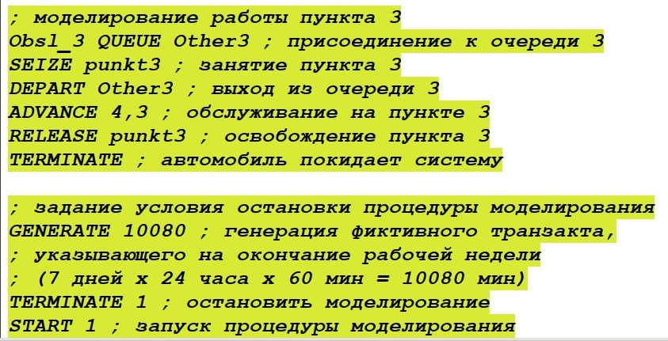{#fig:008 width=70%}

## Отчёт по модели с тремя очередями и пунктами ч.1

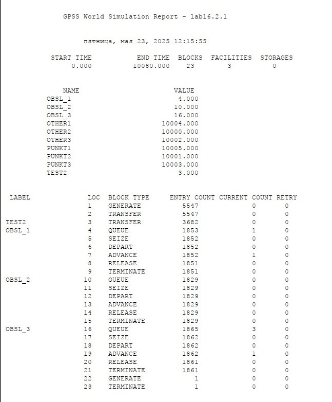{#fig:009 width=70%}

## Отчёт по модели с тремя очередями и пунктами ч.2

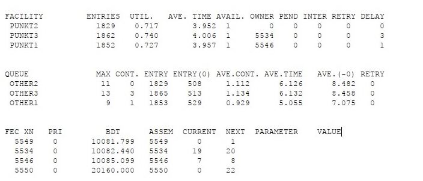{#fig:010 width=70%}

## Модель с четырьмя очередями и пунктами ч.1

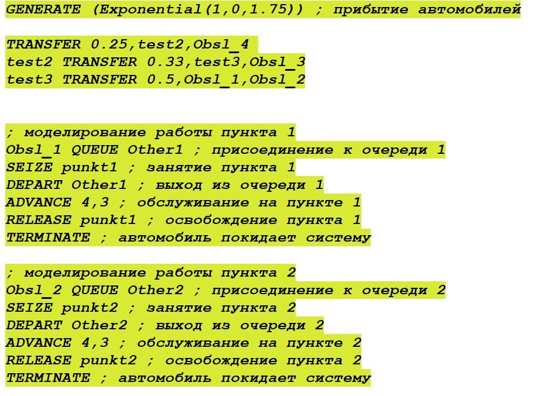{#fig:011 width=70%}

## Модель с четырьмя очередями и пунктами ч.2

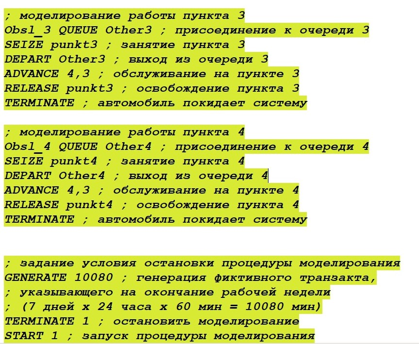{#fig:012 width=70%}

## Отчёт по модели с четырьмя очередями и пунктами ч.1

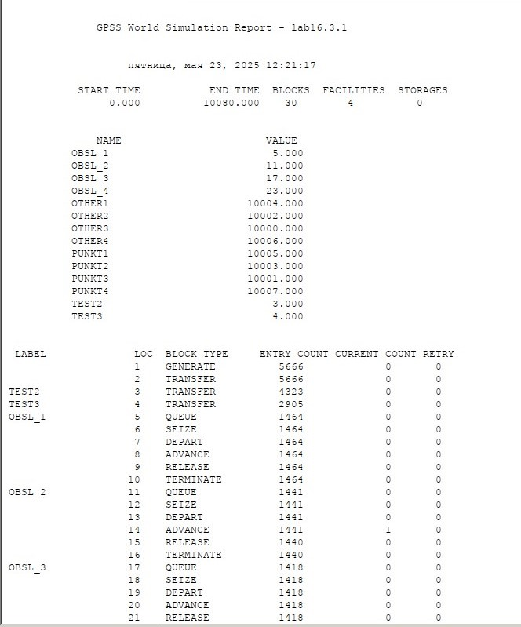{#fig:013 width=70%}

## Отчёт по модели с четырьмя очередями и пунктами ч.2

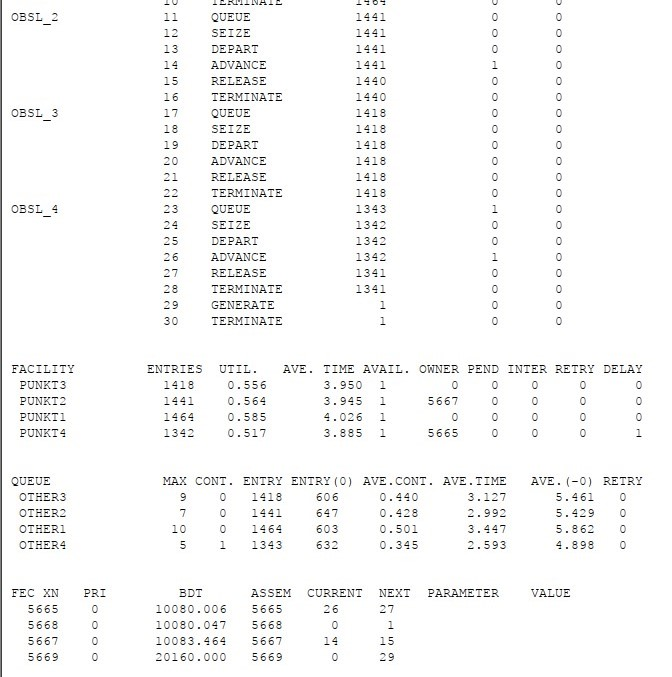{#fig:014 width=70%}

## Модель с одной очередью и одинм пунктом

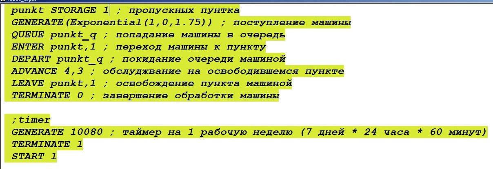{#fig:015 width=70%}

## Отчёт по модели с одной очередью и одинм пунктом

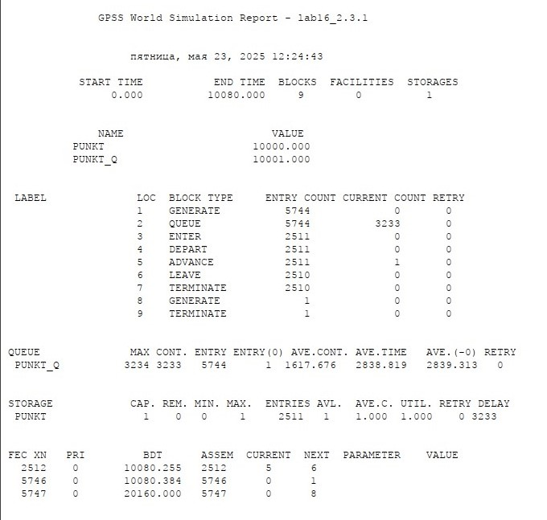{#fig:016 width=70%}

## Модель с одной очередью и тремя пунктами
 
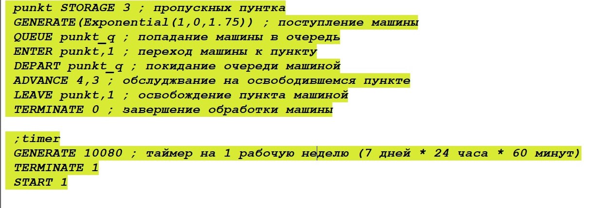{#fig:017 width=70%}

## Отчёт по модели с одной очередью и тремя пунктами

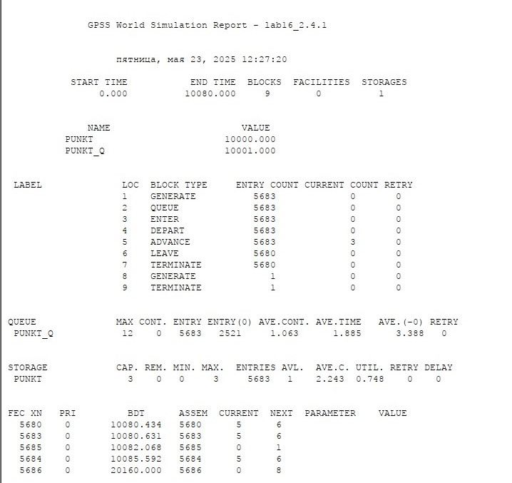{#fig:018 width=70%}

## Модель с одной очередью и четырьмя пунктами

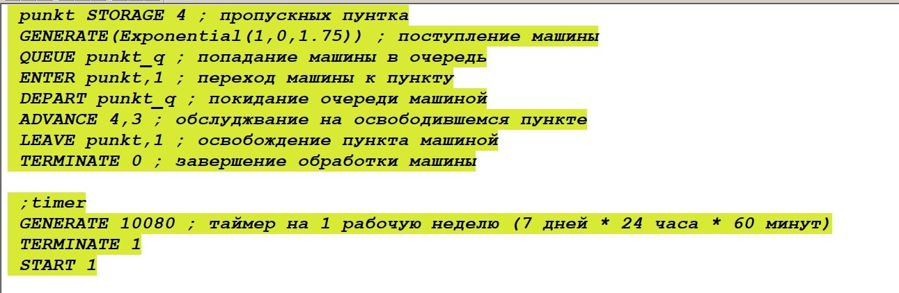{#fig:019 width=70%}

## Отчёт по модели с одной очередью и четырьмя пунктами

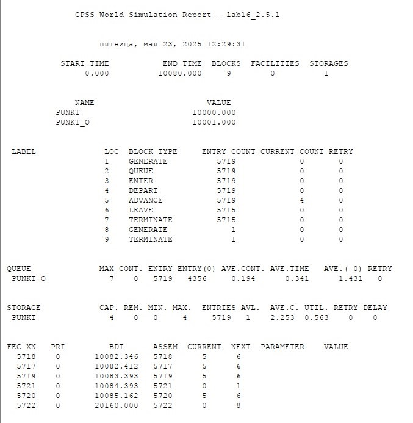{#fig:020 width=70%}

# Выводы

В ходе данной лабораторной работы я реализовала с помощью gpss модель двух стратегий обслуживания и оценила оптимальные параметры.