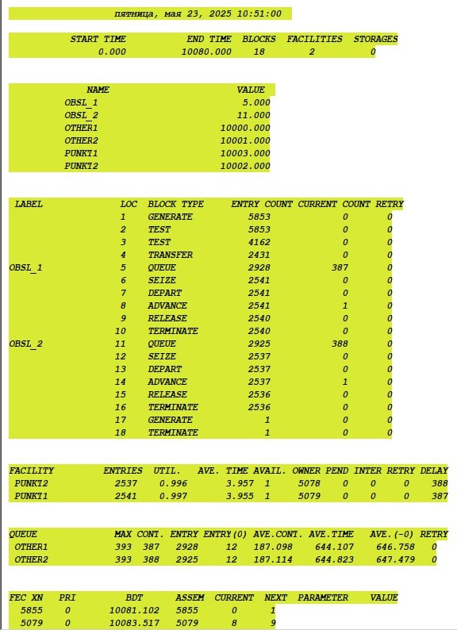

---
## Front matter
title: "Отчёт по лабораторной работе №16"
subtitle: "Задачи оптимизации. Модель двух стратегий обслуживания"
author: "Астраханцева А. А."

## Generic otions
lang: ru-RU
toc-title: "Содержание"

## Bibliography
bibliography: bib/cite.bib
csl: pandoc/csl/gost-r-7-0-5-2008-numeric.csl

## Pdf output format
toc: true # Table of contents
toc-depth: 2
lof: true # List of figures
lot: true # List of tables
fontsize: 12pt
linestretch: 1.5
papersize: a4
documentclass: scrreprt
## I18n polyglossia
polyglossia-lang:
  name: russian
  options:
	- spelling=modern
	- babelshorthands=true
polyglossia-otherlangs:
  name: english
## I18n babel
babel-lang: russian
babel-otherlangs: english
## Fonts
mainfont: PT Serif
romanfont: PT Serif
sansfont: PT Sans
monofont: PT Mono
mainfontoptions: Ligatures=TeX
romanfontoptions: Ligatures=TeX
sansfontoptions: Ligatures=TeX,Scale=MatchLowercase
monofontoptions: Scale=MatchLowercase,Scale=0.9
## Biblatex
biblatex: true
biblio-style: "gost-numeric"
biblatexoptions:
  - parentracker=true
  - backend=biber
  - hyperref=auto
  - language=auto
  - autolang=other*
  - citestyle=gost-numeric
## Pandoc-crossref LaTeX customization
figureTitle: "Рис."
tableTitle: "Таблица"
listingTitle: "Листинг"
lofTitle: "Список иллюстраций"
lotTitle: "Список таблиц"
lolTitle: "Листинги"
## Misc options
indent: true
header-includes:
  - \usepackage{indentfirst}
  - \usepackage{float} # keep figures where there are in the text
  - \floatplacement{figure}{H} # keep figures where there are in the text
---

# Цель работы

Реализовать с помощью gpss модель двух стратегий обслуживания и оценить оптимальные параметры.

# Задание

Реализовать с помощью gpss:

- модель с двумя очередями;
- модель с одной очередью;
- изменить модели, чтобы определить оптимальное число пропускных пунктов.

# Теоретическое введение

GPSS (General Purpose Simulation System) — это один из первых специализированных языков программирования для имитационного моделирования, созданный в 1961 году американским инженером Джеффри Гордоном в корпорации IBM. Первоначально язык разрабатывался для нужд моделирования сложных логистических и производственных процессов в промышленных и военных системах, где требовался учёт случайных событий и взаимодействия большого количества объектов во времени.

GPSS стал знаковым инструментом в истории моделирования: он заложил основы событийного подхода и ввёл понятие транзакта как активного объекта, перемещающегося по блокам логики системы. Эти концепции впоследствии легли в основу многих других языков и программных сред моделирования. Благодаря модульной структуре и простой записи моделей, GPSS получил широкое распространение в университетах и научных учреждениях как средство обучения и анализа дискретных систем.

Практическое применение GPSS охватывает широкий спектр задач:

- Организация работы производственных цехов: моделирование потока деталей между станками, учёт времени обработки, простоев и загрузки оборудования;

- Системы массового обслуживания: моделирование очередей в банках, поликлиниках, аэропортах с целью оценки времени ожидания и необходимости в дополнительном персонале;

- Логистика и склады: моделирование перемещения товаров между зонами хранения, погрузки и разгрузки, анализ загрузки транспортных средств;

- Транспорт: моделирование движения автобусов, поездов, планирование расписаний с учётом времени на посадку и высадку пассажиров;

- Военные приложения: планирование операций снабжения, имитация действий в сложных логистических цепочках.

Одним из достоинств GPSS является то, что язык допускает использование случайных величин (например, времени обслуживания или интервалов между заявками), что позволяет создавать реалистичные модели, приближенные к поведению реальных систем. Также GPSS даёт возможность легко собирать статистику по ключевым метрикам: времени пребывания объектов в системе, загрузке ресурсов, количеству отказов и пр.

Несмотря на то, что с момента своего создания прошло более шестидесяти лет, GPSS продолжает использоваться как в учебных целях, так и в инженерной практике благодаря своей простоте, наглядности и эффективности в решении прикладных задач, связанных с анализом и оптимизацией дискретных процессов.

[@Korolkova2025; @sosnovikov2023].

# Выполнение лабораторной работы

## Постановка задачи

На пограничном контрольно -пропускном пункте транспорта имеются 2 пункта пропуска. Интервалы времени между поступлением автомобилей имеют экспоненциальное распределение со средним значением $\mu$. Время прохождения автомобилями пограничного контроля имеет равномерное распределение на интервале [a, b].
Предлагается две стратегии обслуживания прибывающих автомобилей:

1. автомобили образуют две очереди и обслуживаются соответствующими пунктами
пропуска;
2. автомобили образуют одну общую очередь и обслуживаются освободившимся
пунктом пропуска.
Исходные данные: $\mu$ = 1, 75 мин, a = 1 мин, b = 7 мин.

Целью моделирования является определение:

- характеристик качества обслуживания автомобилей, в частности, средних длин очередей; среднего времени обслуживания автомобиля; среднего времени пребывания автомобиля на пункте пропуска;
- наилучшей стратегии обслуживания автомобилей на пункте пограничного контроля;
- оптимального количества пропускных пунктов.

В качестве критериев, используемых для сравнения стратегий обслуживания
автомобилей, выберем:
- коэффициенты загрузки системы;
- максимальные и средние длины очередей;
- средние значения времени ожидания обслуживания.

## Модель для первой стретегии

Для первой стратегии обслуживания, когда прибывающие автомобили образуют
две очереди и обслуживаются соответствующими пропускными пунктами, имеем
следующую модель (рис. @fig:001).

{#fig:001 width=70%}

После запуска симуляции получаем отчёт (рис. @fig:002).

{#fig:002 width=70%}

## Модель для второй стретегии

Составим модель для второй стратегии обслуживания, когда прибывающие автомобили образуют одну очередь и обслуживаются освободившимся пропускным пунктом (рис. @fig:003).

{#fig:003 width=70%}

После запуска симуляции получаем отчёт (рис. @fig:004).

{#fig:004 width=70%}

Сведём полученные статистики моделирования в таблицу (табл. [-@tbl:sravn]).

: Сравнение стратегий {#tbl:sravn}

| Показатель                 | стратегия 1 |         |          |  стратегия 2 |
|----------------------------|-------------|---------|----------|--------------|
|                            | пункт 1     | пункт 2 | в целом  |              |
| Поступило автомобилей      | 2928        | 2925    | 5853     | 5719         |
| Обслужено автомобилей      | 2540        | 2536    | 5076     | 5049         |
| Коэффициент загрузки       | 0,997       | 0,996   | 0,9965   | 1            |
| Максимальная длина очереди | 393         | 393     | 786      | 668          |
| Средняя длина очереди      | 187,098     | 187,114 | 374,212  | 344,466      |
| Среднее время ожидания     | 644,107     | 644,823 | 644,465  | 607,138      |

В результате моделирования мы получили такие выводы:

- коэффициент загрузки системы немного выше для системы с общей очередью для двух пунктов (1 против 0.9965 для стратегии с раздельными очередями)

- максимальная и средняя длины очередей значительно меньше для второй стратегии (максимальная длина очереди меньше на 118 машин, а средняя длна очереди на 30 машин)

- средние значения времени ожидания обслуживания меньше почти на полчаса для второй стратегии

Таким образом с данными парарметрами модели более оптимальной является вторая стратегия с общей очередью.

## Подбор оптимального числа пропускных пунктов для первой стратегии

– изменив модели, определить оптимальное число пропускных пунктов (от 1 до 4) для каждой стратегии при условии, что:

  – коэффициент загрузки пропускных пунктов принадлежит интервалу [0, 5; 0, 95];

  – среднее число автомобилей, одновременно находящихся на контрольно-пропускном пункте, не должно превышать 3;

  – среднее время ожидания обслуживания не должно превышать 4 мин.

Рассмотрим сначала разное число пропускнух пунктов для первой стретигии. Если установить один пункт досмотра, то получим такую модель (рис. @fig:005):

{#fig:005 width=70%}

После запуска симуляции получаем отчёт (рис. @fig:006).

{#fig:006 width=70%}

По отчету можно увидеть, что ни одио из выше описанных требований не выполняется:  

– коэффициент загрузки пропускных пунктов равняется 1 (больше, чем нужный диапазон);

– среднее число автомобилей, одновременно находящихся на контрольно-пропускном пункте составляет 1617.676;

– среднее время ожидания обслуживания составляет 2838.819 мин.

Модель с двумя пунктами для обоих стратегий мы уже рассмотрели, поэтому теперь рассмотрим для 3 пунктов. Будем распределять автомобили равномерно, не сравнивая длины очередей (в каждую из очередей с вер-тью 0.33) (рис. @fig:007, @fig:008):

{#fig:007 width=70%}

{#fig:008 width=70%}

После запуска симуляции получаем отчёт (рис. @fig:009, @fig:010).

{#fig:009 width=70%}

{#fig:010 width=70%}

По отчету можно увидеть, что 2 из 3 из выше описанных требований выполняются:  

– коэффициент загрузки пропускных пунктов в среднем равняется $(0.717 + 0.740 + 0.727) / 3 = 0.728$;

– среднее число автомобилей, одновременно находящихся на контрольно-пропускном пункте составляет $(1.112 + 1.134 + 0.929) / 3 \approx 1.053$;

– среднее время ожидания обслуживания составляет $(6.126 + 6.132 + 5.055) / 3 = 5.771$ мин. 

Модель не соответствует требованиям только по критерию среднего времени обслуживания.

Рассмотрим модель с 4 пунктами. Будем распределять автомобили равномерно, не сравнивая длины очередей (в каждую из очередей с вер-тью 0.25) (рис. @fig:011, @fig:012):

{#fig:011 width=70%}

{#fig:012 width=70%}

После запуска симуляции получаем отчёт (рис. @fig:013, @fig:014).

{#fig:013 width=70%}

{#fig:014 width=70%}

По отчету можно увидеть, модель соответствует всем требованиям:  

– коэффициент загрузки пропускных пунктов в среднем равняется $(0.556 + 0.564 + 0.585 + 0.517) / 4 = 0.5555$;

– среднее число автомобилей, одновременно находящихся на контрольно-пропускном пункте составляет $(0.44 + 0.428 + 0.501 + 0.345) / 4 = 0.4285$;

– среднее время ожидания обслуживания составляет $(3.127 + 2.992 + 3.447 + 2.593) / 4 \approx 3.0398$ мин. 

Модель полностью соответствует требованиям.

## Подбор оптимального числа пропускных пунктов для второй стратегии

Рассмотрим разное число пропускнух пунктов для второй стретигии. Если установить один пункт досмотра, то получим модель с результатами аналогично первой стратегии, единственное - в реализации модеи будем использовать многоканальное устройство (`STORAGE`) (рис. @fig:015):

{#fig:015 width=70%}

После запуска симуляции получаем отчёт (рис. @fig:016).

{#fig:016 width=70%}

Отчет полностью соответствует модели первой стратегии с 1 пропускным пунктом. По отчету можно увидеть, что ни одио из выше описанных требований не выполняется:  

– коэффициент загрузки пропускных пунктов равняется 1 (больше, чем нужный диапазон);

– среднее число автомобилей, одновременно находящихся на контрольно-пропускном пункте составляет 1617.676;

– среднее время ожидания обслуживания составляет 2838.819 мин.

Модель с двумя пунктами для обоих стратегий мы уже рассмотрели, поэтому теперь рассмотрим для 3 пунктов. Автомобили поступают в общую очереь и как только один из пкунктов освобождается - автомоболь переходит к этому пункту  (рис. @fig:017):

{#fig:017 width=70%}

После запуска симуляции получаем отчёт (рис. @fig:018).

{#fig:018 width=70%}

По отчету можно увидеть, все выше описанные требования выполняются:  

– коэффициент загрузки пропускных пунктов в среднем равняется $0.748$;

– среднее число автомобилей, одновременно находящихся на контрольно-пропускном пункте составляет $1.063$;

– среднее время ожидания обслуживания составляет $1.885$ мин. 

Модель полностью соответствует требованиям.

Для полноты картины рассмотрим модель с 4 пунктами (рис. @fig:019):

{#fig:019 width=70%}

После запуска симуляции получаем отчёт (рис. @fig:020).

{#fig:020 width=70%}

По отчету можно увидеть, модель соответствует всем требованиям:  

– коэффициент загрузки пропускных пунктов в среднем равняется $0.563$;

– среднее число автомобилей, одновременно находящихся на контрольно-пропускном пункте составляет $0.194$;

– среднее время ожидания обслуживания составляет $0.341$ мин. 

Модель полностью соответствует требованиям, но использовать 4 обработчика в жанной стратегии не оченб рационально, так как достаточно большое время (около 44% от всего времени) пункты свободны и происходит простой. Автомобили ожидают осуживания всего несколько секунд. Для данных требований дял второй стратегии оптимальное число пунктов - 3.

# Выводы

В ходе данной лабораторной работы я реализовала с помощью gpss модель двух стратегий обслуживания и оценила оптимальные параметры.

# Список литературы{.unnumbered}

::: {#refs}
:::
