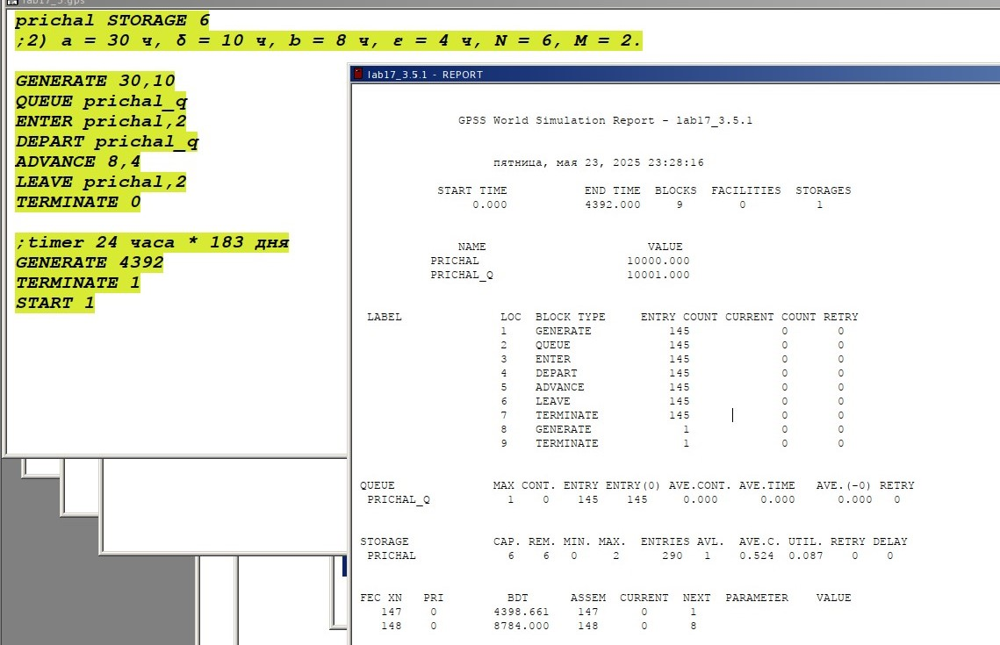

---
## Front matter
lang: ru-RU
title: "Лабораторная работа №17"
subtitle: "Задания для самостоятельной работы"
author:
  - Астраханцева А. А.
institute:
  - Группа НФИбд-01-22
  - Российский университет дружбы народов, Москва, Россия
date: 24 мая 2025

## i18n babel
babel-lang: russian
babel-otherlangs: english

## Formatting pdf
toc: false
toc-title: Содержание
slide_level: 2
aspectratio: 169
section-titles: true
theme: metropolis
header-includes:
 - \metroset{progressbar=frametitle,sectionpage=progressbar,numbering=fraction}
 - '\makeatletter'
 - '\beamer@ignorenonframefalse'
 - '\makeatother'
---

# Информация

## Докладчик

:::::::::::::: {.columns align=center}
::: {.column width="70%"}

  * Астраханцева Анастасия Александровна
  * НФИбд-01-22, 1132226437
  * Российский университет дружбы народов
  * [1132226437@pfur.ru](mailto:1132226437@pfur.ru)
  * <https://github.com/aaastrakhantseva>

:::
::: {.column width="30%"}

:::
::::::::::::::

# Вводная часть

## Цель

Выполнить с помощью gpss задание для самостоятельного выполнения.

## Задание

Реализовать с помощью gpss:

- модель работы вычислительного центра;

- модель работы аэропорта;

- модель работы морского порта.

## Моделирование работы вычислительного центра. Постановка задачи

На вычислительном центре в обработку принимаются три класса заданий `А`, `В` и `С`. Исходя из наличия оперативной памяти ЭВМ задания классов `А` и `В` могут решаться одновременно, а задания класса `С` монополизируют ЭВМ. Задания класса `А` поступают через $20 \pm 5$ мин, класса `В` — через $20 \pm 10$ мин, класса `С` — через $28 \pm 5$ мин и требуют для выполнения: класс `А` — $20 \pm 5$ мин, класс `В` — $21 \pm 3$ мин, класс `С` — $28 \pm 5$ мин. Задачи класса `С` загружаются в ЭВМ, если она полностью свободна. Задачи классов `А` и `В` могут дозагружаться к решающей задаче. Смоделировать работу ЭВМ за 80 ч. Определить её загрузку.

## Модель работы вычислительного центра

{#fig:001 width=70%}

## Отчёт по модели работы вычислительного центра ч.1

{#fig:002 width=70%}

## Отчёт по модели работы вычислительного центра ч.2

{#fig:003 width=70%}

## Моделирование работы аэропорта. Постановка задачи

Самолёты прибывают для посадки в район аэропорта каждые $10 \pm 5$ мин. Если взлетно-посадочная полоса свободна, прибывший самолёт получает разрешение на посадку. Если полоса занята, самолет выполняет полет по кругу и возвращается в аэропорт каждые 5 мин. Если после пятого круга самолет не получает разрешения на посадку, он отправляется на запасной аэродром. В аэропорту через каждые $10 \pm 2$ мин к взлетно-посадочной полосе выруливают готовые к взлёту самолёты и получают разрешение на взлёт, если полоса свободна. Для взлета и посадки самолёты занимают полосу ровно на 2 мин. Если при свободной полосе одновременно один самолёт прибывает для посадки, а другой — для взлёта,
то полоса предоставляется взлетающей машине.

Требуется:

– выполнить моделирование работы аэропорта в течение суток;

– подсчитать количество самолётов, которые взлетели, сели и были направлены на запасной аэродром;

– определить коэффициент загрузки взлетно-посадочной полосы

## Модель работы аэропорта ч.1

{#fig:004 width=70%}

## Модель работы аэропорта ч.2

{#fig:005 width=70%}

## Отчёт по модели работы аэропорта ч.1

{#fig:006 width=70%}

## Отчёт по модели работы аэропорта ч.2

{#fig:007 width=70%}

## Моделирование работы морского порта. Постановка задачи

Морские суда прибывают в порт каждые $[\alpha \pm \delta]$ часов. В порту имеется `N` причалов. Каждый корабль по длине занимает `M` причалов и находится в порту $[\beta \pm \epsilon]$ часов. Требуется построить GPSS-модель для анализа работы морского порта в течение
полугода, определить оптимальное количество причалов для эффективной работы порта.

Исходные данные:

1) $\alpha$ = 20 ч, $\delta$ = 5 ч, $\beta$ = 10 ч, $\epsilon$ = 3 ч, `N` = 10, `M` = 3;

## Модель работы морского порта и отчет, первый вариант

{#fig:008 width=70%}

## Модель работы морского порта и отчет, первый вариант, оптимизация

{#fig:009 width=70%}

## Модель работы морского порта и отчет, первый вариант, оптимальные параметры

{#fig:010 width=70%}

## Модель работы морского порта и отчет, второй вариант, оптимизация

{#fig:011 width=70%}

## Модель работы морского порта и отчет, второй вариант, оптимальные параметры

{#fig:012 width=70%}

# Выводы

В ходе данной лабораторной работы я выполнила с помощью gpss задание для самостоятельного выполнения.
