---
## Front matter
title: "Отчёт по лабораторной работе №17"
subtitle: "Задания для самостоятельной работы"
author: "Астраханцева А. А."

## Generic otions
lang: ru-RU
toc-title: "Содержание"

## Bibliography
bibliography: bib/cite.bib
csl: pandoc/csl/gost-r-7-0-5-2008-numeric.csl

## Pdf output format
toc: true # Table of contents
toc-depth: 2
lof: true # List of figures
lot: false # List of tables
fontsize: 12pt
linestretch: 1.5
papersize: a4
documentclass: scrreprt
## I18n polyglossia
polyglossia-lang:
  name: russian
  options:
	- spelling=modern
	- babelshorthands=true
polyglossia-otherlangs:
  name: english
## I18n babel
babel-lang: russian
babel-otherlangs: english
## Fonts
mainfont: PT Serif
romanfont: PT Serif
sansfont: PT Sans
monofont: PT Mono
mainfontoptions: Ligatures=TeX
romanfontoptions: Ligatures=TeX
sansfontoptions: Ligatures=TeX,Scale=MatchLowercase
monofontoptions: Scale=MatchLowercase,Scale=0.9
## Biblatex
biblatex: true
biblio-style: "gost-numeric"
biblatexoptions:
  - parentracker=true
  - backend=biber
  - hyperref=auto
  - language=auto
  - autolang=other*
  - citestyle=gost-numeric
## Pandoc-crossref LaTeX customization
figureTitle: "Рис."
tableTitle: "Таблица"
listingTitle: "Листинг"
lofTitle: "Список иллюстраций"
lotTitle: "Список таблиц"
lolTitle: "Листинги"
## Misc options
indent: true
header-includes:
  - \usepackage{indentfirst}
  - \usepackage{float} # keep figures where there are in the text
  - \floatplacement{figure}{H} # keep figures where there are in the text
---

# Цель работы

Выполнить с помощью gpss задание для самостоятельного выполнения.

# Задание

Реализовать с помощью gpss:

- модель работы вычислительного центра;
- модель работы аэропорта;
- модель работы морского порта.

# Теоретическое введение

GPSS (General Purpose Simulation System) — это один из первых специализированных языков программирования для имитационного моделирования, созданный в 1961 году американским инженером Джеффри Гордоном в корпорации IBM. Первоначально язык разрабатывался для нужд моделирования сложных логистических и производственных процессов в промышленных и военных системах, где требовался учёт случайных событий и взаимодействия большого количества объектов во времени.

GPSS стал знаковым инструментом в истории моделирования: он заложил основы событийного подхода и ввёл понятие транзакта как активного объекта, перемещающегося по блокам логики системы. Эти концепции впоследствии легли в основу многих других языков и программных сред моделирования. Благодаря модульной структуре и простой записи моделей, GPSS получил широкое распространение в университетах и научных учреждениях как средство обучения и анализа дискретных систем.

Практическое применение GPSS охватывает широкий спектр задач:

- Организация работы производственных цехов: моделирование потока деталей между станками, учёт времени обработки, простоев и загрузки оборудования;

- Системы массового обслуживания: моделирование очередей в банках, поликлиниках, аэропортах с целью оценки времени ожидания и необходимости в дополнительном персонале;

- Логистика и склады: моделирование перемещения товаров между зонами хранения, погрузки и разгрузки, анализ загрузки транспортных средств;

- Транспорт: моделирование движения автобусов, поездов, планирование расписаний с учётом времени на посадку и высадку пассажиров;

- Военные приложения: планирование операций снабжения, имитация действий в сложных логистических цепочках.

Одним из достоинств GPSS является то, что язык допускает использование случайных величин (например, времени обслуживания или интервалов между заявками), что позволяет создавать реалистичные модели, приближенные к поведению реальных систем. Также GPSS даёт возможность легко собирать статистику по ключевым метрикам: времени пребывания объектов в системе, загрузке ресурсов, количеству отказов и пр.

Несмотря на то, что с момента своего создания прошло более шестидесяти лет, GPSS продолжает использоваться как в учебных целях, так и в инженерной практике благодаря своей простоте, наглядности и эффективности в решении прикладных задач, связанных с анализом и оптимизацией дискретных процессов.

[@Korolkova2025; @sosnovikov2023].

# Выполнение лабораторной работы

## Моделирование работы вычислительного центра

На вычислительном центре в обработку принимаются три класса заданий `А`, `В` и `С`. Исходя из наличия оперативной памяти ЭВМ задания классов `А` и `В` могут решаться одновременно, а задания класса `С` монополизируют ЭВМ. Задания класса `А` поступают через $20 \pm 5$ мин, класса `В` — через $20 \pm 10$ мин, класса `С` — через $28 \pm 5$ мин и требуют для выполнения: класс `А` — $20 \pm 5$ мин, класс `В` — $21 \pm 3$ мин, класс `С` — $28 \pm 5$ мин. Задачи класса `С` загружаются в ЭВМ, если она полностью свободна. Задачи классов `А` и `В` могут дозагружаться к решающей задаче. Смоделировать работу ЭВМ за 80 ч. Определить её загрузку.

Использую многоканальное устройство `STORAGE`, которое содержит 2 канала: заявки типа `A` и `B` занимают по 1 каналу, а зявка типа `C` - 2 (рис. @fig:001).

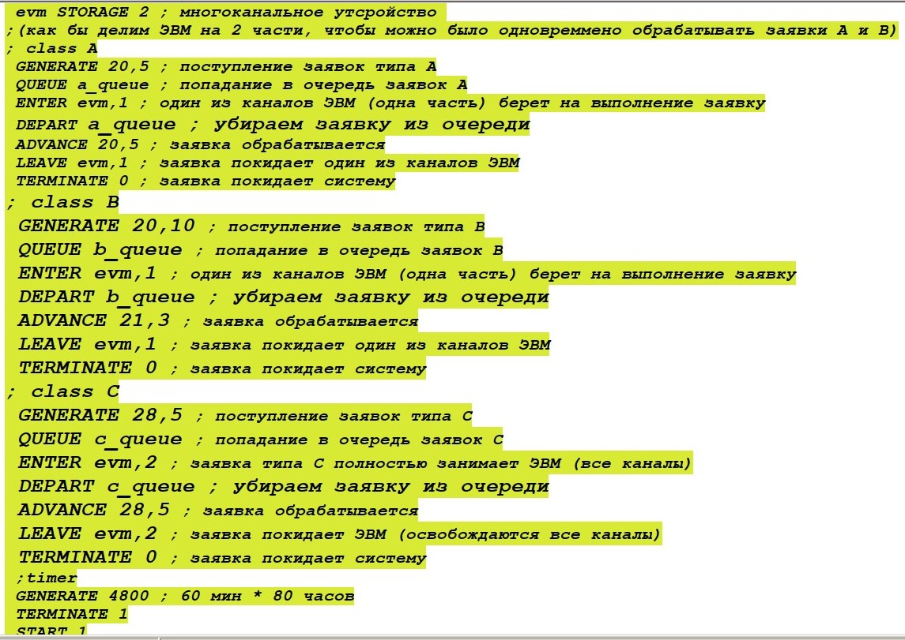{#fig:001 width=70%}

После запуска симуляции получаем отчёт (рис. @fig:002, @fig:003).

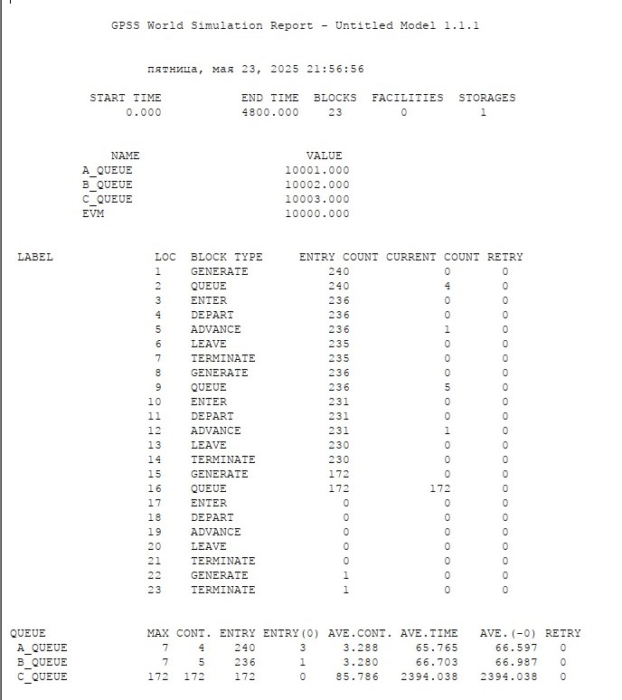{#fig:002 width=70%}

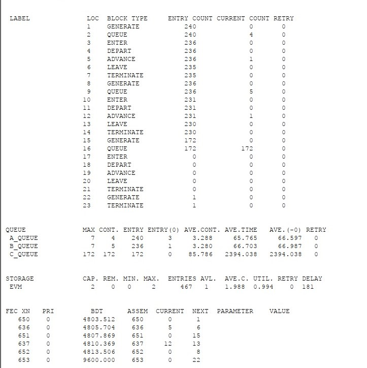{#fig:003 width=70%}

Загрузка системы составялет `0.994`.

## Моделирование работы аэропорта

Самолёты прибывают для посадки в район аэропорта каждые $10 \pm 5$ мин. Если взлетно-посадочная полоса свободна, прибывший самолёт получает разрешение на посадку. Если полоса занята, самолет выполняет полет по кругу и возвращается в аэропорт каждые 5 мин. Если после пятого круга самолет не получает разрешения на посадку, он отправляется на запасной аэродром. В аэропорту через каждые $10 \pm 2$ мин к взлетно-посадочной полосе выруливают готовые к взлёту самолёты и получают разрешение на взлёт, если полоса свободна. Для взлета и посадки самолёты занимают полосу ровно на 2 мин. Если при свободной полосе одновременно один самолёт прибывает для посадки, а другой — для взлёта,
то полоса предоставляется взлетающей машине.

Требуется:

– выполнить моделирование работы аэропорта в течение суток;

– подсчитать количество самолётов, которые взлетели, сели и были направлены на запасной аэродром;

– определить коэффициент загрузки взлетно-посадочной полосы

Для данной модели я реализовала отдельные блоки для посадки, вылета, ожидания (уход на доп. круг) и для посадки на запасном аэродроме. 
Интересные моменты модели:

- Использую пятый параметр команды `GENERATE` для задания приоритетности: для вылета - 2, для прилета - 1.

- Использую `ASSIGN` для задания значения переменной `round` - количество дополнительных кругов, сделанных самолетом.

- Блок `GATE` для перехода к посдаке в случае, если ВПП свободна[@studfile_gpss]

- Блок `TEST` для проверки того, что самолет сделал меньше 5 кругов [@teor_gpss] (рис. @fig:004, @fig:005).

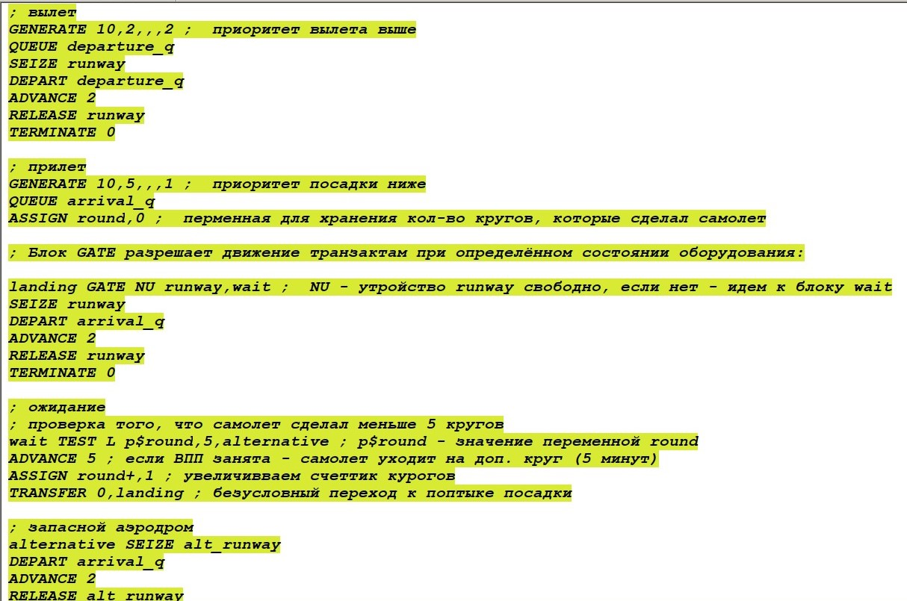{#fig:004 width=70%}

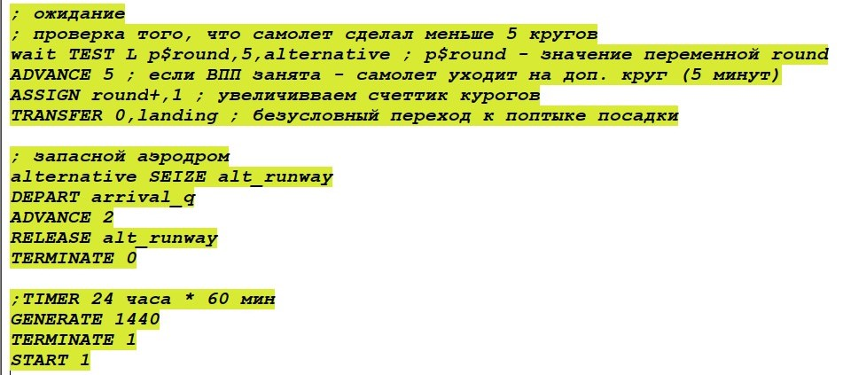{#fig:005 width=70%}

После запуска симуляции получаем отчёт (рис. @fig:006, @fig:007).

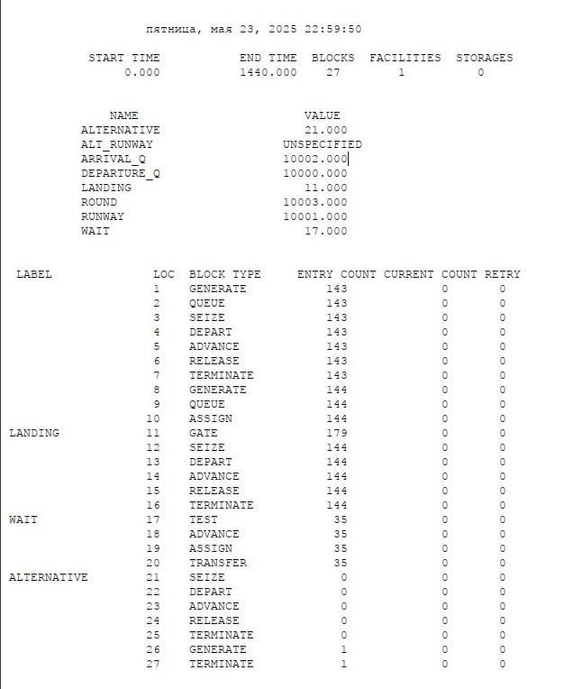{#fig:006 width=70%}

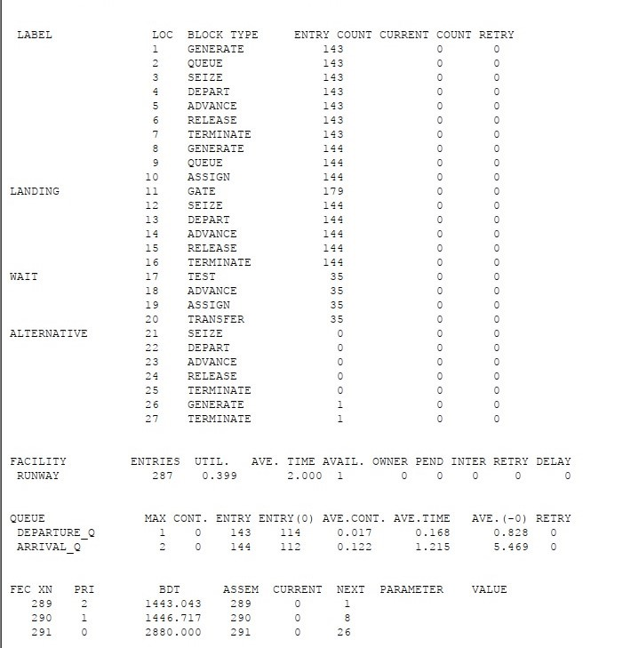{#fig:007 width=70%}

В резултате:

– Я выполнила моделирование работы аэропорта в течение суток (24 часа * 60 минут = 1440);

– Количество самолётов, которые взлетели - 143

- Количество самолётов, которые сели - 144

- Количество самолётов, которые были направлены на запасной аэродром - 0, именно поэтому одноканальное устройство `ALT_RUNWAY` находится в статусе `uncpecified` - ни один транзакт (самолет) не прошел через данное одноканальное устройство (запасную ВВП).

– Коэффициент загрузки взлетно-посадочной полосы - 0.399

## Моделирование работы морского порта

Морские суда прибывают в порт каждые $[\alpha \pm \delta]$ часов. В порту имеется `N` причалов. Каждый корабль по длине занимает `M` причалов и находится в порту $[\beta \pm \epsilon]$ часов. Требуется построить GPSS-модель для анализа работы морского порта в течение
полугода, определить оптимальное количество причалов для эффективной работы порта.

Исходные данные:

1) $\alpha$ = 20 ч, $\delta$ = 5 ч, $\beta$ = 10 ч, $\epsilon$ = 3 ч, `N` = 10, `M` = 3;

В данной модели буду использовать простое многоканальное устройство `STORAGE`, в котором будет `N` каналов, а каждое судно будет использовать `M` каналов (рис. @fig:008):

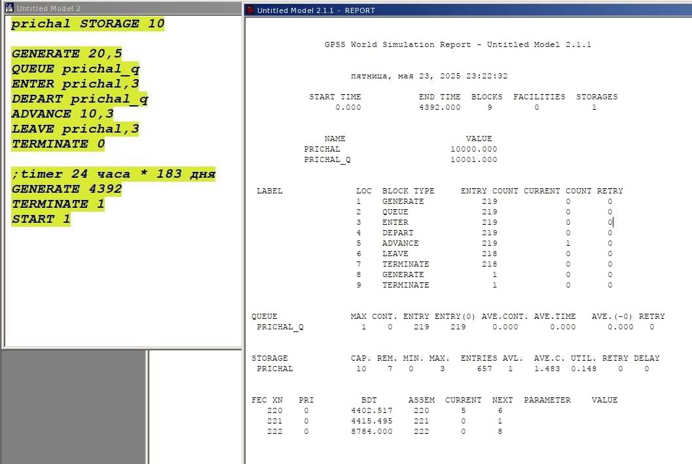{#fig:008 width=70%}

Можем видеть, что корабли поступают в диапазоне от 15 до 25 часов, а обрабатываются за время в диапазоне от 7 до 13 часов, то есть суда обрабатываются быстрее, чем успевают поступить новые, поэтому загруженность причалов низкая - 0.148. Уменьшая количество причалов `N` до 6 (теперь одновременно могут обслуживаться 2 вместо 3 кораблей) мы немного повышаем загруженность системы не в ущерб количеству обслуженных кораблей (было 218, столько и осталось) до 0.247 (рис. @fig:009). Далее я изменила количество портов до 3 (меньше взять не можем, так как для 1 судна надо ровно 3 причала), количество обслуженных судов не поменялось - 218, но загруженность выросла до 0.494 (рис. @fig:010). Поэтому, вариант `N` = 3, `M` = 3 является оптимальным для параметров, данных в пункте 1 для данной модели.

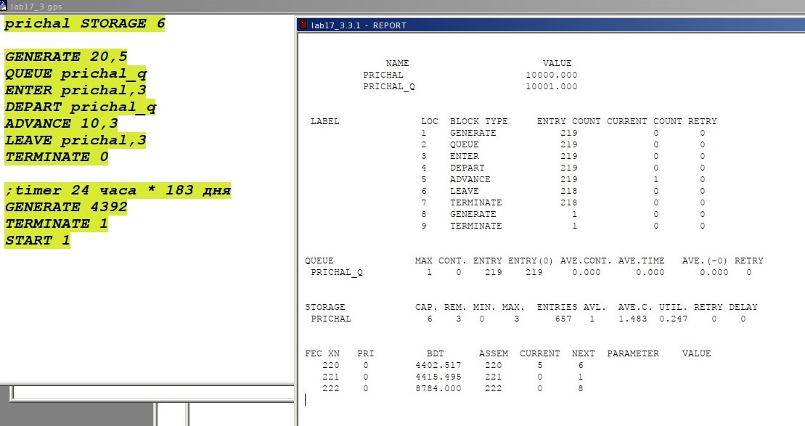{#fig:009 width=70%}

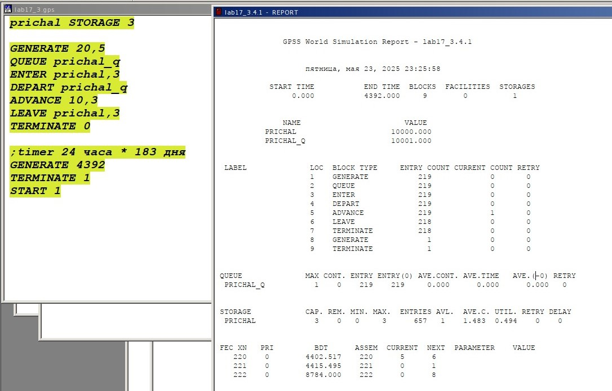{#fig:010 width=70%}

Рассмотрим второй набор исходных данных:

2) $\alpha$ = 30 ч, $\delta$ = 10 ч, $\beta$ = 8 ч, $\epsilon$ = 4 ч, `N` = 6, `M` = 2.

Можем видеть, что корабли поступают в диапазоне от 20 до 40 часов, а обрабатываются за время в диапазоне от 4 до 12 часов, то есть суда обрабатываются быстрее, чем успевают поступить новые, поэтому загруженность причалов низкая - 0.087 (рис. @fig:011). Далее я изменила количество причалов до 2 (меньше взять не можем, так как для 1 судна надо ровно 2 причала), количество обслуженных судов не поменялось - 145, но загруженность выросла до 0.262 (рис. @fig:012). Поэтому, вариант `N` = 2, `M` = 2 является оптимальным для параметров, данных в пункте 2 для данной модели.

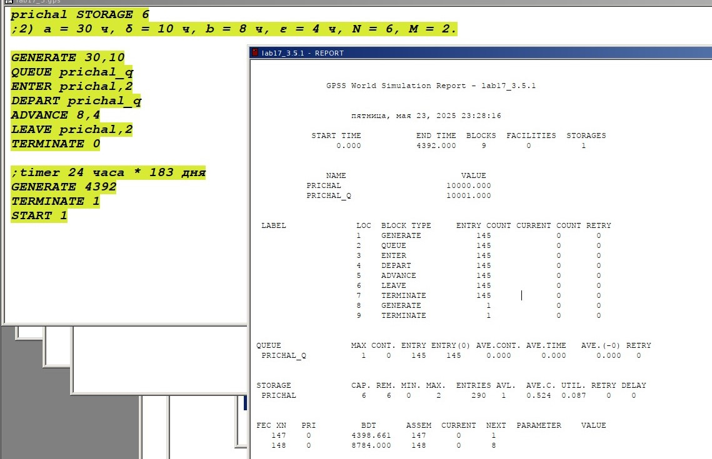{#fig:011 width=70%}

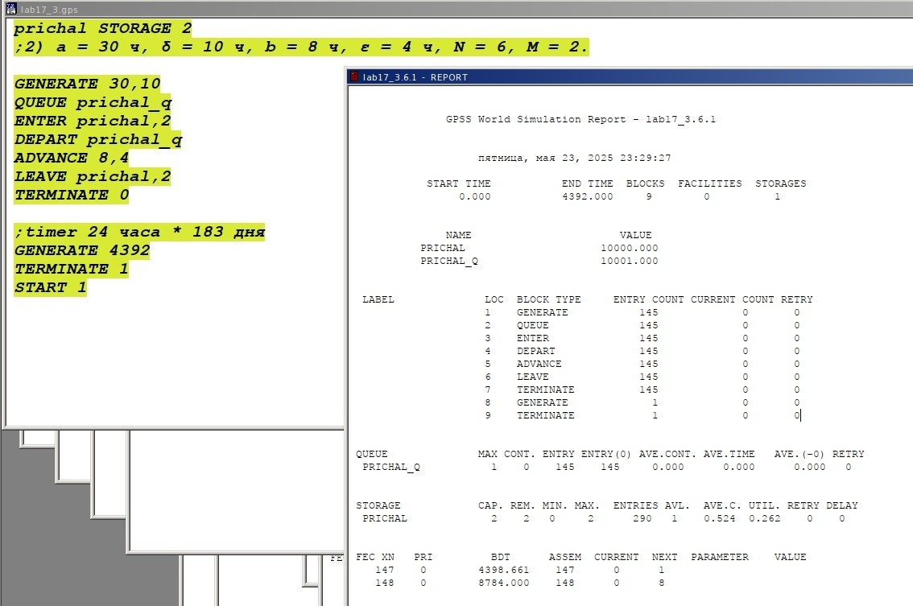{#fig:012 width=70%}

# Выводы

В ходе данной лабораторной работы я выполнила с помощью gpss задание для самостоятельного выполнения.

# Список литературы{.unnumbered}

::: {#refs}
:::
