---
## Front matter
lang: ru-RU
title: Упражнение"
subtitle: "Компонентное моделирование. Scilab, подсистема xcos"
author: 
  - Астраханцева А. А.
institute:
  - Российский университет дружбы народов, Москва, Россия
date: 7 марта 2025

## i18n babel
babel-lang: russian
babel-otherlangs: english

## Formatting pdf
toc: false
toc-title: Содержание
slide_level: 2
aspectratio: 169
section-titles: true
theme: metropolis
header-includes:
 - \metroset{progressbar=frametitle,sectionpage=progressbar,numbering=fraction}
---

# Информация

## Докладчик

:::::::::::::: {.columns align=center}
::: {.column width="70%"}

  * Астраханцева Анастасия Александровна
  * НФИбд-01-22, 1132226437
  * Российский университет дружбы народов
  * [1132226437@pfur.ru](mailto:1132226437@pfur.ru)
  * <https://github.com/aaastrakhantseva>

:::
::: {.column width="30%"}

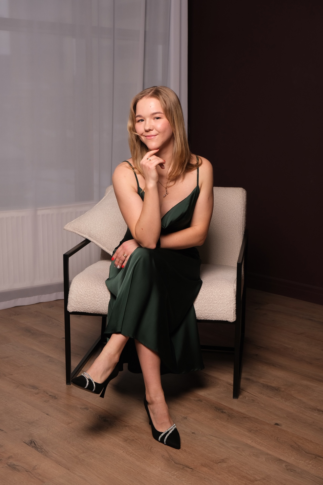

:::
::::::::::::::

# Вводная часть

## Цели лабораторной работы

Приобретение навыков моделирования математических моделей с помощью средства имитационного моделирования Scilab, xcos. 

## Задачи

1. Построить фигуру Лиссажу с различными параметрами.

# Выполнение упражнения

## Описание модели

$$
\begin{cases}
  x(t) = A \sin(\alpha t + \delta) \\
  y(t) = B \sin(\beta t) ,
\end{cases}
$$

где $A, B$ — амплитуды колебаний, $\alpha, \beta$ — частоты, $\delta$ — сдвиг фаз.

## Запуск xcos

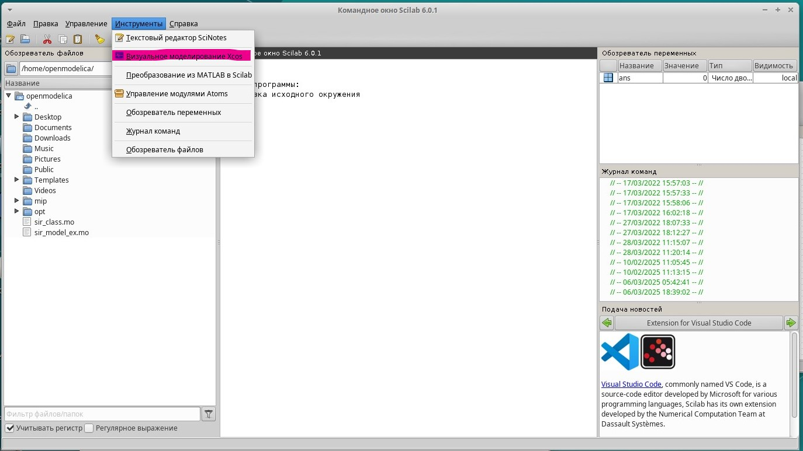{#fig:001 width=70%}

## Параметры для первого генератора синусоидального источника

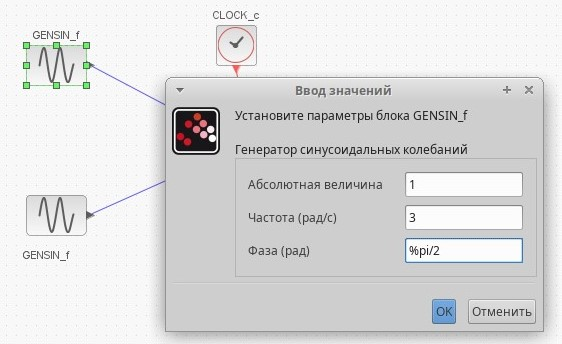{#fig:002 width=70%}

## Параметры для второго генератора синусоидального источника

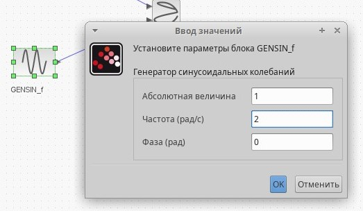{#fig:003 width=70%}

## Параметры для регистрирующего устройства

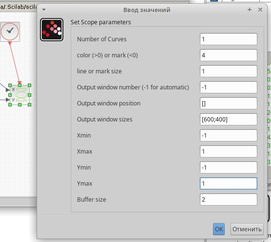{#fig:004 width=70%}

## Полученная схема

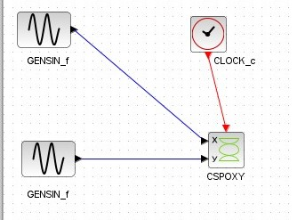{#fig:005 width=70%}

## Фигура Лиссажу с параметрами: $A = B = 1, \alpha = 3, \beta = 2, \delta = \pi/2$.

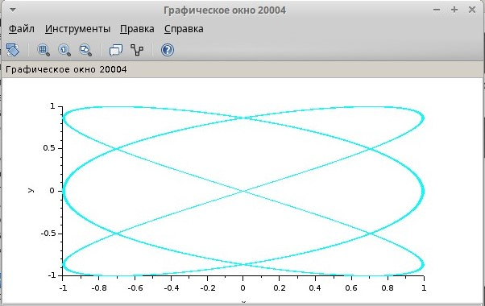{#fig:006 width=70%}

## Фигура Лиссажу с параметрами: $A = B = 1, \alpha = 2, \beta = 2, \delta = 0$

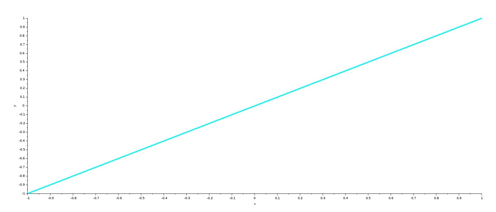{#fig:007 width=70%}

## Фигура Лиссажу с параметрами: $A = B = 1, \alpha = 2, \beta = 2, \delta = \pi/4$

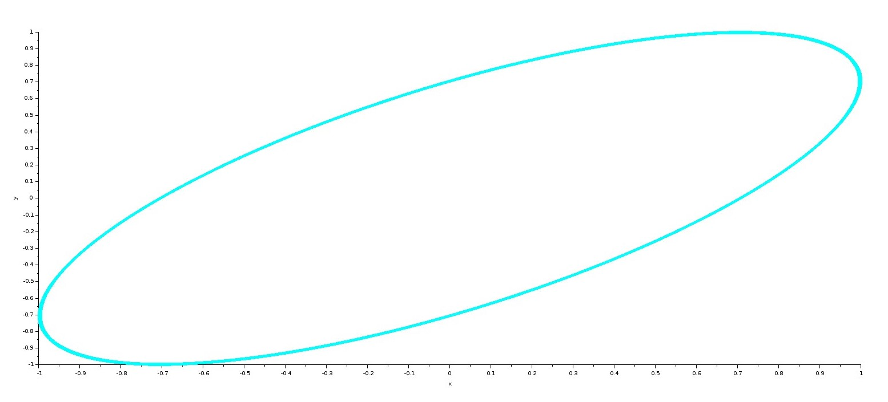{#fig:008 width=70%}

## Фигура Лиссажу с параметрами: $A = B = 1, \alpha = 2, \beta = 2, \delta = \pi/2$

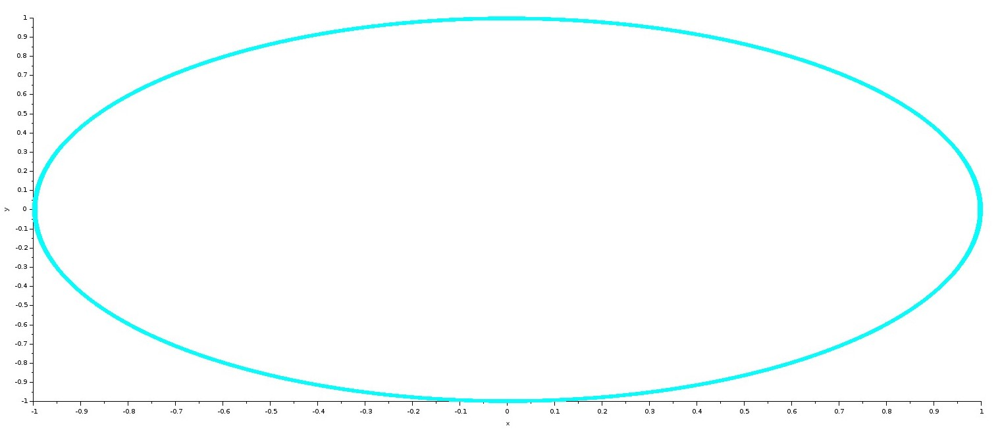{#fig:009 width=70%}

## Фигура Лиссажу с параметрами: $A = B = 1, \alpha = 2, \beta = 2, \delta = 3\pi/4$

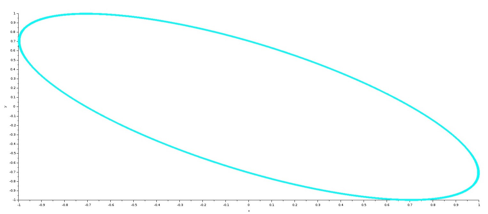{#fig:010 width=70%}

## Фигура Лиссажу с параметрами: $A = B = 1, \alpha = 2, \beta = 2, \delta = \pi$

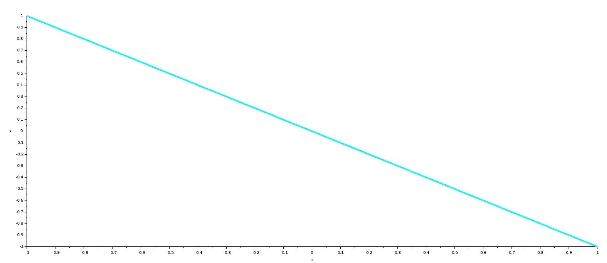{#fig:011 width=70%}

## Фигура Лиссажу с параметрами: $A = B = 1, \alpha = 2, \beta = 4, \delta = 0$

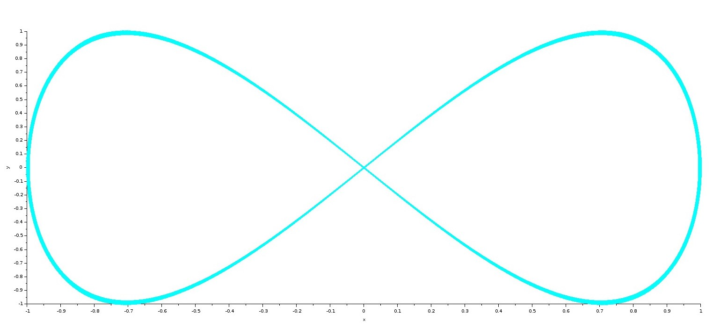{#fig:012 width=70%}

## Фигура Лиссажу с параметрами: $A = B = 1, \alpha = 2, \beta = 4, \delta = \pi/4$

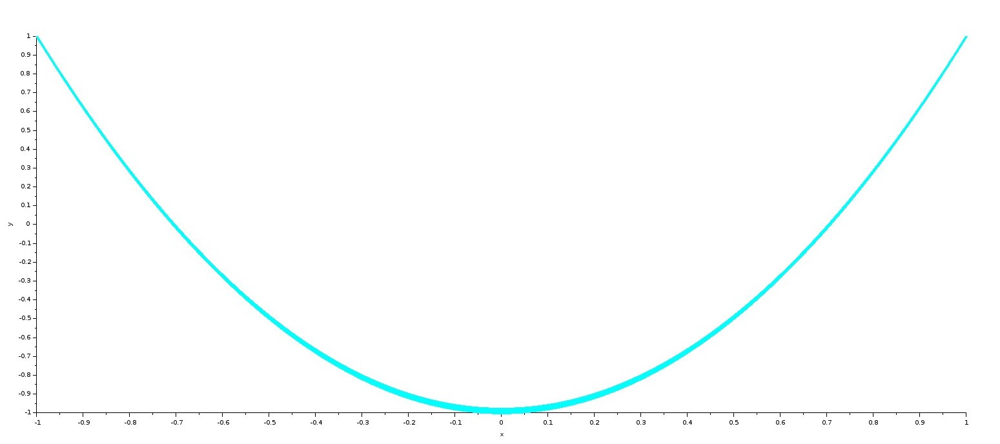{#fig:013 width=70%}

## Фигура Лиссажу с параметрами: $A = B = 1, \alpha = 2, \beta = 4, \delta = \pi/2$

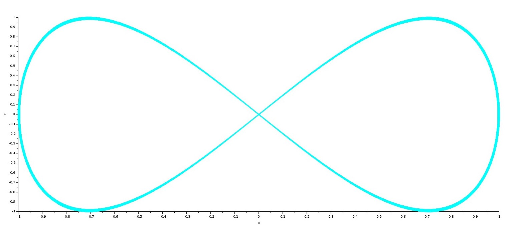{#fig:014 width=70%}

## Фигура Лиссажу с параметрами: $A = B = 1, \alpha = 2, \beta = 4, \delta = 3\pi/4$

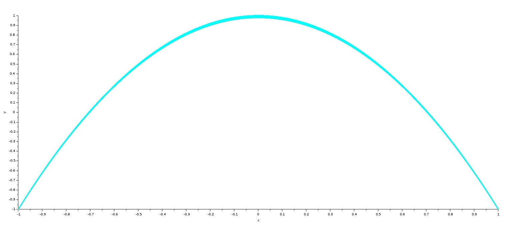{#fig:015 width=70%}

## Фигура Лиссажу с параметрами: $A = B = 1, \alpha = 2, \beta = 4, \delta = \pi$

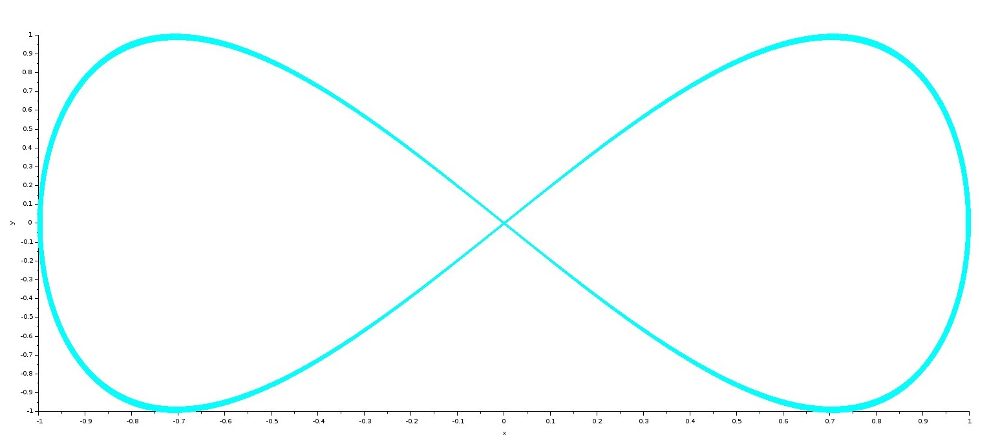{#fig:016 width=70%}

## Фигура Лиссажу с параметрами: $A = B = 1, \alpha = 2, \beta = 6, \delta = 0$

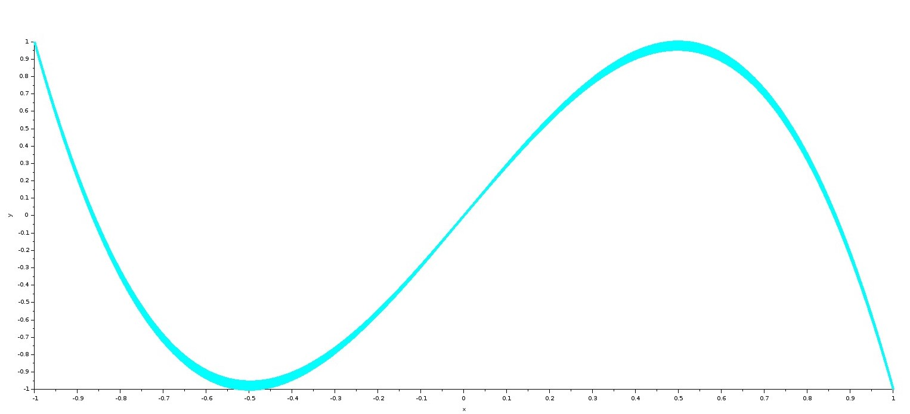{#fig:017 width=70%}

## Фигура Лиссажу с параметрами: $A = B = 1, \alpha = 2, \beta = 6, \delta = \pi/4$

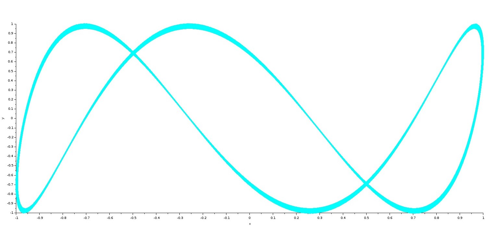{#fig:018 width=70%}

## Фигура Лиссажу с параметрами: $A = B = 1, \alpha = 2, \beta = 6, \delta = \pi/2$

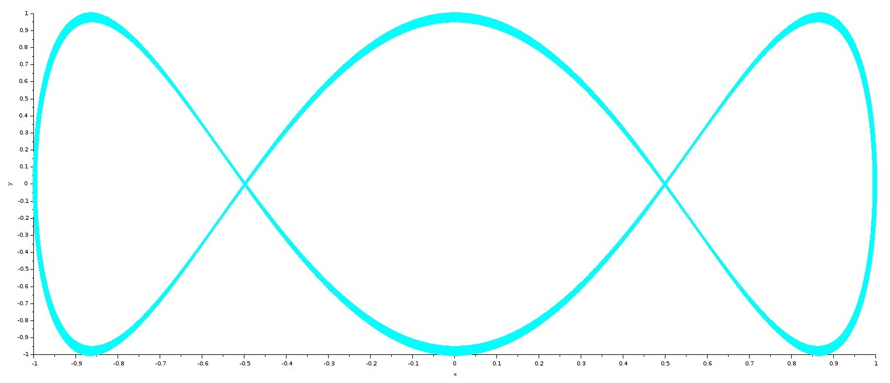{#fig:019 width=70%}

## Фигура Лиссажу с параметрами: $A = B = 1, \alpha = 2, \beta = 6, \delta = 3\pi/4$

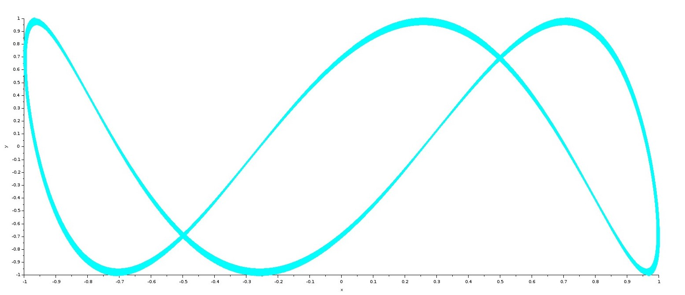{#fig:020 width=70%}

## Фигура Лиссажу с параметрами: $A = B = 1, \alpha = 2, \beta = 6, \delta = \pi$

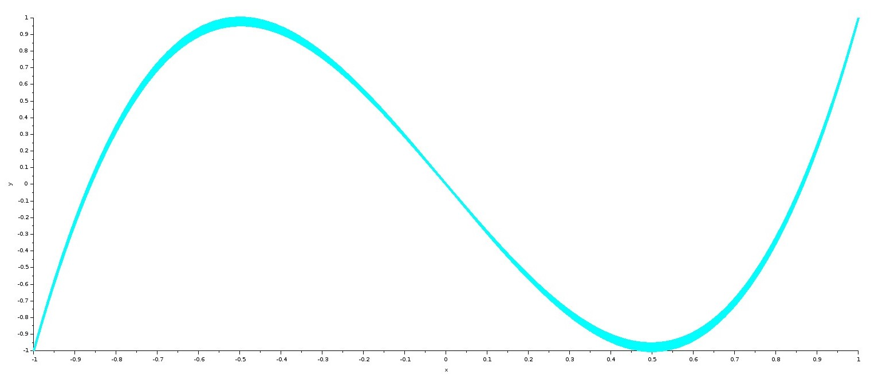{#fig:021 width=70%}

## Фигура Лиссажу с параметрами: $A = B = 1, \alpha = 2, \beta = 3, \delta = 0$

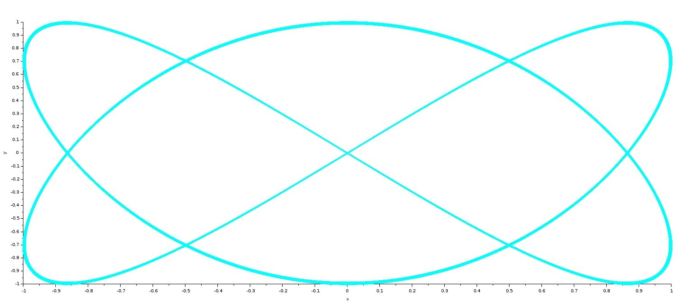{#fig:023 width=70%}

## Фигура Лиссажу с параметрами: $A = B = 1, \alpha = 2, \beta = 3, \delta = \pi/4$

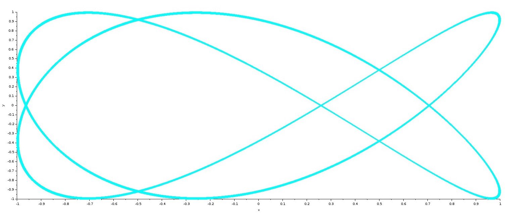{#fig:024 width=70%}

## Фигура Лиссажу с параметрами: $A = B = 1, \alpha = 2, \beta = 3, \delta = \pi/2$

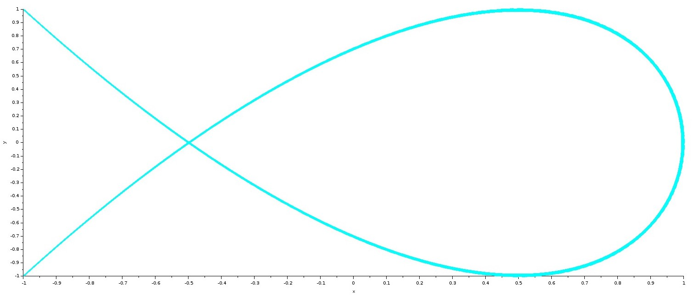{#fig:025 width=70%}

## Фигура Лиссажу с параметрами: $A = B = 1, \alpha = 2, \beta = 3, \delta = 3\pi/4$

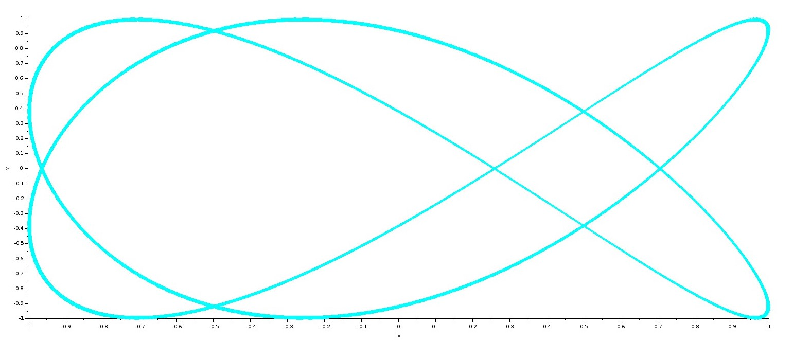{#fig:026 width=70%}

## Фигура Лиссажу с параметрами: $A = B = 1, \alpha = 2, \beta = 3, \delta = \pi$

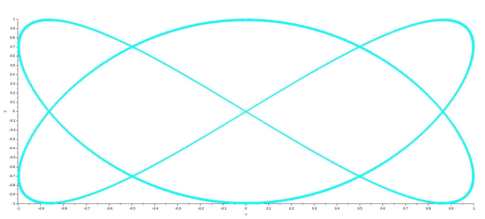{#fig:027 width=70%}

## Выводы

В ходе выполнения лабораторной работы я приобрела навыки моделирования математических моделей с помощью средства имитационного моделирования Scilab, xcos. 

# Спасибо за внимание!
