---
## Front matter
title: Упражнение"
subtitle: "Компонентное моделирование. Scilab, подсистема xcos"
author: "Астраханцева А. А."

## Generic otions
lang: ru-RU
toc-title: "Содержание"

## Bibliography
bibliography: bib/cite.bib
csl: pandoc/csl/gost-r-7-0-5-2008-numeric.csl

## Pdf output format
toc: true # Table of contents
toc-depth: 2
lof: true # List of figures
lot: false # List of tables
fontsize: 12pt
linestretch: 1.5
papersize: a4
documentclass: scrreprt
## I18n polyglossia
polyglossia-lang:
  name: russian
  options:
	- spelling=modern
	- babelshorthands=true
polyglossia-otherlangs:
  name: english
## I18n babel
babel-lang: russian
babel-otherlangs: english
## Fonts
mainfont: PT Serif
romanfont: PT Serif
sansfont: PT Sans
monofont: PT Mono
mainfontoptions: Ligatures=TeX
romanfontoptions: Ligatures=TeX
sansfontoptions: Ligatures=TeX,Scale=MatchLowercase
monofontoptions: Scale=MatchLowercase,Scale=0.9
## Biblatex
biblatex: true
biblio-style: "gost-numeric"
biblatexoptions:
  - parentracker=true
  - backend=biber
  - hyperref=auto
  - language=auto
  - autolang=other*
  - citestyle=gost-numeric
## Pandoc-crossref LaTeX customization
figureTitle: "Рис."
tableTitle: "Таблица"
listingTitle: "Листинг"
lofTitle: "Список иллюстраций"
lotTitle: "Список таблиц"
lolTitle: "Листинги"
## Misc options
indent: true
header-includes:
  - \usepackage{indentfirst}
  - \usepackage{float} # keep figures where there are in the text
  - \floatplacement{figure}{H} # keep figures where there are in the text
---

# Цель работы

Приобретение навыков моделирования математических моделей с помощью средства имитационного моделирования Scilab, xcos. 

# Задание

1. Построить фигуру Лиссажу с различными параметрами.

# Теоретическое введение

Математическое выражение для кривой Лиссажу:

$$
\begin{cases}
  x(t) = A \sin(\alpha t + \delta) \\
  y(t) = B \sin(\beta t) ,
\end{cases}
$$

где $A, B$ — амплитуды колебаний, $\alpha, \beta$ — частоты, $\delta$ — сдвиг фаз.

# Выполнение упражнения 

Первым делом откроем Scilab, далее во вкладке "Инструменты" найдем xcos (рис. [-@fig:001]).

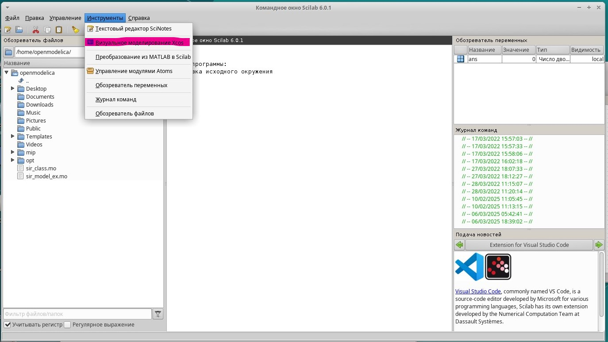{#fig:001 width=70%}

Начнем заполнять схему необходимыми блоками, для начала нам понадобятся два (потому что в системе уравнений, описывающей фигуру Лиссажу, 2 уравнения) генератора синусоидального источника. Нам нужно установить параметры для каждого из источников: (рис. [-@fig:002] - [-@fig:003]).

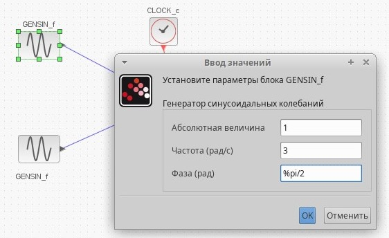{#fig:002 width=70%}

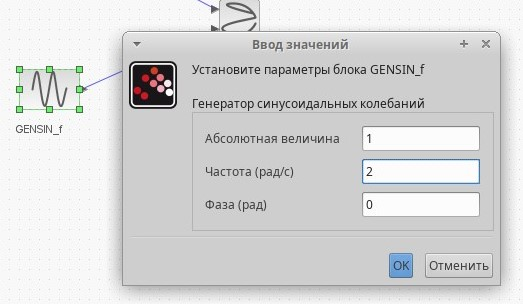{#fig:003 width=70%}

Далее нужно установить параметры для регистрирующего устройства: я выбрала блок CSPOXY. Уставновила границы по осям Ох и Оу (рис. [-@fig:004]).

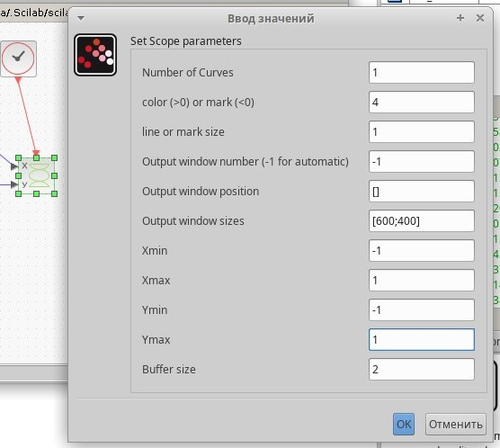{#fig:004 width=70%}

Такая схема получилась: (рис. [-@fig:005]).

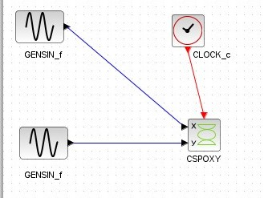{#fig:005 width=70%}

Фигура Лиссажу со следующими параметрами: $A = B = 1, \alpha = 3, \beta = 2, \delta = \pi/2$. Получим такой график (рис. [-@fig:006]).

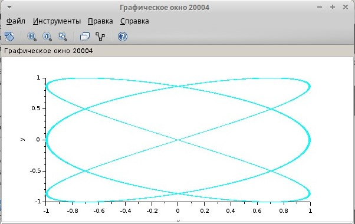{#fig:006 width=70%}

Изменим параметры на первом генераторе: $A = B = 1, \alpha = 2, \beta = 2, \delta = 0$. Далее, меняя значение сдвига фаз на $\pi/4; \pi/2; 3\pi/4; \pi$ получим следующие графики: (рис. [-@fig:007] - [-@fig:011]).

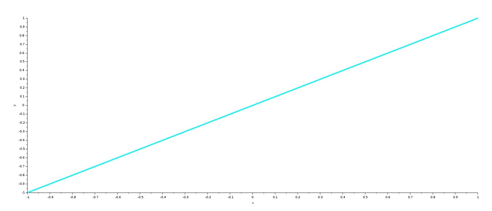{#fig:007 width=70%}

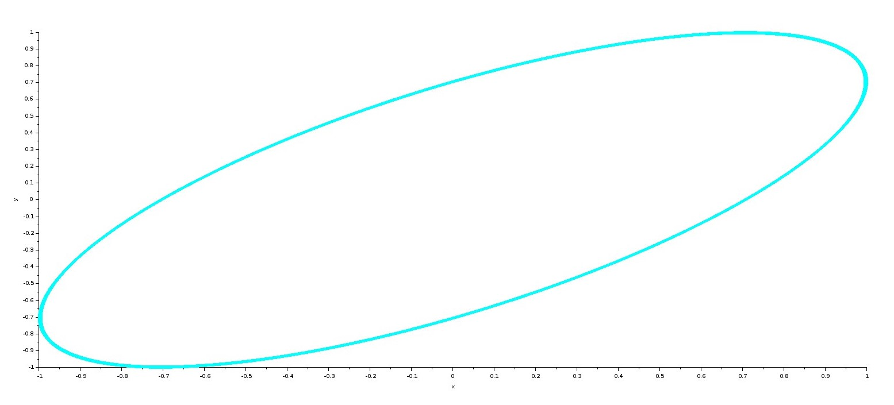{#fig:008 width=70%}

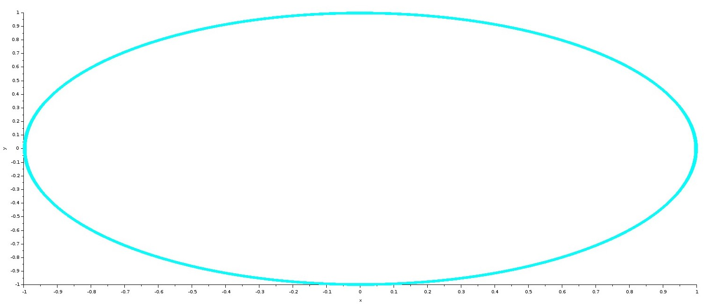{#fig:009 width=70%}

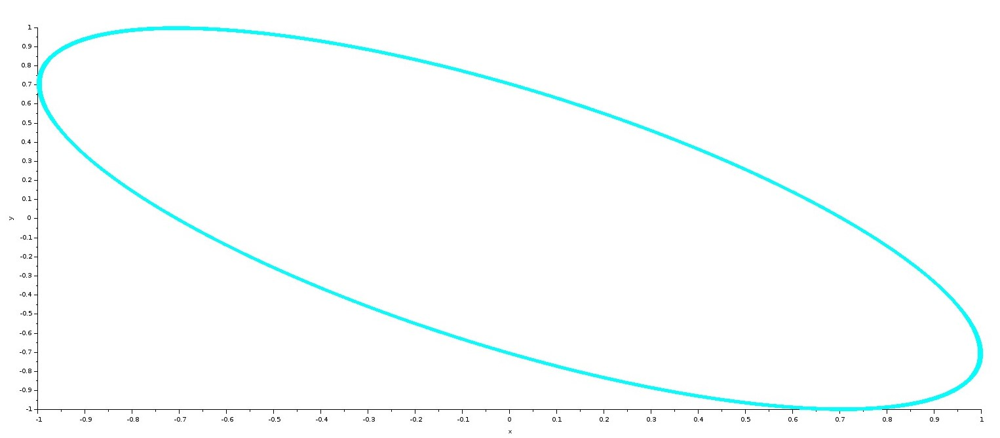{#fig:010 width=70%}

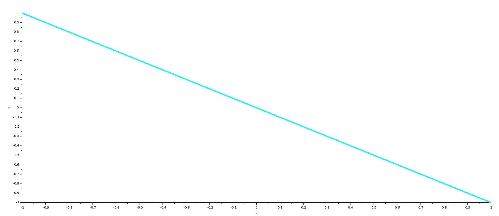{#fig:011 width=70%}

Изменим параметры на первом генераторе: $A = B = 1, \alpha = 2, \beta = 4, \delta = 0$. Далее, меняя значение сдвига фаз на $\pi/4; \pi/2; 3\pi/4; \pi$ получим следующие графики: (рис. [-@fig:012] - [-@fig:016]).

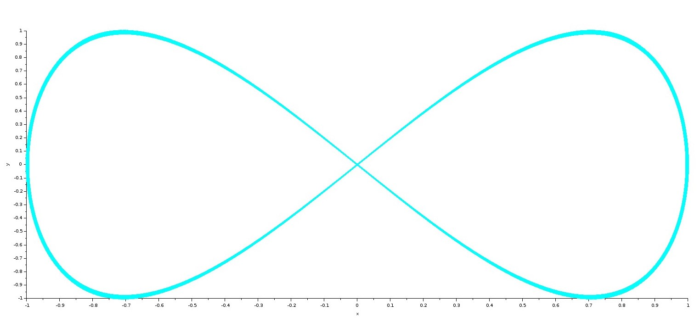{#fig:012 width=70%}

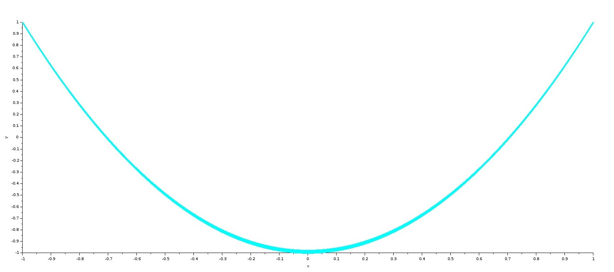{#fig:013 width=70%}

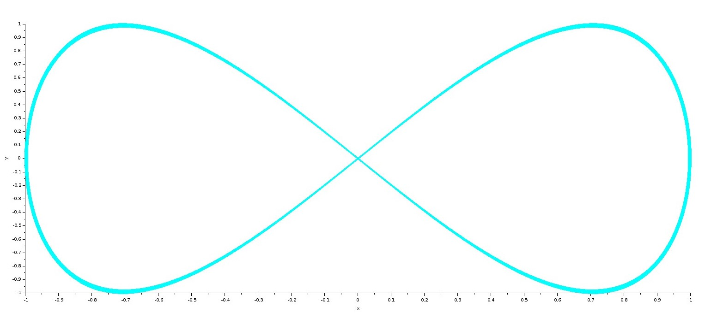{#fig:014 width=70%}

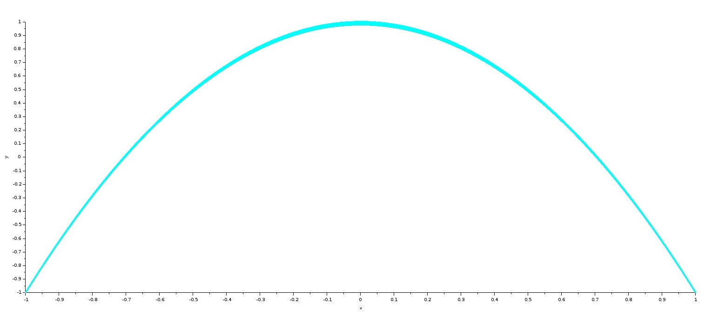{#fig:015 width=70%}

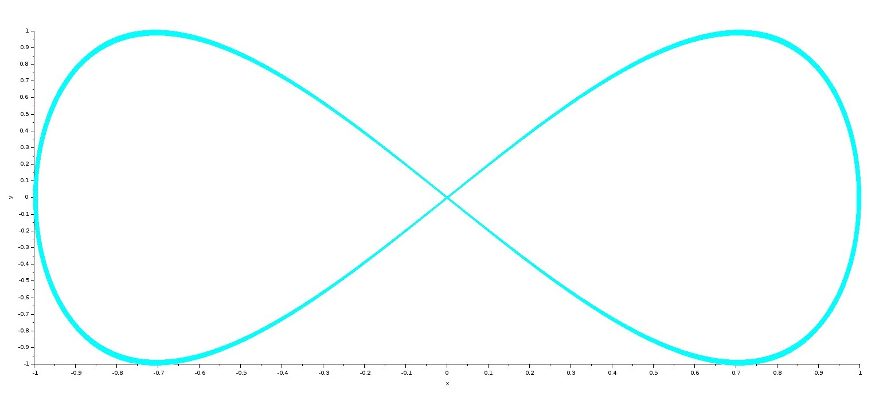{#fig:016 width=70%}

Изменим параметры на первом генераторе: $A = B = 1, \alpha = 2, \beta = 6, \delta = 0$. Далее, меняя значение сдвига фаз на $\pi/4; \pi/2; 3\pi/4; \pi$ получим следующие графики: (рис. [-@fig:017] - [-@fig:021]).

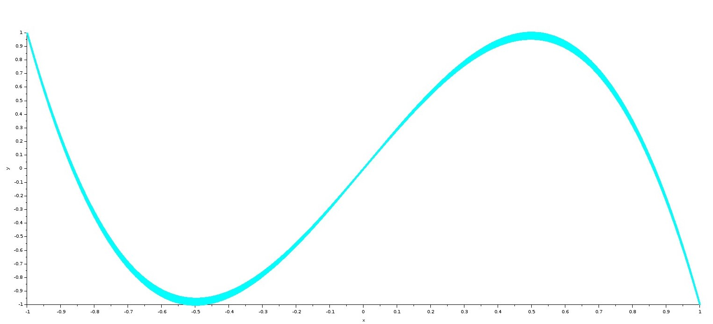{#fig:017 width=70%}

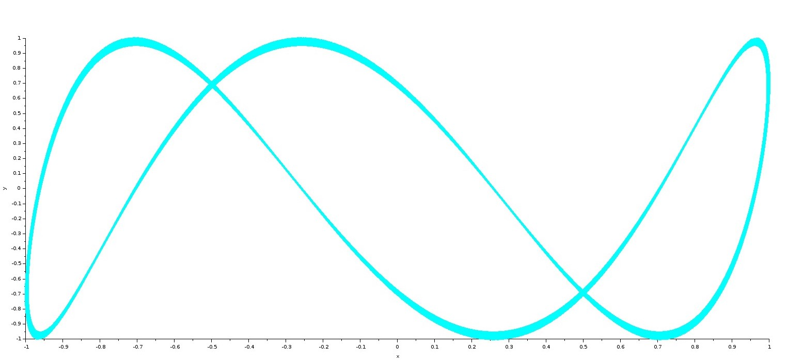{#fig:018 width=70%}

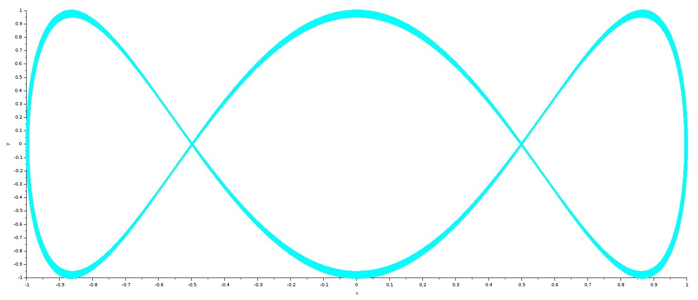{#fig:019 width=70%}

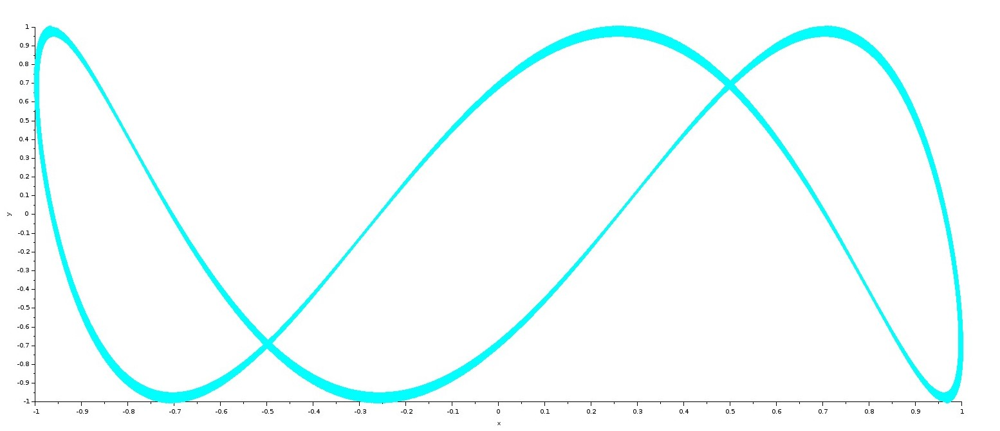{#fig:020 width=70%}

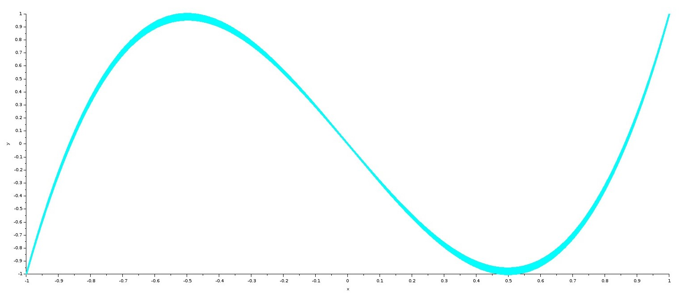{#fig:021 width=70%}

Изменим параметры на первом генераторе: $A = B = 1, \alpha = 2, \beta = 3, \delta = 0$. Далее, меняя значение сдвига фаз на $\pi/4; \pi/2; 3\pi/4; \pi$ получим следующие графики: (рис. [-@fig:023] - [-@fig:027]).

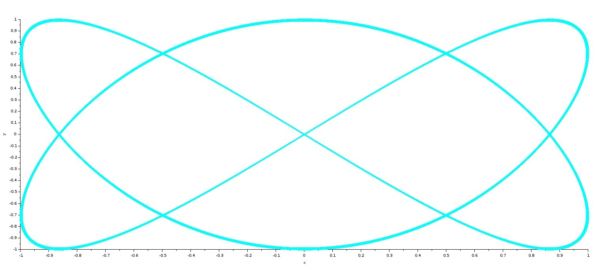{#fig:023 width=70%}

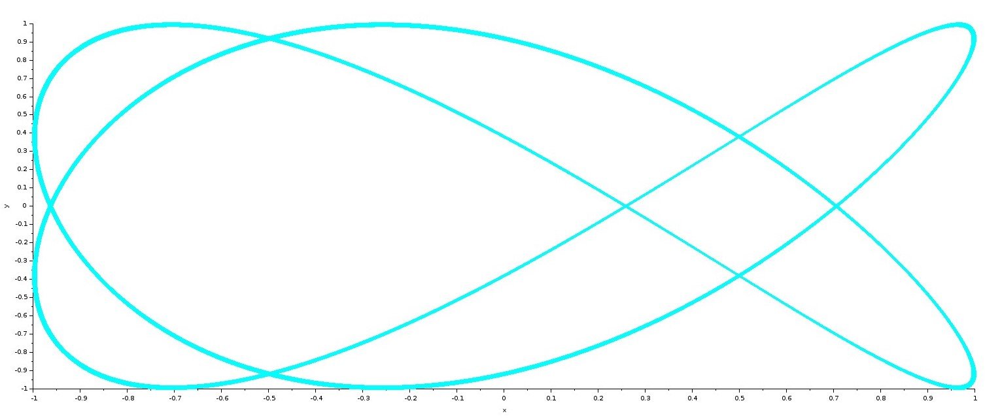{#fig:024 width=70%}

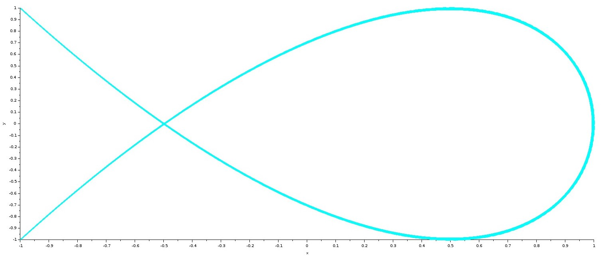{#fig:025 width=70%}

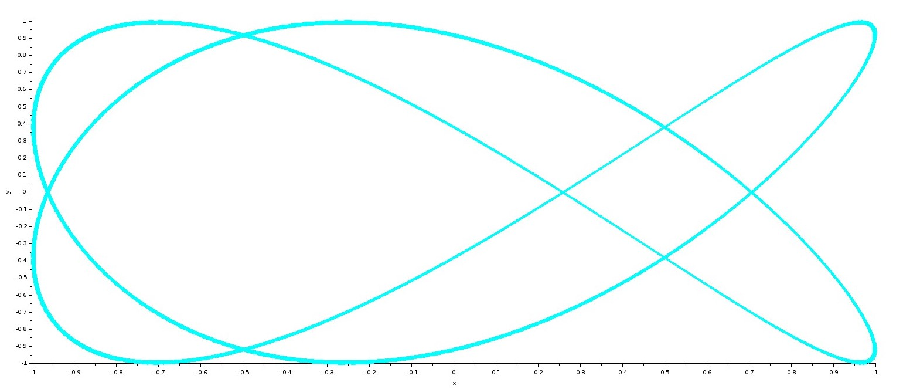{#fig:026 width=70%}

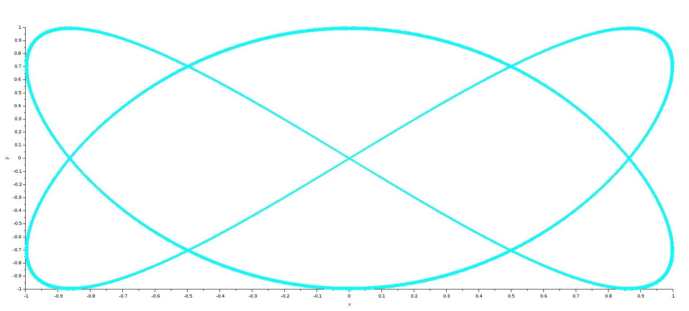{#fig:027 width=70%}

# Выводы

В ходе выполнения лабораторной работы я приобрела навыки моделирования математических моделей с помощью средства имитационного моделирования Scilab, xcos. 

